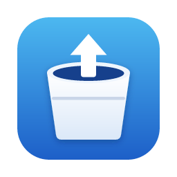

<p align="center">
  
</p>

<h1 align="center">S3 Drive</h1>

<p align="center">
  Amazon S3 のバケットを、いつものドライブのように扱える macOS アプリ
</p>

<p align="center">
  <a href="https://github.com/Sh1gekicks/s3driveapp/releases/latest">最新のリリース</a> ·
  <a href="CHANGELOG.md">変更履歴</a> ·
  <a href="docs/ope/README.md">運用ドキュメント</a> ·
  <a href="docs/design/README.md">設計書</a>
</p>

## アプリケーション概要

S3 Drive は、事前に用意した Amazon S3 のバケットを、Google ドライブや Finder と同じ感覚で操作できる macOS ネイティブアプリです。ファイルの一覧表示・アップロード・ダウンロードに加えて、ストレージクラスの変更、バージョン管理、利用容量とコストの確認まで、AWS マネジメントコンソールを開かずに行えます。

- **サインイン**: アプリの利用者は Google アカウントで認証します。
- **S3 へのアクセス**: バケットごとに、IAM ユーザのアクセスキー（任意で AssumeRole するロール）を登録して接続します。シークレットアクセスキーは macOS のキーチェーンにだけ保存します。
- **見た目**: macOS の標準アプリに合わせたデザイン（システムフォント、透過タイトルバー、ダーク／ライトモードへの追従）です。

技術スタックは Tauri 2（Rust）と React です。S3 との通信には AWS SDK for Rust を使います。

| パス | 内容 |
|---|---|
| `crates/s3drive-core` | Tauri に依存しないコア（S3・STS・CloudWatch・Cost Explorer・Price List、SQLite、キーチェーン、転送、検索） |
| `src-tauri` | アプリ本体（パッケージ名 `s3drive-app`）。IPC コマンド、メニュー、メニューバー常駐、ウィンドウ |
| `src` | フロントエンド（React 19、TypeScript 7、Tailwind CSS 4、Base UI、TanStack Query、Zustand） |
| `e2e` | WebdriverIO の E2E テスト |
| `docs/design` | 設計書 |
| `docs/ope` | 運用ドキュメント（開発環境・ビルド・テスト・リリース） |
| `design-system` | 画面の見た目の正本（デザインシステムの写し） |

## インストール方法

### 1. アプリのインストール

1. [Releases](https://github.com/Sh1gekicks/s3driveapp/releases/latest) から `S3.Drive_<バージョン>_universal.dmg` をダウンロードします。
2. DMG を開き、「S3 Drive」を「アプリケーション」フォルダにドラッグします。
3. 「S3 Drive」を開きます。「Apple は、“S3 Drive”にマルウェアが含まれていないことを検証できませんでした」などの警告が表示されたら「完了」を押して閉じます。
4. 「システム設定」→「プライバシーとセキュリティ」を開き、「セキュリティ」の項目にある「“S3 Drive”は Mac を保護するためにブロックされました」の「このまま開く」を押します。管理者のパスワードで認証し、表示されたダイアログで「開く」を押します。
5. 以降は通常どおり起動できます。

> [!NOTE]
> 手順 3〜4 が必要なのは、Apple の公証を行っていないためです（[制約事項](#制約事項)）。macOS 14 以前では、Finder で Control キーを押しながらアプリをクリックし、「開く」を選んでも許可できます。

配布物が改ざんされていないことは、次のどちらかで確認できます。

```bash
shasum -a 256 S3.Drive_0.3.0_universal.dmg
```

```bash
gh attestation verify S3.Drive_0.3.0_universal.dmg -R Sh1gekicks/s3driveapp
```

`shasum` の結果がリリースノートに記載した SHA-256 と一致すること、または `gh attestation verify` が成功することを確認してください。

### 2. AWS 側の準備

アプリはバケットや IAM の設定を変更しません。事前に次を用意してください。

| 項目 | 内容 |
|---|---|
| S3 バケット | 接続先のバケット。削除したファイルを復元するには、バージョニングを有効にしてください |
| IAM ユーザ | アクセスキーを発行済みの IAM ユーザ。付与する権限は [07 §4 IAM ポリシー](docs/design/07-security.md#4-iam-ポリシー) を参照してください |
| IAM ロール（任意） | AssumeRole で使うロール。使う場合は IAM ユーザに `sts:AssumeRole` を許可します（[07 §4.2](docs/design/07-security.md#42-iam-ユーザのポリシーassumerole-を使う場合)） |
| Cost Explorer（任意） | コストを表示する場合は、アカウントで Cost Explorer を有効にします。バケット単位のコストを表示するには、バケットごとにタグを付けます（[4. バケットごとのコストを表示する](#4-バケットごとのコストを表示する)） |

推奨する設定（ライフサイクルルールなど）は [設計書 §5](docs/design/README.md#5-前提条件制約) を参照してください。

### 3. 初回の設定

1. アプリを起動し、「Google でサインイン」を押します。既定のブラウザが開くので、サインインするとアプリに戻ります。
2. 「バケットに接続」で、バケット名・リージョン・アクセスキー ID・シークレットアクセスキーを入力し、「接続」を押します。AssumeRole を使う場合は「IAM ロール ARN（任意）」を、別アカウントのロールを使う場合は「詳細設定」の「外部 ID（任意）」も入力します。
3. 接続を確認できると、バケットの中身が表示されます。2 つ目以降のバケットは、サイドバーの「バケットを追加」から登録します。

ルートユーザーのアクセスキーは使用できません。必ず IAM ユーザーのアクセスキーを使ってください。

### 4. バケットごとのコストを表示する

「ストレージとコスト」のコストは、何も設定しなければアカウント全体の S3（バケットのリージョン）の金額です。複数のバケットのコストを別々に見るには、**キーは共通、値はバケットごとに異なる**タグを各バケットに付け、そのタグを接続ごとにアプリに指定します。

例（東京リージョンの 2 つのバケット）:

| バケット | バケットに付けるタグ | アプリの設定（キー／値） | ダッシュボードの対象範囲 |
|---|---|---|---|
| `acme-media-tokyo` | `Name` = `acme-media-tokyo` | `Name`／`acme-media-tokyo` | タグ Name=acme-media-tokyo |
| `acme-archive-tokyo` | `Name` = `acme-archive-tokyo` | `Name`／`acme-archive-tokyo` | タグ Name=acme-archive-tokyo |

1. **バケットにタグを付ける**: S3 コンソールでバケットを開き、「プロパティ」タブの「タグ」で、キー `Name`、値にバケット名のタグを追加します（すでに同じキーのタグがあれば、値をバケット名に変えます）。値はバケットを区別できれば何でもかまいませんが、バケット名にしておくと重複しません。
2. **タグのキーをコスト配分タグとして有効にする**: Billing and Cost Management コンソールの「コスト配分タグ」で、ユーザー定義タグのキー `Name` を選んで「有効化」します。有効化はキー単位なので、1 回有効にすれば、あとから付けた値（別のバケット）も対象になります。タグを付けてからキーが一覧に表示されるまでと、有効化してから反映されるまでは、それぞれ最大 24 時間かかります。
3. **アプリにタグを指定する**: アプリの「設定」→「コスト」→「コスト配分タグ」で、バケットの行ごとにキーと値を入力します。アプリはバケットに付いたタグを読み取らないため、この設定が必要です。
4. **コストを取得する**: 「ストレージとコスト」でバケットを選んで「更新」を押します。KPI とコスト内訳に「タグ Name=acme-media-tokyo」のように対象範囲が表示されます。

> [!IMPORTANT]
> 同じキーと値のタグを複数のバケットに付けると、どのバケットで表示しても、それらのバケットの**合計**になります（例: 2 つのバケットに `Name=s3drive` を付けると、どちらも 2 つの合計）。バケットごとに見るには、値を必ず別にしてください。

- 集計の条件には S3 とバケットのリージョンも含むため、同じタグを付けたほかのサービスのリソース（EC2 など）や、別のリージョンのバケットは含まれません。
- タグを付ける前（値を変える前）の期間のコストは、そのタグでは集計されません。値を変えた直後は前月の同じ期間のデータがないため、前月比も表示されません。
- タグは付いていたが、キーを有効化する前だった期間は、「コスト配分タグ」の「タグのバックフィル」（Backfill tags）で最大 12 か月さかのぼって集計できます。
- AWS Organizations のメンバーアカウントでは、コスト配分タグの有効化とバックフィルができません。管理アカウントで行ってください。
- 「更新」はバケット（接続）ごとに Cost Explorer に問い合わせ、1 回あたり約 $0.05 かかります。
- CLI でタグを付ける場合、`aws s3api put-bucket-tagging` はバケットのタグをすべて置き換えます。ほかのタグがあるバケットでは、`aws s3api get-bucket-tagging` で今のタグを確認し、それらも含めて指定してください。

  ```bash
  aws s3api put-bucket-tagging --bucket acme-media-tokyo --tagging 'TagSet=[{Key=Name,Value=acme-media-tokyo}]'
  ```

### アップデート

新しいバージョンが公開されると、起動時（とその後 24 時間ごと）にアプリが通知します。メニューの「アップデートを確認…」からも確認できます。更新後の初回起動では、キーチェーンへのアクセスの確認が表示されるため「常に許可」を選んでください。

## 機能概要

| 機能 | 内容 |
|---|---|
| サインイン | Google アカウントでのサインイン（OAuth 2.0 + PKCE）と、起動時のセッション復元 |
| バケット接続の管理 | 複数のバケットの登録と切り替え。認証情報はアクセスキーと AssumeRole に対応し、キーチェーンに保存 |
| ファイル一覧 | リスト／アイコン表示、フォルダの階層表示、並べ替え、削除済みの項目の表示 |
| アップロード・ダウンロード | ドラッグ＆ドロップ、フォルダや複数選択での一括操作、大きなファイルのマルチパート並列転送 |
| 転送の管理 | 転送の一覧・進捗表示・キャンセル・再試行、完了時の通知 |
| ファイルとフォルダの管理 | 削除、フォルダの作成・移動・名前の変更 |
| ストレージクラス | ストレージクラスの変更と、アーカイブ（Glacier など）からの取り出し |
| メタデータ | 作成日・更新日・サイズ・ストレージクラス・ETag などの表示 |
| 検索とフィルタ | 名前での検索と、種類・拡張子・サイズ・更新日・ストレージクラスでの絞り込み（ローカルの検索インデックス） |
| バージョン管理 | バージョンの一覧・復元・削除、削除済みの項目の復元 |
| ストレージとコスト | 利用容量（CloudWatch）・リージョン・ストレージクラス別の内訳と、コスト（Cost Explorer）の表示 |
| メニューバー常駐 | メニューバーから転送の状況の確認、アップロード、ウィンドウや設定の表示 |
| 自動更新 | GitHub Releases からの更新の確認と適用 |

画面と機能の詳細は [03 画面仕様](docs/design/03-screens.md) と [04 機能設計](docs/design/04-features.md) を参照してください。

## 動作環境

| 項目 | 内容 |
|---|---|
| OS | macOS 13 Ventura 以降 |
| CPU | Apple Silicon、Intel（ユニバーサルバイナリ） |
| ネットワーク | AWS（S3・STS・CloudWatch・Cost Explorer・Price List）と Google（サインイン）に HTTPS で接続できること |
| AWS | [インストール方法の 2.](#2-aws-側の準備) の準備ができていること |
| Google | Google アカウント（配布元が利用できるアカウントを制限している場合は、許可されたアカウント） |

## 制約事項

- **公証していません。** Apple Developer Program に加入していないため、アドホック署名のみで配布しています。初回起動時は [インストール方法](#1-アプリのインストール) の手順で許可してください。自動更新のたびに署名が変わるため、更新後の初回起動でキーチェーンへのアクセスの確認が表示されます。
- **macOS 専用です。** Windows・Linux 版と、Mac App Store での配布はありません。
- **UI は日本語のみです。**
- **Amazon S3 専用です。** MinIO などの S3 互換ストレージは正式な対象外です。
- **バケットと IAM の設定は行いません。** バージョニングやライフサイクルルール、バケットポリシーの変更は AWS 側で行ってください。アプリは状態の表示のみ行います。
- **削除からの復元には、バケットのバージョニングが必要です。** バージョニングが無効なバケットで削除したファイルは元に戻せません。
- **転送の中断からの再開には対応していません。** 転送中にアプリを終了すると、確認のうえ転送を中止します。失敗した転送は再試行で最初からやり直します。
- **検索はローカルのインデックスで行います。** 初回はバケット内の全キーを取得するため時間がかかります。想定する規模は 100 万オブジェクトまでです。
- **コストの取得には料金がかかります。** Cost Explorer の API は 1 リクエストあたり $0.01 かかり、1 回の更新で約 $0.05 を使います。このため、コストは「更新」を押したときだけ取得します（設定で無効にできます）。
- **コストは最大 24 時間遅れて反映されます。** 金額は米ドルです。バケット単位のコストは、バケットにタグを付けて有効にした日以降のデータだけが集計されます。タグを指定していない場合は、アカウント全体の S3（該当リージョン）のコストを表示します（[4. バケットごとのコストを表示する](#4-バケットごとのコストを表示する)）。
- **Finder との同期や、他者とのファイル共有（署名付き URL）はありません。**

## 開発に参加する

開発環境の構築・ビルド・テスト・リリースの手順は [運用ドキュメント](docs/ope/README.md) を参照してください。設計の背景は [設計書](docs/design/README.md) にまとめています。

## ライセンス

[MIT License](LICENSE)

Copyright © 2026 Sh1gekicks
