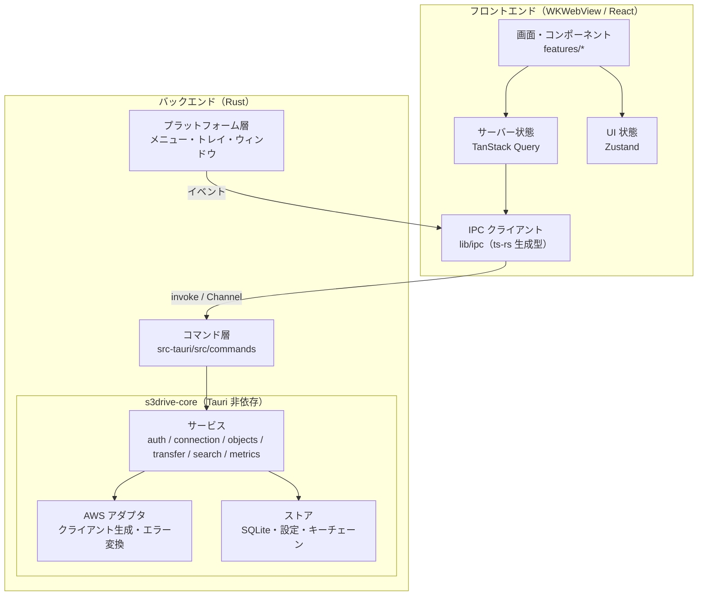
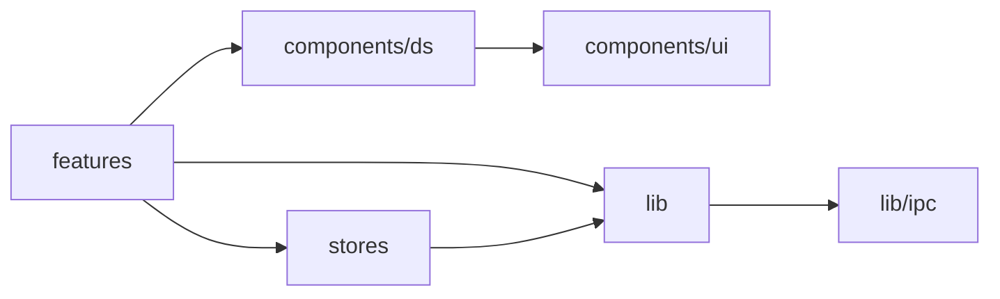

# 01. アーキテクチャ

## 1. システム構成

本アプリは単一の Tauri v2 アプリケーションで、WebView 上の React フロントエンドと、Rust のバックエンドからなる。AWS・Google・キーチェーン・ファイルシステムへのアクセスはすべて Rust 側で行い、フロントエンドは IPC 経由でのみバックエンドを呼び出す。



| 構成要素 | 責務 |
|---|---|
| 画面・コンポーネント | デザインシステムに沿った表示と操作。AWS の概念（キー、プレフィックス、バージョン）を UI 上の概念（ファイル、フォルダ、履歴）に写像して見せる |
| TanStack Query | バックエンド由来のデータ（一覧、メタデータ、メトリクスなど）のキャッシュ・再取得・無効化 |
| Zustand | 選択状態、表示モード、ダイアログ、フィルタなど UI だけの状態 |
| IPC クライアント | `invoke` と `Channel` を型付きでラップする唯一の層 |
| コマンド層 | IPC の入口。引数の検証、サービス呼び出し、エラーの IPC 形式への変換のみを行う |
| プラットフォーム層 | macOS のメニューバー、メニューバー常駐（トレイ）、ウィンドウの生成・テーマ・閉じる挙動 |
| サービス | 業務ロジック（認証、接続、オブジェクト操作、転送、検索、メトリクス） |
| AWS アダプタ | 接続ごとの SDK クライアント生成、認証情報プロバイダ、SDK エラーの分類 |
| ストア | SQLite（インデックス・キャッシュ・転送状態）、設定ファイル、キーチェーン |

## 2. 技術スタック

バージョンは 2026 年 9 月時点の最新版を基準とし、ロックファイルで固定する。開発ツールの固定方法は [§8](#8-開発環境とツールチェーン) を参照する。

### 2.1 フロントエンド

| 区分 | 採用技術 | 用途・備考 |
|---|---|---|
| 言語 | TypeScript 7（strict） | Go で書き直されたネイティブ版。型検査（`tsc`）とエディタの言語サービスに使い、トランスパイルは Vite が行う。7.0 には外部ツール向けの API がないため、API に依存するツール（typescript-eslint など）は使わない（[§8.3](#83-typescript-7-の設定)） |
| UI ライブラリ | React 19（19.3） | |
| ビルド | Vite 8（8.3） | Tauri の `devUrl` / `frontendDist` と連携する |
| スタイル | Tailwind CSS v4（4.3、`@tailwindcss/vite`） | DS のトークンを `@theme inline` で割り当てる |
| コンポーネント | shadcn/ui（CLI v4、base = Base UI）、`@base-ui/react` 1.x | REQ-D02。詳細は [02-ui-foundation.md](02-ui-foundation.md) |
| アイコン | lucide-react | DS の正式採用アイコンセット |
| サーバー状態 | @tanstack/react-query v5 | |
| UI 状態 | zustand v5 | |
| 仮想リスト | @tanstack/react-virtual v3 | 大量ファイルの一覧・アイコン表示 |
| フォーム | react-hook-form + zod | 接続フォーム、設定 |
| Tauri API | @tauri-apps/api v2、各プラグインの JS パッケージ | |
| Lint / Format | Biome v2（2.5） | 独自の解析器で動くため TypeScript 7 の影響を受けない |
| テスト | Vitest 5、Testing Library、WebdriverIO（E2E） | [09-testing.md](09-testing.md) |
| パッケージ管理 | pnpm 12 | 設定は `pnpm-workspace.yaml` に書く（[§8.2](#82-pnpm-の設定)） |
| 実行環境（Node.js） | Node.js 26 | `package.json` の `devEngines.runtime` で固定し、pnpm が取得する（[§8.1](#81-バージョンの固定)）。2026 年 10 月 28 日に Active LTS へ移行する |

### 2.2 バックエンド

| 区分 | 採用技術 | 用途・備考 |
|---|---|---|
| 言語 | Rust stable（edition 2024） | |
| デスクトップシェル | Tauri 2.x（2.11） | REQ-D01 |
| Tauri プラグイン | dialog、opener、store、log、updater、process、window-state、single-instance、notification、clipboard-manager | 用途は §6.3 |
| 非同期 | tokio、tokio-util（`CancellationToken`）、futures | |
| AWS SDK | aws-config、aws-sdk-s3、aws-sdk-sts、aws-sdk-cloudwatch、aws-sdk-costexplorer、aws-sdk-pricing | REQ-T01。`BehaviorVersion::latest()` |
| キーチェーン | keyring-core 1.x ＋ apple-native-keyring-store 1.x（`keychain` モジュール） | keyring 4 系で、API（keyring-core）と OS ごとの保存先が別クレートに分かれた構成。App Store 外で配布するアプリ（アドホック署名。データ保護キーチェーンに必要な entitlements を使えない）では `keychain` モジュールを使う |
| DB | rusqlite（`bundled`、FTS5 を含む）、r2d2_sqlite、rusqlite_migration | |
| Google 認証 | openidconnect 4（PKCE、ID トークン検証）、reqwest（rustls） | |
| ループバック受信 | hyper 1.x（最小の HTTP サーバー） | OAuth のリダイレクト受信専用 |
| シリアライズ | serde、serde_json | |
| 型共有 | ts-rs | Rust の DTO から TypeScript 型を生成（D9） |
| エラー | thiserror | |
| ログ | log / tracing | 出力は tauri-plugin-log |
| その他 | mime_guess、unicode-normalization、uuid、walkdir、filetime | Content-Type 推定、キーの NFC 正規化、フォルダのアップロード、更新日時の復元 |
| テスト | aws-smithy-mocks、tempfile、insta | [09-testing.md](09-testing.md) |

## 3. 実行時の構成

| 項目 | 方針 |
|---|---|
| プロセス | 単一プロセス（WebView は WebKit の子プロセス群）。`tauri-plugin-single-instance` で二重起動を防ぎ、2 つ目の起動は既存ウィンドウを前面に出す |
| 非同期処理 | Tauri が管理する tokio ランタイム（`tauri::async_runtime`）で実行する |
| 長時間処理 | 転送、一括操作（削除・移動・クラス変更）、インデックス構築、メトリクス取得は「ジョブ」として tokio タスクで実行し、進捗を `Channel` で返す（§6.2） |
| DB アクセス | コネクションプールから取得し、`spawn_blocking` 上で実行する |
| ウィンドウ | `main`（メイン）と `settings`（設定）の 2 つ。メインは初回表示時に生成し、閉じても破棄せず隠す |
| 常駐 | メニューバー常駐（トレイ）を既定で有効にする。メインウィンドウを閉じても転送は継続し、Dock アイコンのクリックまたはメニューバーから再表示する。⌘Q で終了し、転送中は確認する |

## 4. リポジトリ構成

Cargo ワークスペースと pnpm プロジェクトを同じリポジトリに置く。Rust は Tauri 非依存の `s3drive-core` と、コマンド層の `src-tauri` に分ける（D1）。

```text
s3driveapp/
├── .github/
│   ├── workflows/            # ci.yml, release.yml
│   └── （Renovate の設定はリポジトリ直下の renovate.json）
├── docs/design/              # 本設計書
├── crates/
│   └── s3drive-core/         # ドメイン・AWS・DB・検索（Tauri 非依存）
│       ├── src/
│       │   ├── lib.rs
│       │   ├── error.rs
│       │   ├── model/        # Connection, ObjectEntry, ObjectVersion, StorageClass …
│       │   ├── aws/          # client_factory.rs, error_map.rs
│       │   ├── auth/         # google.rs（OIDC）, loopback.rs
│       │   ├── credentials/  # keychain.rs, provider.rs（静的キー / AssumeRole）
│       │   ├── objects/      # list, head, folder, delete, copy, move, storage_class, restore, versions
│       │   ├── transfer/     # manager, upload, download, multipart, progress
│       │   ├── search/       # indexer, query
│       │   ├── metrics/      # storage（CloudWatch）, cost（Cost Explorer）, pricing
│       │   ├── store/        # db, migrations/, repos/, settings
│       │   └── util/         # key（正規化・検証）, size, time
│       └── tests/            # moto を使う結合テスト
├── src-tauri/
│   ├── Cargo.toml
│   ├── tauri.conf.json
│   ├── capabilities/         # main.json, settings.json
│   ├── icons/
│   └── src/
│       ├── main.rs, lib.rs   # Builder、プラグイン・状態の登録
│       ├── commands/         # auth, connections, objects, versions, transfers, search, metrics, settings, app
│       ├── state.rs          # AppState
│       ├── menu.rs           # アプリのメニューバー
│       ├── tray.rs           # メニューバー常駐
│       └── window.rs         # ウィンドウ生成・テーマ・閉じる挙動
├── src/                      # フロントエンド
│   ├── main.tsx, App.tsx
│   ├── settings.tsx          # 設定ウィンドウのエントリ
│   ├── app/                  # Providers、レイアウト、ショートカット、ネイティブメニュー連携
│   ├── components/
│   │   ├── ui/               # shadcn/ui で生成したコンポーネント（base-*）
│   │   └── ds/               # DS 固有部品: FileIcon, StorageClassBadge, UsageBar, AppShell …
│   ├── features/             # auth, connections, browser, inspector, transfers, dialogs, search, dashboard, settings
│   ├── lib/
│   │   ├── ipc/              # invoke ラッパー、bindings/（ts-rs 生成物）
│   │   ├── format.ts         # サイズ・日時・金額の書式
│   │   ├── file-kind.ts, storage-class.ts
│   │   └── i18n/ja.ts        # 文言辞書
│   ├── stores/               # Zustand ストア
│   └── styles/
│       ├── tokens/           # colors.css, typography.css, spacing.css, base.css（DS から取り込み）
│       └── globals.css       # Tailwind の読み込みと @theme inline の割り当て
├── e2e/                      # WebdriverIO
├── tests/fixtures/           # テストデータ（DS のモックデータ相当）
├── docker-compose.test.yml   # moto（S3 などのモック）
├── Cargo.toml                # workspace
├── rust-toolchain.toml       # §8.1
├── package.json, pnpm-workspace.yaml, pnpm-lock.yaml   # §8.1〜8.2
├── tsconfig.json, tsconfig.app.json, tsconfig.node.json # §8.3
├── biome.json, vite.config.ts, components.json, renovate.json
└── requirements.txt
```

## 5. フロントエンド設計

### 5.1 レイヤと依存方向



- `components/ui` と `components/ds` は `features` や `stores` を参照しない（見た目のみ）。
- `invoke` を呼んでよいのは `lib/ipc` だけとする。
- 文言は `lib/i18n/ja.ts` から取得し、コンポーネントに直接書かない。

### 5.2 画面の切り替え

画面数が少なく URL も持たないため、ルーターは使わない。

| 状態 | 保持場所 | 値 |
|---|---|---|
| 表示中の画面 | `useUiStore.view` | `signin`／`files`／`dashboard` |
| 表示中の接続とフォルダ | `useNavStore` | `connectionId`、`prefix` |
| 戻る／進む | `useNavStore` | `back[]`、`forward[]`（DS: `ui_kits/s3-drive/App.jsx` と同じ振る舞い） |
| 設定 | 別ウィンドウ | Vite のマルチページ構成で `settings.html` をエントリにする |

### 5.3 サーバー状態（TanStack Query）

| クエリキー | 取得内容 | staleTime | 無効化のきっかけ |
|---|---|---|---|
| `['session']` | サインイン状態 | ∞ | サインイン／サインアウト |
| `['connections']` | 接続一覧 | ∞ | 接続の追加・更新・削除 |
| `['bucket', connId]` | リージョン、バージョニング、暗号化 | 10 分 | 手動更新 |
| `['objects', connId, prefix, opts]` | フォルダの一覧（infinite query） | 30 秒 | 同じプレフィックスへの変更操作、⌘R |
| `['object', connId, key, versionId]` | メタデータ（HeadObject） | 60 秒 | 対象キーへの変更操作 |
| `['versions', connId, key]` | バージョン一覧 | 30 秒 | アップロード・復元・削除 |
| `['folderSummary', connId, prefix]` | 項目数・合計サイズ | 5 分 | 配下への変更操作 |
| `['search', connId, query]` | 検索結果 | 0 | インデックス更新 |
| `['indexStatus', connId]` | インデックスの状態 | 0（ジョブ中はイベントで更新） | インデックス構築の進捗 |
| `['storageMetrics', connId]` | クラス別容量・オブジェクト数 | 1 時間 | 手動更新 |
| `['cost', connId, month]` | コスト内訳・日別・予測（保存済みの結果） | ∞ | 手動の「更新」のみ（自動では取得しない。[04 §13.4](04-features.md#134-取得のタイミングと料金)） |
| `['pricing', region]` | ストレージ単価 | 7 日 | なし |
| `['settings']` | アプリ設定 | ∞ | 設定の変更（設定ウィンドウからのイベントでも無効化） |

変更操作は `useMutation` で実行し、成功時に上表のキーを無効化する。削除と移動は一覧から楽観的に取り除き、失敗時に戻す。

### 5.4 UI 状態（Zustand）

| ストア | 主な状態 |
|---|---|
| `useUiStore` | `view`、`viewMode`（`list`／`grid`）、`sort`（キーと向き）、`selection`（選択キーと起点）、`inspector`（表示／タブ）、`query`、`filters`（種類・拡張子・サイズ・期間・クラス）、`filtersOpen`、`dialog`（種類とペイロード）、`contextMenu` |
| `useNavStore` | `connectionId`、`prefix`、`back[]`、`forward[]` |
| `useTransferStore` | 転送ジョブの一覧と進捗（転送チャネルのイベントで更新） |

`viewMode`、`sort`、インスペクタの表示有無は設定として保存し、次回起動時に復元する。

### 5.5 ウィンドウ幅による振る舞い

DS の UI キットに合わせ、メインウィンドウのコンテンツ幅で次のように切り替える。

| 幅 | 振る舞い |
|---|---|
| 1,100 px 以上 | 標準。インスペクタを常時表示できる。リストは「名前・更新日・サイズ・種類・ストレージクラス」の 5 列 |
| 900〜1,099 px | リストから「種類」列を省く。インスペクタは項目を選択しているときだけ表示する。ツールバーの「アップロード」はアイコンボタンになる |
| 900 px 未満 | インスペクタはコンテンツ右側に重ねて表示する（幅は 300 px または 85% の小さい方） |

## 6. バックエンド設計（概要）

詳細は [05-backend-ipc.md](05-backend-ipc.md) を参照する。

### 6.1 AWS クライアントの管理

- 接続ごとに `SdkConfig` を作り、S3 と CloudWatch のクライアントを `ClientCache`（接続 ID をキーとするマップ）に保持する。認証情報や接続の更新時に作り直す。
- Cost Explorer と Price List のクライアントは `us-east-1` 固定で作る（どちらもこのリージョンのエンドポイントを使う）。
- 認証情報プロバイダ:
  - ロール ARN なし: キーチェーンから読み込んだアクセスキーで静的な認証情報を作る。
  - ロール ARN あり: 上記を元に `aws_config::sts::AssumeRoleProvider` を作る。一時認証情報の期限切れ前の再取得は SDK に任せる。セッション名は Google アカウントから作る（[07 §3](07-security.md#3-aws-認証情報の管理)）。
- 共通設定:
  - リトライ: 通常は standard（最大 3 回）。一括操作用のクライアントは adaptive にして `SlowDown` に追従する。
  - タイムアウト: 接続 10 秒、単発 API の試行 30 秒。転送の本文は SDK の停止ストリーム保護（既定で有効）で検知する。
  - エンドポイントの上書き（テスト用）: 設定されていれば `endpoint_url` を指定し、パス形式にする。
- リージョンの自動補正: `HeadBucket` が 301 と `x-amz-bucket-region` を返した場合は、接続のリージョンを修正して再試行し、ユーザーに通知する。

### 6.2 ジョブモデル

転送や一括操作は次の共通モデルで扱う。

| 項目 | 内容 |
|---|---|
| ジョブ ID | UUID。フロントエンドはこの ID で進捗の購読とキャンセルを行う |
| 種類 | `upload`、`download`、`delete`、`move`、`storageClass`、`restoreRequest`、`indexBuild`、`metricsRefresh` |
| 状態 | `queued` → `running` → `succeeded`／`failed`／`canceled`（一部成功は `succeeded` に失敗件数を付ける） |
| キャンセル | `JobRegistry` がジョブごとに `CancellationToken` を持ち、`job_cancel` コマンドで発火する |
| 進捗通知 | ジョブの開始時に渡された `Channel` へ送る。1 ジョブあたり最大 10 回/秒に間引く |
| 同時実行数 | 転送はセマフォで制限（ファイル 3 並列 × パート 4 並列が既定）。一括操作は 1 ジョブにつき API 呼び出しを 8 並列まで |

### 6.3 Tauri プラグインの用途

| プラグイン | 用途 |
|---|---|
| dialog | ファイル・フォルダの選択、保存先の選択 |
| opener | Google 認可 URL をブラウザで開く、ダウンロードしたファイルを Finder で表示する |
| store | 設定ファイル（`settings.json`）の読み書き |
| log | ログファイルの出力（§7.3） |
| updater / process | 自動更新と更新後の再起動 |
| window-state | ウィンドウの位置・サイズの保存と復元 |
| single-instance | 二重起動の防止 |
| notification | アーカイブの取り出し完了、バックグラウンド転送の完了の通知 |
| clipboard-manager | キー・ARN・バージョン ID などのコピー |

## 7. 横断的な方針

### 7.1 エラーハンドリング

- `s3drive-core` はエラーを `CoreError`（thiserror）で表す。コマンド層で IPC 用の `AppError { code, message, detail, retryable }` に変換する。コード体系は [05 §5](05-backend-ipc.md#5-エラーコード) を参照する。
- AWS SDK のエラーは次のように分類する。
  - サービスエラー: エラーコード（`AccessDenied`、`NoSuchKey`、`InvalidObjectState` など）から `AppError` のコードに変換する。
  - 通信エラー・タイムアウト: `NETWORK` として `retryable = true` にする。
  - `ExpiredToken`: 認証情報を取り直して 1 回だけ再試行する。
- UI での扱い:
  - 操作の失敗: トースト（tone = destructive）で通知する。
  - 画面の読み込み失敗: 該当領域に空状態と「再試行」ボタンを表示する。
  - 認証情報の失敗: 「認証情報を更新…」ダイアログへ誘導する。
- メッセージは DS の文言ルール（[02 §9](02-ui-foundation.md#9-文言と書式)）に従う。

### 7.2 リトライ

| 対象 | 方式 |
|---|---|
| 単発の API 呼び出し | SDK の standard リトライ（最大 3 回） |
| 一括操作 | adaptive リトライ。失敗した項目は結果に含め、ユーザーが再実行できるようにする |
| 転送のパート | パートごとに最大 5 回。指数バックオフ（初回 1 秒、上限 30 秒、ジッターあり） |

### 7.3 ログ

- 出力先: `~/Library/Logs/io.github.sh1gekicks.s3drive/s3drive.log`（10 MB で切り替え、5 世代）。開発時は標準出力と WebView のコンソールにも出す。
- レベル: 既定は info。設定で debug に変更できる。
- マスキング: シークレットアクセスキー、セッショントークン、OAuth のコード・トークン、ID トークンは出力しない。アクセスキー ID は先頭 4 文字と末尾 4 文字以外を伏せる。オブジェクトのキーは個人情報を含みうるため debug レベルでのみ出力する。
- テレメトリ（外部送信）は行わない。

### 7.4 性能

- 一覧は 1,000 件ずつページングして取得し、最初のページを受け取った時点で描画する。
- リスト・アイコン表示は仮想化し、描画する行を画面内に限る。
- 進捗イベントは間引き、UI の再描画は `requestAnimationFrame` 単位でまとめる。
- 一括削除は `DeleteObjects`（1 リクエスト 1,000 件）でまとめる。
- キャッシュの有効期限は [06 §5](06-data.md#5-キャッシュ方針) を参照する。

### 7.5 文言と書式

- 文言は `src/lib/i18n/ja.ts` に集約する。文体・用語は DS の Content Fundamentals に従う（[02 §9](02-ui-foundation.md#9-文言と書式)）。
- 書式は `src/lib/format.ts` に集約する（サイズは 10 進接頭辞、日時は `YYYY/MM/DD HH:mm`、金額は米ドル）。

## 8. 開発環境とツールチェーン

### 8.1 バージョンの固定

pnpm と Node.js のバージョンは `package.json` で固定し、開発者の端末と CI で同じものを使う。

```json
{
  "name": "s3driveapp",
  "private": true,
  "version": "0.1.0",
  "type": "module",
  "packageManager": "pnpm@12.6.0",
  "devEngines": {
    "runtime": { "name": "node", "version": "^26.0.0", "onFail": "download" }
  },
  "scripts": {
    "dev": "vite",
    "dev:mock": "vite --mode mock",
    "build": "vite build",
    "typecheck": "tsc -b",
    "lint": "biome check .",
    "test": "vitest run",
    "tauri": "tauri"
  }
}
```

| 対象 | 方針 |
|---|---|
| pnpm | `packageManager` に 12 系の完全なバージョンを書く（上の値は例。Renovate で更新する。[08 §2](08-cicd.md#2-ワークフロー一覧)）。別のバージョンの pnpm で実行した場合は、指定のバージョンが自動で取得される |
| Node.js | `devEngines.runtime` に `^26.0.0` を書く。pnpm が該当する Node.js を取得してスクリプトの実行に使い、解決したバージョンとチェックサムを `pnpm-lock.yaml` に記録する。開発者が各自で Node.js のバージョンを揃える必要はない |
| CI | 同じ指定を `pnpm/setup` アクションが読み取る（[08 §3](08-cicd.md#3-ciyml)）。ワークフローにはバージョンを書かない |
| Rust | `rust-toolchain.toml` で stable チャンネルと、リリースに必要なターゲット（`aarch64-apple-darwin`、`x86_64-apple-darwin`）を指定する |

### 8.2 pnpm の設定

pnpm 11 以降、pnpm の設定は `pnpm-workspace.yaml` に書く（`.npmrc` はレジストリと認証情報だけ。`package.json` の `pnpm` フィールドは読まれない）。単一パッケージのリポジトリでもこのファイルを置く。

```yaml
# pnpm-workspace.yaml

# 依存パッケージのビルドスクリプト（postinstall など）は既定で実行しない。
# 必要になったものだけ、理由をコメントして許可する（例: some-native-package: true）
allowBuilds: {}

# 公開から 1 日（1,440 分）未満のバージョンはインストールしない（pnpm 11 以降の既定値を明示）
minimumReleaseAge: 1440
```

- pnpm 12 は、`packageManager` でバージョンを固定している場合、設定ファイルの未知のキー（書き間違い）をエラーにする。
- CLI を一時的に実行するときは `pnpm dlx`（短縮形 `pnx`）を使う（shadcn/ui の CLI など）。

### 8.3 TypeScript 7 の設定

TypeScript 7 は、6.0 で非推奨になった設定をエラーとして扱い、いくつかの既定値も変わった。これに合わせて次の設定にする。

`tsconfig.app.json`（`src` 用）の例。`vite.config.ts` 用の `tsconfig.node.json` は `"types": ["node"]` とし、`tsconfig.json` から両方を参照する。

```json
{
  "compilerOptions": {
    "target": "es2023",
    "lib": ["es2023", "dom"],
    "module": "esnext",
    "moduleResolution": "bundler",
    "jsx": "react-jsx",
    "strict": true,
    "noEmit": true,
    "verbatimModuleSyntax": true,
    "erasableSyntaxOnly": true,
    "noUncheckedIndexedAccess": true,
    "skipLibCheck": true,
    "types": ["vite/client"],
    "paths": { "@/*": ["./src/*"] }
  },
  "include": ["src"]
}
```

| 項目 | 方針 |
|---|---|
| `baseUrl` | TypeScript 7 ではエラーになるため使わない。`paths` は tsconfig ファイルの場所からの相対パスで解決される。shadcn/ui の Vite 向けの手順は `baseUrl` の追加を案内しているが、`paths` だけを設定する（[02 §5](02-ui-foundation.md#5-shadcnui-on-base-ui-のセットアップ)） |
| `types` | 既定が空になったため、`vite/client`（CSS・画像などのインポートの型を含む）を明示する。Vitest はグローバル API を使わず、`vitest` から明示的にインポートする |
| `noUncheckedSideEffectImports` | 既定で有効になった。`import './styles/globals.css'` のような副作用のためのインポートも、`vite/client` の型で解決できることが前提になる |
| `strict` | 既定で有効になったが、明示しておく |
| `erasableSyntaxOnly` | 有効にし、enum・namespace・コンストラクタ引数によるプロパティ宣言を使わない。型を取り除くだけで JavaScript になる書き方に揃える（ts-rs が生成する型も文字列リテラルの共用体で、この方針に合う） |
| 型検査 | `pnpm typecheck`（`tsc -b`）で `tsconfig.app.json` と `tsconfig.node.json` をまとめて検査する |
| API を使うツール | 7.0 にはプログラムから使う API がない（7.1 で新しい API が提供される予定）。どうしても必要な場合は、互換パッケージ `@typescript/typescript6`（コマンドは `tsc6`）を併用する |
| エディタ | VS Code では TypeScript 7 用の拡張機能を使う |

### 8.4 ビルドの対象環境

Vite の `build.target` は `safari16` とする。対応 OS の下限（macOS 13）の WKWebView に合わせるためである。
