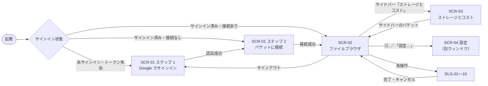

# 03. 画面設計

画面の見た目の正本はデザインシステムの UI キット（`DS: ui_kits/s3-drive/`）である。本章は、UI キットの各画面を実装仕様として整理し、UI キットにない画面・状態（エラー、読み込み中、設定など）を DS の部品で補う。

## 1. 画面一覧

| ID | 名称 | 種別 | DS の出典 | 主な要件 |
|---|---|---|---|---|
| SCR-01 | サインイン（オンボーディング） | メインウィンドウ | `SignIn.jsx`、`signin.html` | REQ-F01、REQ-P01 |
| SCR-02 | ファイルブラウザ | メインウィンドウ | `App.jsx`、`Sidebar.jsx`、`Toolbar.jsx`、`FileList.jsx`、`Inspector.jsx` | REQ-F02、F04〜F07、F09〜F12 |
| SCR-03 | ストレージとコスト | メインウィンドウ | `Dashboard.jsx` | REQ-F02、REQ-F08 |
| SCR-04 | 設定 | 別ウィンドウ | なし | — |
| DLG-01 | 新規フォルダ | ダイアログ | `Dialogs.jsx`（NewFolderDialog） | REQ-F11 |
| DLG-02 | 削除の確認 | ダイアログ | `Dialogs.jsx`（DeleteDialog） | REQ-F07、REQ-F11 |
| DLG-03 | 移動 | ダイアログ | `Dialogs.jsx`（MoveDialog） | REQ-F11 |
| DLG-04 | ストレージクラスを変更 | ダイアログ | `Dialogs.jsx`（StorageClassDialog） | REQ-F03 |
| DLG-05 | バケットを追加 | ダイアログ | なし（SCR-01 ステップ 2 のフォームを流用） | REQ-P01 |
| DLG-06 | 認証情報を更新 | ダイアログ | なし（同上） | REQ-P01 |
| DLG-07 | アーカイブからの取り出し | ダイアログ | なし | REQ-F03、REQ-F06 |
| DLG-08 | 同名の項目がある場合の確認 | ダイアログ | なし | REQ-F05 |
| DLG-09 | バージョンの完全削除の確認 | ダイアログ | なし（DLG-02 と同じ体裁） | REQ-F12 |
| DLG-10 | 名前を変更 | ダイアログ | なし（DLG-01 と同じ体裁） | REQ-F11 |
| MNU-01〜05 | メニュー | メニュー | `App.jsx`（menuItems） | — |
| TST | トースト・通知 | 通知 | `Toast` | — |

「DS の出典」が「なし」のものは DS の既存部品で構成し、実装後に DS へ追加を提案する。

## 2. 画面遷移



起動時は前回表示していた接続とフォルダを復元する。前回の接続が削除されていれば、サイドバーの先頭の接続を開く。

## 3. 共通レイアウト

`DS: components/shell/AppWindow.jsx` の構成に従う。

```text
+--------------+------------------------------------------+---------------+
| o o o        | (1) Toolbar 52px  [drag region]          | (6) Inspector |
|              +------------------------------------------+     280px     |
| (2) Sidebar  | (3) Filter bar (optional)                |               |
|     220px    +------------------------------------------+               |
|   vibrancy   | (4) Content                              |               |
|              |     list / grid / dashboard              |               |
|              +------------------------------------------+               |
|              | (5) Status bar 26px                      |               |
+--------------+------------------------------------------+---------------+
```

| No | 領域 | 仕様 |
|---|---|---|
| 1 | ツールバー | 高さ 52px。タイトルバーを兼ねるドラッグ領域。左右の余白 14／12px、要素間 8px、下端にヘアライン |
| 2 | サイドバー | 幅 220px。上部 52px は信号機ボタン用に空ける。半透明の `--sidebar`（下にネイティブ vibrancy）。右端にヘアライン |
| 3 | フィルタバー | 表示時のみ。背景 `--muted`、余白 8／14px、下端にヘアライン |
| 4 | コンテンツ | 背景 `--background`（不透明） |
| 5 | ステータスバー | 高さ 26px、11px・`--muted-foreground`・中央寄せ、上端にヘアライン |
| 6 | インスペクタ | 幅 280px、ウィンドウの高さいっぱい。左端にヘアライン、背景 `--background` |

ウィンドウ幅による振る舞い（インスペクタの重ね表示など）は [01 §5.5](01-architecture.md#55-ウィンドウ幅による振る舞い) を参照する。

## 4. SCR-01 サインイン

サイドバーを持たないウィンドウ。全面がドラッグ領域で、中央に幅 380px のカラムを置く。

```text
+------------------------------------------------------------+
| o o o                                      (drag region)   |
|                      [ app icon 88 ]                       |
|                      <title 22px bold>                     |
|                      <subtitle 13px muted>                 |
|               (1) step 1  ------  (2) step 2               |
|                                                            |
|  step 1:  [ Google sign-in button  lg / outline / 100% ]   |
|           <hint 11px muted>                                |
|                                                            |
|  step 2:  [ signed-in chip: email            (change) ]    |
|           access key id        [......................]    |
|           secret access key    [......................]    |
|           role ARN (optional)  [......................]    |
|           region [select]      bucket [...............]    |
|           [ connect button  lg / default / 100% ]          |
|           <lock icon> <keychain note 11px>                 |
+------------------------------------------------------------+
```

### 4.1 表示内容

| 要素 | 内容 |
|---|---|
| タイトル | S3 Drive へようこそ |
| サブタイトル | S3 バケットを、いつものドライブのように。 |
| ステップ表示 | 1「アカウント」 → 2「バケットに接続」。完了したステップは success 色のチェック、現在のステップは primary |
| ステップ 1 のボタン | 「Google でサインイン」（lg・outline）。待機中は「ブラウザで認証中…」で無効化し、下に「キャンセル」リンクを出す |
| ステップ 1 のヒント | ブラウザが開きます。認証後、自動でアプリに戻ります。 |
| サインイン中の表示 | 「{メールアドレス} でサインイン中」と「変更」リンク（サインアウトしてステップ 1 に戻る） |
| 接続ボタン | 「接続」（lg・default）。確認中は「接続を確認中…」で無効化する |
| 注記 | 鍵アイコン＋「認証情報は macOS キーチェーンに保存されます」 |

### 4.2 入力項目（ステップ 2）

| 項目 | 部品 | 必須 | 検証 | 備考 |
|---|---|---|---|---|
| アクセスキー ID | Input（等幅） | ○ | `AKIA` で始まる 20 文字の英大文字・数字 | プレースホルダ `AKIA…` |
| シークレットアクセスキー | Input（password） | ○ | 40 文字 | 表示／非表示の切り替えは設けない |
| IAM ロール ARN（任意） | Input（等幅） | — | `arn:aws:iam::<12桁>:role/<名前>` の形式 | ヒント「指定すると AssumeRole で一時認証情報を取得します」 |
| リージョン | NativeSelect | ○ | 一覧から選択 | 既定 ap-northeast-1（東京）。項目は「東京」「大阪」などの日本語名 |
| バケット名 | Input | ○ | 3〜63 文字、英小文字・数字・`.`・`-`、先頭と末尾は英数字 | |
| 詳細設定（折りたたみ） | Input | — | — | 外部 ID（AssumeRole 用）。DS への追加提案 |

### 4.3 接続の確認とエラー表示

「接続」を押すと [04 §2](04-features.md#2-バケット接続と認証情報の管理) の順で確認する。エラーは該当する入力欄の下（DS の Input の `invalid` と `hint`）に表示する。

| 状況 | 表示先 | 文言 |
|---|---|---|
| アクセスキーが無効・署名不一致 | シークレットアクセスキー | 認証に失敗しました。アクセスキーとシークレットキーを確認してください |
| ロールを引き受けられない | IAM ロール ARN | ロールを引き受けられませんでした。信頼ポリシーと権限を確認してください |
| バケットが存在しない | バケット名 | バケットが見つかりません |
| バケットへのアクセス権がない | バケット名 | このバケットへのアクセス権がありません |
| リージョンが違う | リージョン | 自動で正しいリージョン（例: 大阪）に切り替え、「バケットのリージョンに合わせて大阪に変更しました」と表示して続行する |
| 通信できない | フォーム下部 | 接続できませんでした。ネットワークを確認してください |

## 5. SCR-02 ファイルブラウザ

### 5.1 サイドバー

```text
+--------------------+
| o o o              |  <- 52px reserved
| BUCKETS            |  section heading 11px
|  [db] bucket-a  *  |  active row
|  [db] bucket-b     |
|  [+]  add bucket   |
| MANAGE             |
|  [pie] storage&cost|
|                    |
| 248.6 GB used  TYO |  usage meter
| [=========|==|=]   |  stacked by class
| 12,408 objects     |
| (Y) name        ^v |  account button
|     email          |
+--------------------+
```

| 要素 | 仕様 |
|---|---|
| セクション「バケット」 | 登録した接続を 1 行ずつ表示（`database` アイコン、ラベルはバケット名）。表示中の接続は active。行の右クリックで「接続を編集…」「認証情報を更新…」「接続を削除…」（DS への追加提案） |
| 「バケットを追加」 | `plus` アイコン（muted）。DLG-05 を開く |
| セクション「管理」 | 「ストレージとコスト」（`chart-pie`）。SCR-03 を開く |
| 利用容量メーター | 「{合計} GB 使用中」（11px・semibold）と右端にリージョンの短縮名、クラス別の積み上げバー（高さ 5px）、「{件数} オブジェクト」。値は [04 §12](04-features.md#12-利用容量リージョンストレージクラスの表示) の方法で取得し、取得中はスケルトン、取得できないときは「—」 |
| アカウント | 頭文字の丸いアバター（`--azure-500`）、名前、メールアドレス、`chevrons-up-down`。クリックで MNU-03 を開く。Google のプロフィール画像は外部画像の読み込みを避けるため使わない |

### 5.2 ツールバー

ファイル表示時（左から順に）:

| No | 要素 | 部品 | 動作 |
|---|---|---|---|
| 1 | 戻る／進む | IconButton（`chevron-left`／`chevron-right`） | 閲覧履歴を移動。履歴がなければ無効（⌘[／⌘]） |
| 2 | パンくず | Breadcrumbs | 先頭はバケット（`database`）、続いてプレフィックスの各階層。クリックでその階層へ移動 |
| 3 | 余白 | — | ドラッグ領域 |
| 4 | 検索 | Input（`search` アイコン、幅 180px・最小 110px） | 入力でバケット全体を検索（[04 §10](04-features.md#10-検索フィルタ)）。⌘F でフォーカス、Esc で消去 |
| 5 | フィルタ | IconButton（`sliders-horizontal`） | フィルタバーの表示切り替え。条件があるときは active で、ラベルは「フィルタ（{件数}）」 |
| 6 | 表示切り替え | SegmentedControl（`list`／`layout-grid`、アイコンのみ） | リスト／アイコン表示 |
| 7 | 区切り | 0.5px × 18px の線 | — |
| 8 | 新規フォルダ | IconButton（`folder-plus`） | DLG-01（⇧⌘N） |
| 9 | アップロード | Button（default、`upload`）。幅が狭いときは IconButton | ファイル選択ダイアログ（⌘U）。フォルダはメニューの「フォルダをアップロード…」（⌥⌘U）またはドロップで扱う |
| 10 | インスペクタ | IconButton（`panel-right`） | インスペクタの表示切り替え（⌥⌘I） |

ストレージとコスト表示時: タイトル「ストレージとコスト」（13px・semibold）、余白（ドラッグ領域）、接続の選択（NativeSelect・sm・幅 180px）、更新（IconButton `refresh-cw`）。

### 5.3 フィルタバー

`DS: ui_kits/s3-drive/Toolbar.jsx` の FilterBar に従う。

| 要素 | 部品 | 選択肢 |
|---|---|---|
| ラベル | テキスト（12px・muted） | 絞り込み |
| 種類 | NativeSelect（sm） | すべての種類／画像／ムービー／オーディオ／PDF 書類／スプレッドシート／アーカイブ／ソースコード／書類 |
| 拡張子 | Input（sm） | プレースホルダ「拡張子（例: pdf）」 |
| サイズ | NativeSelect（sm） | すべてのサイズ／1 MB 未満／1〜100 MB／100 MB 以上 |
| 期間（更新日） | NativeSelect（sm） | すべての期間／過去 7 日間／過去 30 日間／今年 |
| ストレージクラス | NativeSelect（sm） | すべてのクラス／各クラスの短縮名 |
| クリア | Button（link・sm） | 条件と検索語を消去する |
| 件数 | テキスト（右寄せ） | 「{件数} 件」 |

検索語かフィルタが指定されているときは、ツールバーの下に「{バケット名} 全体を検索中 · {件数} 件 · インデックス {n} 分前に更新（更新）」の 1 行を表示する（インデックスの鮮度表示は DS への追加提案）。

### 5.4 ファイル一覧（リスト／アイコン）

#### リスト表示

| 項目 | 仕様 |
|---|---|
| 見出し行 | 高さ 28px、上部に固定、12px。列: 名前／更新日／サイズ（右寄せ）／種類／ストレージクラス。クリックで並べ替え（同じ列は昇順・降順を切り替え）。並べ替え中の列は foreground 色とシェブロン |
| 列幅 | 標準: `minmax(200px,1fr) 140px 80px 120px 120px`。幅が狭いとき: `minmax(140px,1fr) 124px 72px 112px`（「種類」を省く） |
| 行 | 高さ 28px、内側に角丸 6px。縞模様（`--row-stripe`）、ホバー（`--row-hover`）、選択（`--row-selected`＋白文字。ウィンドウ非アクティブ時は `--row-selected-inactive`） |
| 名前列 | FileIcon（16px）＋名前（末尾を省略）。検索中は親フォルダのパスを muted で併記 |
| 更新日・サイズ・種類 | 12px・tabular-nums。フォルダのサイズは「—」。フォルダの更新日はフォルダマーカーがあればその日時、なければ「—」 |
| ストレージクラス列 | StorageClassBadge（plain）。フォルダは「—」。アーカイブの状態に応じて Badge「取り出しが必要」「復元中」（warning・`clock`）「取り出し済み」を添える |
| 並び順 | フォルダを常に先頭にし、その中で選択した列の順に並べる |

#### アイコン表示

| 項目 | 仕様 |
|---|---|
| 配置 | `repeat(auto-fill, minmax(104px, 1fr))`、間隔 8px、余白 16px |
| タイル | 72×64px・角丸 8px の枠に FileIcon（44px）。選択時は枠を `--row-selected-inactive` で塗る |
| 名前 | 12px・中央寄せ・2 行で省略。選択時は `--row-selected` のピル状 |

#### 操作

| 操作 | 動作 |
|---|---|
| クリック | 単一選択。空白部分のクリックで選択解除 |
| ⌘クリック／⇧クリック | 追加・解除／範囲選択 |
| ↑↓（⇧＋↑↓） | 選択の移動（範囲の拡張） |
| ダブルクリック、⌘↓ | フォルダは開く。ファイルはダウンロードする（DS の振る舞い） |
| 右クリック | 未選択の項目なら選択してから MNU-01。空白部分では MNU-02 |
| Finder からのドロップ | 一覧全体に重ね表示（内側 8px、角丸 10px、2px の破線 primary、primary 8% の塗り）。`cloud-upload` アイコンと「ドロップして {バケット}/{プレフィックス} にアップロード」。フォルダ行に重ねた場合はそのフォルダにアップロードする（DS への追加提案） |

#### 状態

| 状態 | 表示 |
|---|---|
| 読み込み中（最初のページ） | スケルトン行 |
| 読み込み中（続きのページ） | 取得済みの行を表示したまま、ステータスバーに「{件数} 項目を読み込み中…」 |
| 空のフォルダ | `cloud-upload`（32px）＋「ファイルをドロップしてアップロード」 |
| 検索結果なし | `search-x`（32px）＋「一致する項目はありません」 |
| 読み込み失敗 | `circle-alert`（32px）＋エラー文言＋「再試行」ボタン |
| 隠しファイル | 名前が `.` で始まる項目は、設定「隠しファイルを表示」（⇧⌘.）が有効な場合のみ表示する |
| 削除済みの項目 | 表示メニュー「削除済みの項目を表示」が有効な場合、最新が削除マーカーのキーを薄く（不透明度 0.55）表示し Badge「削除マーカー」を付ける。操作は「復元」と「完全に削除」のみ |

#### ステータスバー

「{件数} 項目」に、選択時は「 · {n} 項目を選択（{合計サイズ}）」、通常表示時は「 · {リージョンの短縮名}」を続ける。

### 5.5 アップロードの入口

| 入口 | 対象 |
|---|---|
| ツールバー「アップロード」、⌘U、MNU-02「アップロード…」 | ファイル（複数選択可） |
| ファイルメニュー「フォルダをアップロード…」、⌥⌘U | フォルダ（配下を再帰的に） |
| Finder からのドロップ | ファイルとフォルダ |
| メニューバー常駐の「アップロード…」 | ファイル（表示中のフォルダへ） |

### 5.6 インスペクタ

選択状態によって表示を切り替える（`DS: ui_kits/s3-drive/Inspector.jsx`）。

#### (a) ファイルを 1 つ選択

| 要素 | 仕様 |
|---|---|
| 見出し | FileIcon（36px）、名前（13px・semibold・選択可）、「{種類} · {サイズ}」 |
| タブ | SegmentedControl（block）: 「詳細」「バージョン ({件数})」 |
| 詳細タブ | ラベル列 88px のグリッド（12px）。項目は下表 |
| 操作 | 「ダウンロード」（default）、「移動…」「削除」（outline、削除は destructive の文字色）。取り出しが必要なアーカイブでは主ボタンを「取り出し…」（DLG-07）にし、ダウンロードを無効にする |

| 詳細の項目 | 値 | 出典 |
|---|---|---|
| サイズ | 4.2 MB（4,200,000 バイト） | DS |
| 作成日 | [04 §9](04-features.md#9-メタデータ表示) の規則で求めた日時 | DS |
| 更新日 | LastModified | DS |
| クラス | StorageClassBadge＋「変更…」リンク（DLG-04） | DS |
| Content-Type | 等幅・選択可 | DS |
| キー | 等幅・選択可 | DS |
| ETag | 等幅・選択可 | DS |
| 暗号化 | SSE-S3 (AES-256)／SSE-KMS（キー ID） | DS |
| バージョン ID | 等幅・選択可（バージョニング有効時） | 追加 |
| 取り出し状態 | 取り出しが必要／復元中（{開始日時}〜）／取り出し済み（{有効期限}まで） | 追加（アーカイブのみ） |
| ユーザー定義メタデータ | `x-amz-meta-*` の一覧（折りたたみ） | 追加 |

#### バージョンタブ

| 要素 | 仕様 |
|---|---|
| バージョニング無効時 | 「このバケットはバージョニングが無効です。」 |
| 行 | 左に点（最新は primary、ほかは gray）、日時（12px・semibold）＋Badge「最新」（success）または「削除マーカー」（destructive）、下段に「{サイズ} · {バージョン ID}」（ID は等幅 10.5px・選択可・省略）。最新の行は `--muted` で塗る |
| 行の操作 | IconButton（sm）: 「このバージョンを復元」（`rotate-ccw`、最新では無効）、「このバージョンをダウンロード」（`download`、削除マーカーでは無効）、「このバージョンを完全に削除」（`trash-2`、バージョンが 1 つだけなら無効、DLG-09） |
| 件数が多い場合 | 100 件ずつ表示し、末尾に「さらに読み込む」 |

#### (b) フォルダを選択、または何も選択していない（現在のフォルダ）

見出し（フォルダアイコン、名前、「{件数} 項目 · {合計サイズ}」）と、バケット／リージョン／プレフィックス（等幅）／バージョニング（有効／無効／一時停止）を表示する。フォルダを選択している場合だけ「移動…」「削除」を表示する。項目数と合計サイズは非同期に求め、求まるまでは「計算中…」とする。

#### (c) 複数選択

見出し「{n} 項目」「複数選択（{合計サイズ}）」と、「ダウンロード」（default）、「移動…」、「ストレージクラスを変更…」、「削除」（ghost・destructive の文字色）。

## 6. SCR-03 ストレージとコスト

`DS: ui_kits/s3-drive/Dashboard.jsx` に従う。余白 24px、要素間 16px、最大幅 1,000px。

```text
+-------------------------------------------------------------------+
| [KPI: usage] [KPI: cost this month] [KPI: region] [KPI: versioning]|
+-------------------------------------------------------------------+
| By storage class                         <unit price note>         |
| [==========================|=====|===|==]                          |
| class | size | share | price / GB-month | monthly                    |
+---------------------------------+---------------------------------+
| Cost breakdown (month)          | Daily cost        [forecast]    |
|  storage / requests /           |  | || ||| || |:::::            |
|  transfer out / retrieval       |  1   8   15   22   30           |
|  total                          |                                 |
+---------------------------------+---------------------------------+
| <footnote: source / delay / scope / last updated>                  |
+-------------------------------------------------------------------+
```

| 要素 | 仕様 | データ（[04 §12〜13](04-features.md#13-コスト表示)） |
|---|---|---|
| KPI「利用容量」 | `hard-drive`。「{GB}」と「{件数} オブジェクト」 | CloudWatch（BucketSizeBytes、NumberOfObjects） |
| KPI「今月の推定コスト」 | `receipt`。当月累計と「前月比 {±x.x}%」（増加は destructive、減少は success の色） | Cost Explorer |
| KPI「リージョン」 | `globe`。短縮名とリージョンコード | HeadBucket |
| KPI「バージョニング」 | `history`。有効／無効／一時停止と補足（「削除・上書きから復元可能」／「バケット設定で有効化」） | GetBucketVersioning |
| ストレージクラス別 | 積み上げバー（高さ 10px）と表（クラス／容量／割合／単価 / GB·月／月額）。注記「単価は {リージョン} リージョンの公開料金」 | CloudWatch × Price List API |
| コスト内訳（{n} 月） | ストレージ／リクエスト（PUT / GET / LIST）／データ転送（アウト）／取り出し／合計 | Cost Explorer（使用タイプ別） |
| 日別コスト | 当月の日数分の棒。確定日は primary、未来日は枠線のみ。ツールチップ「9/12 $0.257」。右上に Badge（outline）「月末予測 ${金額}」 | Cost Explorer（日別・予測） |
| 脚注 | 「コストは AWS Cost Explorer の見積もりです。反映まで最大 24 時間かかります。」に加え、対象範囲（「このバケット（タグ: {キー}={値}）」または「アカウント全体の S3（{リージョン}）」）と最終更新日時 | — |

状態:

- カードごとにスケルトンを表示し、取得できたものから描画する。
- 権限がない・未有効化などで取得できないカードは、カード内に理由と対処を表示する（例: 「Cost Explorer にアクセスする権限がありません（ce:GetCostAndUsage）」）。
- CloudWatch のメトリクスがまだない（作成直後のバケット）場合は、検索インデックスから集計し「インデックスから集計（現行バージョンのみ）」と注記する。
- 設定で Cost Explorer を無効にしている場合、コスト系のカードは「設定で無効になっています」と表示し、ストレージクラス別の月額（単価 × 容量）だけを示す。

## 7. SCR-04 設定

別ウィンドウ（560×480px、サイズ変更不可）。上部の SegmentedControl でタブを切り替える。DS に定義がないため DS の部品（Switch の設定行、NativeSelect、Button）で構成する。

| タブ | 項目 | 部品 | 既定値 |
|---|---|---|---|
| 一般 | 外観 | SegmentedControl（自動／ライト／ダーク） | 自動 |
| 一般 | ダウンロード先 | パス表示＋「変更…」 | `~/Downloads` |
| 一般 | 隠しファイルを表示 | Switch | オフ |
| 一般 | メニューバーに表示 | Switch | オン |
| 転送 | 同時に転送するファイル数 | NativeSelect（1〜8） | 3 |
| 転送 | 1 ファイルあたりの並列数 | NativeSelect（1〜16） | 4 |
| 転送 | マルチパートにする最小サイズ | NativeSelect（8／16／32／64 MB） | 16 MB |
| 転送 | アップロード時のストレージクラス | NativeSelect（7 クラス） | Standard |
| 転送 | ファイル名を NFC に正規化する | Switch | オン |
| 転送 | .DS_Store を除外する | Switch | オン |
| 転送 | 完了時に通知する | Switch | オン |
| 接続 | 接続の一覧（バケット、リージョン、認証方式） | 一覧＋「編集…」「削除…」「バケットを追加…」 | — |
| コスト | Cost Explorer を使う | Switch＋注記「1 リクエストあたり $0.01 の料金がかかります」 | オン |
| コスト | 自動更新の間隔 | NativeSelect（3／6／12／24 時間） | 6 時間 |
| コスト | コスト配分タグ（接続ごと） | Input（キー／値） | 未設定 |
| 詳細 | 検索インデックス（接続ごとの件数・更新日時） | 表示＋「再構築」「削除」 | — |
| 詳細 | インデックスの自動更新 | NativeSelect（検索開始時に 60 分以上経過していれば更新／手動のみ） | 60 分 |
| 詳細 | ログレベル | NativeSelect（標準／詳細） | 標準 |
| 詳細 | ログ | 「ログフォルダを開く」 | — |
| 詳細 | キャッシュ | 「キャッシュを削除」 | — |
| 詳細 | アップデートを自動で確認 | Switch＋「今すぐ確認」 | オン |

変更は即時に反映して保存する（macOS の設定ウィンドウの慣例に合わせ、「保存」ボタンは置かない）。

## 8. ダイアログ

共通仕様（`DS: components/feedback/Dialog.jsx`）: ウィンドウ内のオーバーレイ（`--overlay`）、角丸 12px、余白 20px、左上に色付きタイルのアイコン、主ボタンは右端。Return で主ボタン、Esc でキャンセル。

### DLG-01 新規フォルダ

| 項目 | 内容 |
|---|---|
| 開き方 | ツールバー「新規フォルダ」、⇧⌘N、MNU-02 |
| アイコン／タイトル | `folder-plus`／新規フォルダ |
| 説明 | 現在の場所にプレフィックスを作成します。 |
| 入力 | 「名前」（既定「新規フォルダ」、開いた時点で全選択） |
| 検証 | 空、`/` を含む、`.` または `..`、同じ階層に同名のフォルダがある（「同じ名前のフォルダがあります」）、キー全体が 1,024 バイトを超える |
| ボタン | キャンセル（outline）／作成（default、検証エラー時は無効） |
| 結果 | トースト: 「{名前}」を作成しました。作成したフォルダを選択する |

### DLG-02 削除の確認

| 項目 | 内容 |
|---|---|
| 開き方 | ⌘⌫、MNU-01「削除」、インスペクタ「削除」 |
| アイコン／トーン | `trash-2`／destructive |
| タイトル | 1 項目: 「{名前}」を削除しますか？／複数: {n} 項目を削除しますか？ |
| 説明 | バージョニング有効かつ全バージョン削除なし: 「削除マーカーが作成されます。以前のバージョンからいつでも復元できます。」。それ以外: 「この操作は取り消せません。」 |
| 追加の説明 | フォルダを含む場合: 「フォルダ内の {n} 項目も削除されます。」（DS への追加提案） |
| 入力 | バージョニング有効時のみ Checkbox「すべてのバージョンを完全に削除する」（既定オフ） |
| ボタン | キャンセル／削除（チェック時は「完全に削除」、destructive） |
| 結果 | トースト「{n} 項目を削除しました」（説明「削除マーカーを作成」または「全バージョンを削除」）。件数が多い場合は進捗付きトースト |

### DLG-03 移動

| 項目 | 内容 |
|---|---|
| 開き方 | MNU-01「移動…」、インスペクタ「移動…」 |
| アイコン | `folder-input` |
| タイトル | 1 項目: 「{名前}」を移動／複数: {n} 項目を移動 |
| 説明 | 移動先のフォルダを選択してください。 |
| 本体 | フォルダのツリー（最大高 240px、行 28px、1 階層ごとに 18px 字下げ、先頭は「/（ルート）」）。階層は展開時に読み込む。移動元のフォルダとその配下、全項目の現在の親フォルダは選択不可（不透明度 0.4） |
| 注意書き | バージョニング有効時: 「移動先では新しいバージョン履歴になります。移動元には削除マーカーが残ります。」。取り出していないアーカイブを含む場合: 「取り出されていないアーカイブの {n} 項目は移動できません」（いずれも DS への追加提案） |
| ボタン | キャンセル／移動（移動先を選ぶまで無効） |
| 結果 | トースト「{n} 項目を移動しました」（説明「→ {移動先}」） |

### DLG-04 ストレージクラスを変更

| 項目 | 内容 |
|---|---|
| 開き方 | MNU-01、インスペクタのクラス欄「変更…」、複数選択時のインスペクタ |
| アイコン／幅 | `layers`／500px |
| タイトル | ストレージクラスを変更 |
| 説明 | 1 項目: 「{名前}」のクラスを変更します。／複数: {n} 項目のクラスを変更します。いずれも続けて「オブジェクトのコピーとして実行され、リクエスト料金がかかります。」 |
| 本体 | 7 クラスのラジオリスト。各行: ラジオ、StorageClassBadge（正式名）、現在のクラスには Badge「現在」、取り出しに時間がかかるクラスには Badge（warning・`clock`）「取り出し {時間}」、2 行目に説明と「最低保存期間 {日数}」、右端に「${単価}/GB」。選択行は primary の内枠（1.5px）と 6% の塗り |
| 注意書き（条件付き） | バージョニング有効時: 「変更前のバージョンは元のクラスのまま残り、料金が発生します。」／最低保存期間のあるクラスから変更する場合: 「最低保存期間より前に変更すると、残りの期間分の料金がかかります。」／取り出していないアーカイブを含む場合: 対象外の件数／1,000 件以上: 「大量のオブジェクトにはライフサイクルルールの利用をおすすめします。」（いずれも DS への追加提案） |
| ボタン | キャンセル／変更（現在と同じクラスなら無効） |
| 結果 | トースト「ストレージクラスを変更しました」（説明はクラスの正式名） |

クラスの説明（`DS: ui_kits/s3-drive/data.js` の CLASS_INFO）:

| クラス | 説明 | 最低保存期間 | 取り出し |
|---|---|---|---|
| Standard | 頻繁にアクセスするデータ向け | なし | ミリ秒 |
| Intelligent-Tiering | アクセス頻度に応じて自動で階層を移動 | なし | ミリ秒 |
| Standard-IA | アクセス頻度は低いが即時取得が必要なデータ | 30 日 | ミリ秒 |
| One Zone-IA | 単一 AZ に保存。再作成可能なデータ向け | 30 日 | ミリ秒 |
| Glacier Instant Retrieval | 四半期に一度程度のアクセス。即時取得 | 90 日 | ミリ秒 |
| Glacier Flexible Retrieval | 年に数回のアクセス。取り出しに数分〜数時間 | 90 日 | 数分〜12 時間 |
| Glacier Deep Archive | 長期保管用。最も低コスト | 180 日 | 12〜48 時間 |

### DLG-05 バケットを追加

| 項目 | 内容 |
|---|---|
| 開き方 | サイドバー「バケットを追加」、設定の接続タブ |
| アイコン／タイトル | `database`／バケットを追加 |
| 本体 | SCR-01 ステップ 2 と同じ入力項目。既存の認証情報がある場合は先頭に SegmentedControl「新しいアクセスキー／既存の認証情報」を置き、後者では NativeSelect で認証情報を選ぶ |
| ボタン | キャンセル／接続 |
| 結果 | サイドバーに追加し、その接続を開く |

### DLG-06 認証情報を更新

| 項目 | 内容 |
|---|---|
| 開き方 | MNU-03「認証情報を更新…」、認証エラーのトーストの「更新…」 |
| アイコン／タイトル | `key-round`／認証情報を更新 |
| 説明 | この認証情報を使う接続: {バケット名の一覧} |
| 本体 | アクセスキー ID、シークレットアクセスキー、IAM ロール ARN（任意） |
| ボタン | キャンセル／更新（GetCallerIdentity で確認してから保存） |

### DLG-07 アーカイブからの取り出し

| 項目 | 内容 |
|---|---|
| 開き方 | 取り出していないアーカイブのダウンロード・移動・クラス変更時、MNU-01「取り出し…」 |
| アイコン | `archive-restore` |
| タイトル | 1 項目: 「{名前}」を取り出しますか？／複数: {n} 項目を取り出しますか？ |
| 説明 | 「{クラス名} のオブジェクトは、ダウンロードする前に取り出しが必要です。」 |
| 入力 | 取り出し速度（NativeSelect）: 迅速（1〜5 分、Glacier Flexible Retrieval のみ）／標準（Flexible Retrieval は 3〜5 時間、Deep Archive は 12 時間以内）／大容量（Flexible Retrieval は 5〜12 時間、Deep Archive は 48 時間以内）。保持日数（1〜30 日、既定 7 日。Intelligent-Tiering のアーカイブ階層では非表示） |
| 注記 | 取り出しには料金がかかります。完了したら通知します。 |
| ボタン | キャンセル／取り出し |
| 結果 | 対象に Badge「復元中」を表示し、完了時に macOS の通知とトーストで知らせる |

### DLG-08 同名の項目がある場合の確認

| 項目 | 内容 |
|---|---|
| 開き方 | アップロード先・移動先に同名の項目がある場合（ダウンロードは確認せず連番を付けて保存する。[04 §5.1](04-features.md#51-保存先と名前)） |
| タイトル | 「{名前}」はすでに存在します。置き換えますか？ |
| 説明 | S3 側でバージョニング有効: 「置き換えても以前のバージョンは残ります。」。それ以外: 「置き換えると元の項目は失われます。」 |
| 入力 | Checkbox「残りの {n} 件にも適用する」（複数件のとき） |
| ボタン | 中止／スキップ／両方を残す／置き換える（default） |
| 「両方を残す」 | 「name (1).ext」の形式で連番を付ける |

### DLG-09 バージョンの完全削除の確認

| 項目 | 内容 |
|---|---|
| アイコン／トーン | `trash-2`／destructive |
| タイトル | このバージョンを完全に削除しますか？ |
| 説明 | 「{日時} のバージョン（{サイズ}）を削除します。この操作は取り消せません。」。最新のバージョンを削除する場合は「1 つ前のバージョンが最新になります。」を加える |
| ボタン | キャンセル／完全に削除 |

### DLG-10 名前を変更

| 項目 | 内容 |
|---|---|
| 開き方 | MNU-01「名前を変更…」、Return（1 項目選択時） |
| アイコン／タイトル | `pencil`／名前を変更 |
| 入力 | 「名前」（現在の名前。拡張子を除いた部分を選択した状態） |
| 検証 | DLG-01 と同じ |
| 注意書き | フォルダの場合: 「フォルダ内の {n} 項目をコピーして名前を変更します。」。バージョニング有効時は DLG-03 と同じ注意書き |
| ボタン | キャンセル／変更 |
| 結果 | トースト「名前を変更しました」 |

## 9. メニュー

コンテキストメニューとアカウントメニューは DS の Menu（幅 220px、ホバーで primary 塗り）で描画する。アプリのメニューバーとメニューバー常駐はネイティブのメニューにする。

### 9.1 MNU-01 項目のコンテキストメニュー

| 項目 | アイコン | ショートカット | 表示条件 | 出典 |
|---|---|---|---|---|
| 開く | `folder-open` | ⌘↓ | フォルダ | DS |
| ダウンロード | `download` | ⌘D | 常に | DS |
| 移動… | `folder-input` | | 常に | DS |
| 名前を変更… | `pencil` | Return | 1 項目 | 追加 |
| ストレージクラスを変更… | `layers` | | 常に | DS |
| 取り出し… | `archive-restore` | | 取り出していないアーカイブを含む | 追加 |
| バージョン履歴 | `history` | | ファイル 1 項目 | DS |
| キーをコピー | `copy` | ⌥⌘C | 常に | 追加 |
| （区切り） | | | | |
| 削除／{n} 項目を削除 | `trash-2`（destructive） | ⌘⌫ | 常に | DS |

削除済みの項目では「復元」（`rotate-ccw`）と「完全に削除」（destructive）だけを表示する。

### 9.2 MNU-02 一覧の空白部分

| 項目 | アイコン | ショートカット | 出典 |
|---|---|---|---|
| 新規フォルダ | `folder-plus` | ⇧⌘N | DS |
| アップロード… | `upload` | ⌘U | DS |
| フォルダをアップロード… | `folder-up` | ⌥⌘U | 追加 |
| （区切り） | | | |
| 再読み込み | `refresh-cw` | ⌘R | 追加 |

### 9.3 MNU-03 アカウント

サイドバー下部のアカウントボタンから、ボタンの上に開く。

| 項目 | アイコン | ショートカット |
|---|---|---|
| 設定… | `settings` | ⌘, |
| 認証情報を更新… | `key-round` | |
| （区切り） | | |
| サインアウト | `log-out` | |

### 9.4 アプリのメニューバー

Tauri の Menu API で作成する。項目の有効・無効は、フロントエンドが選択状態や表示中の画面を Rust 側へ通知して更新する。項目が選ばれたらフロントエンドへイベントで通知する（[05 §4](05-backend-ipc.md#4-イベントとチャネル)）。

| メニュー | 項目 |
|---|---|
| S3 Drive | S3 Drive について／アップデートを確認…／設定… ⌘,／サービス／S3 Drive を隠す ⌘H／ほかを隠す ⌥⌘H／すべてを表示／S3 Drive を終了 ⌘Q |
| ファイル | 新規フォルダ ⇧⌘N／アップロード… ⌘U／フォルダをアップロード… ⌥⌘U／ダウンロード ⌘D／場所を指定してダウンロード… ⇧⌘D／名前を変更…／移動…／ストレージクラスを変更…／取り出し…／削除 ⌘⌫／ウインドウを閉じる ⌘W |
| 編集 | 取り消す ⌘Z／やり直す ⇧⌘Z／カット ⌘X／コピー ⌘C／ペースト ⌘V／すべてを選択 ⌘A／キーをコピー ⌥⌘C／検索 ⌘F |
| 表示 | アイコン ⌘1／リスト ⌘2／インスペクタを表示 ⌥⌘I／フィルタを表示 ⌥⌘F／隠しファイルを表示 ⇧⌘.／削除済みの項目を表示／再読み込み ⌘R／フルスクリーンにする ⌃⌘F |
| 移動 | 戻る ⌘[／進む ⌘]／親フォルダ ⌘↑／選択項目を開く ⌘↓／ストレージとコスト |
| ウインドウ | しまう ⌘M／拡大／縮小／すべてを手前に移動 |
| ヘルプ | S3 Drive ヘルプ／ログフォルダを開く／問題を報告… |

編集メニューのカット・コピー・ペースト・取り消しは OS 定義の項目（PredefinedMenuItem）で作る。macOS では編集メニューがないと入力欄で ⌘C／⌘V が効かないためである。表示切り替えのショートカットは Finder に合わせる（⌘1 がアイコン、⌘2 がリスト）。

### 9.5 MNU-05 メニューバー常駐

`DS: assets/menubar-glyph.svg` をテンプレート画像としてメニューバーに表示する（設定でオフにできる）。

| 項目 | 内容 |
|---|---|
| S3 Drive を開く | メインウィンドウを表示して前面に出す |
| （状態表示・選択不可） | 「転送中: {n} 件（残り {サイズ}）」または「転送はありません」 |
| アップロード… | ファイルを選んで、表示中のフォルダへアップロード |
| 設定… | 設定ウィンドウ |
| S3 Drive を終了 | 転送中は確認する |

## 10. キーボードショートカット

| ショートカット | 動作 | 出典 |
|---|---|---|
| ⌘U | アップロード | DS |
| ⌥⌘U | フォルダをアップロード | 追加 |
| ⇧⌘N | 新規フォルダ | DS |
| ⌘D | ダウンロード | DS |
| ⇧⌘D | 場所を指定してダウンロード | 追加 |
| ⌘⌫ | 削除 | DS |
| ⌘A | すべてを選択 | DS |
| Esc | メニュー・ダイアログを閉じる／検索語を消去 | DS |
| ⌘, | 設定 | DS |
| ⌘F／⌥⌘F | 検索にフォーカス／フィルタバーの表示切り替え | 追加 |
| ⌘1／⌘2 | アイコン表示／リスト表示 | 追加 |
| ⌥⌘I | インスペクタの表示切り替え | 追加 |
| ⇧⌘. | 隠しファイルの表示切り替え | 追加 |
| ⌘R | 再読み込み | 追加 |
| ⌘[／⌘] | 戻る／進む | 追加 |
| ⌘↑／⌘↓ | 親フォルダへ／選択項目を開く | 追加 |
| Return | 名前を変更（1 項目選択時） | 追加 |
| ↑↓／⇧↑↓ | 選択の移動／範囲選択 | 追加 |
| ⌥⌘C | キーをコピー | 追加 |

入力欄にフォーカスがあるときは、⌘A・⌘⌫・Return・矢印キーを入力欄の標準動作に任せる。ツールチップにはショートカットを併記する（例: 「アップロード ⌘U」）。

## 11. トースト・通知

右下（16px 内側）に積み、間隔 8px、幅 340px。同時に表示するのは 4 件までとし、それを超える分は「ほか {n} 件」にまとめる。

| 種類 | 表示 | 自動で閉じる |
|---|---|---|
| 転送中 | アイコン `upload`／`download`。タイトル: {n} 件をアップロード中／「{名前}」をダウンロード中。説明: {現在のファイル} · {完了サイズ} / {合計サイズ}。進捗バー。アクション: キャンセル | 閉じない |
| 転送完了 | tone success、`circle-check`、「アップロードが完了しました」（説明「{n} 件 → {バケット}/{プレフィックス}」）。ダウンロードはアクション「Finder に表示」 | 3.2 秒 |
| 操作の完了 | 「3 項目を移動しました」「ストレージクラスを変更しました」「バージョンを復元しました」（説明「{日時} の内容が最新になりました」）など | 3.2 秒 |
| 一部失敗 | tone warning、「{n} 項目のうち {m} 項目を移動できませんでした」、アクション「詳細」（失敗した項目と理由の一覧） | 閉じない |
| エラー | tone destructive、`circle-alert`、「{操作}できませんでした」と理由、アクション「再試行」または「詳細」。認証エラーはアクション「更新…」（DLG-06） | 閉じない |

ウィンドウが前面にないときは、転送の完了とアーカイブの取り出し完了を macOS の通知でも知らせる（設定でオフにできる）。
