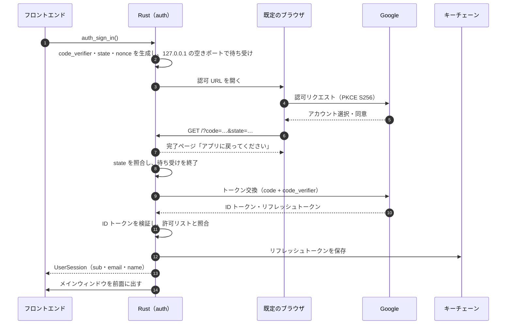
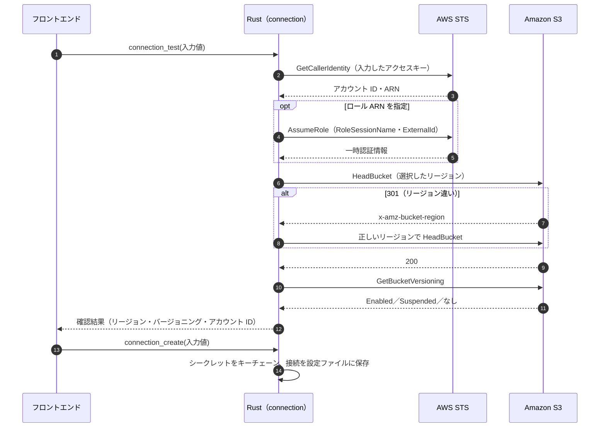
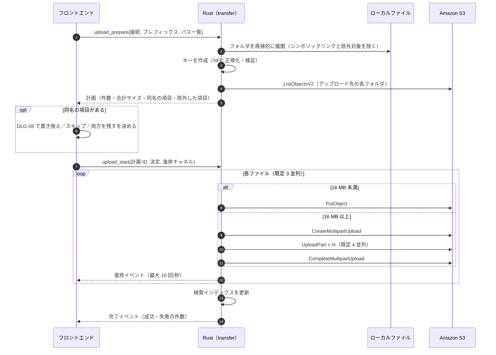
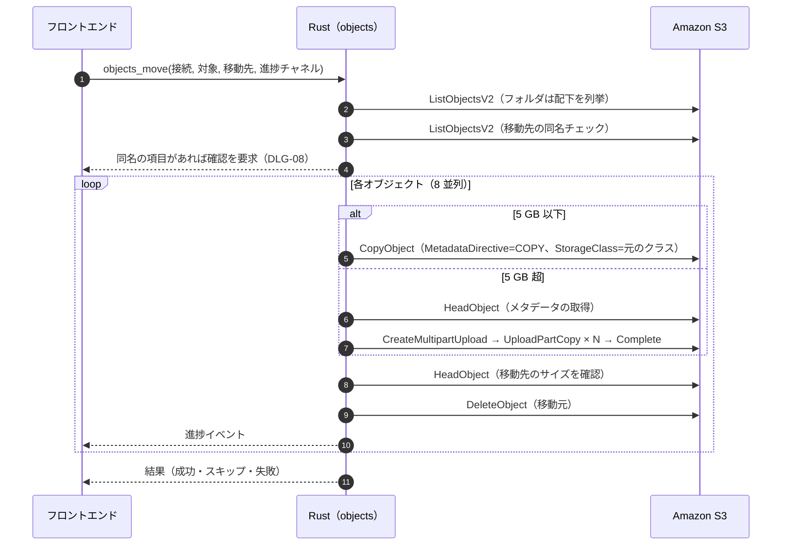
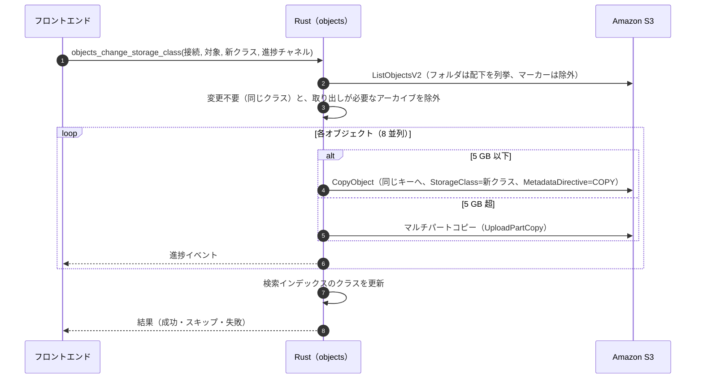
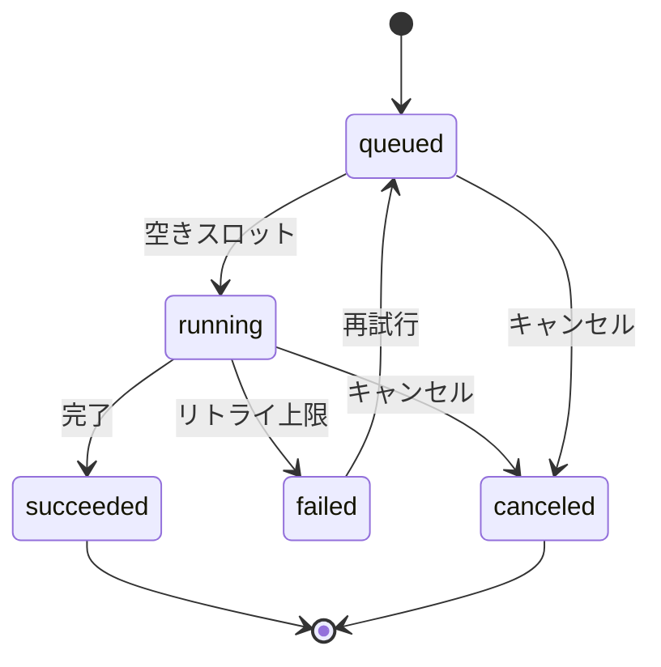

# 04. 機能設計

各機能の処理方式を定義する。処理はすべて Rust（`s3drive-core`）で行い、フロントエンドは IPC コマンド（[05-backend-ipc.md](05-backend-ipc.md)）を呼び出す。API 名は S3 などのオペレーション名（例: `ListObjectsV2`）で記す。AWS SDK for Rust ではスネークケースのメソッド（例: `list_objects_v2()`）になる。

## 1. ユーザ認証（Google）

### 1.1 概要

| 項目 | 内容 |
|---|---|
| 目的 | アプリの利用者を Google アカウントで認証する（REQ-F01）。サインインしないとアプリを使えない |
| 方式 | OAuth 2.0 認可コードフロー + PKCE、システムブラウザ、ループバック（127.0.0.1）リダイレクト。スコープは `openid email profile` |
| 本人情報の使い道 | ① アプリ利用の可否の判定（任意の許可リスト）② 接続・認証情報の名前空間（Google の `sub`）③ AssumeRole のセッション名（CloudTrail での追跡） |
| 保存するもの | リフレッシュトークン（キーチェーン）、表示用のプロフィール（名前・メールアドレス） |

セキュリティ上の詳細（PKCE、state、nonce、ID トークンの検証）は [07 §2](07-security.md#2-google-認証oauth-20--pkce) を参照する。

### 1.2 サインイン

- 待ち受けは 5 分でタイムアウトする。SCR-01 の「キャンセル」で中断できる。
- `access_type=offline` と `prompt=select_account consent` を毎回付け、アカウントを選ばせてリフレッシュトークンを得る。サインアウトでリフレッシュトークンを取り消す（§1.4）ため、次のサインインでも同意画面を経てリフレッシュトークンを発行させる必要がある（Google は同意済みのアカウントには `consent` なしでリフレッシュトークンを返さない）。

### 1.3 起動時のセッション復元

1. キーチェーンにリフレッシュトークンがあれば、トークンエンドポイントで新しい ID トークンを取得して検証する。
2. 成功すればサインイン済みとして SCR-02（接続がなければ SCR-01 のステップ 2）を表示する。
3. `invalid_grant`（失効・取り消し。同意画面が「テスト」のときは 7 日で失効）の場合は SCR-01 のステップ 1 を表示する。
4. 通信できない場合は SCR-01 にエラーと「再試行」を表示する。

### 1.4 サインアウト

1. 転送中（待機中を含む）のジョブがあれば「サインアウトしますか？」で確認し、サインアウトする場合はキャンセルする（キャンセルは Rust 側がまとめて行う）。転送がなければ確認しない。
2. リフレッシュトークンを Google で取り消し（revoke）、キーチェーンから削除する。
3. メモリ上のセッションと AWS クライアントのキャッシュを破棄する。
4. SCR-01 を表示する。接続と AWS の認証情報は `sub` ごとに残し、同じアカウントで再度サインインしたときに使う。

### 1.5 例外

| 状況 | 扱い |
|---|---|
| ブラウザを閉じた・タイムアウト | 「サインインがキャンセルされました」。ボタンを元に戻す |
| 同意を拒否（`access_denied`） | 同上 |
| state の不一致 | 要求を破棄し、ブラウザに「サインインできませんでした」のページを返す。待ち受けは続け、正しい要求が来るかタイムアウトまで待つ（第三者の要求でサインインを中断させないため） |
| 許可リストにないアカウント | 「このアカウントは利用が許可されていません」。トークンを取り消す |
| トークン交換・検証の失敗 | 「サインインに失敗しました」。詳細はログに記録する |

## 2. バケット接続と認証情報の管理

### 2.1 データ

| データ | 主な項目 | 保存先 |
|---|---|---|
| 接続 | ID、所有者（Google の `sub`）、バケット名、リージョン、認証情報 ID、ロール ARN（任意）、外部 ID（任意）、表示順、コスト配分タグ（任意）、既定のストレージクラス（任意） | 設定ファイル |
| 認証情報 | ID、所有者、アクセスキー ID | 設定ファイル |
| シークレットアクセスキー | 認証情報 ID に対応 | キーチェーン |

1 つの認証情報を複数の接続で共有できる（同じ IAM ユーザで複数のバケットを使う場合）。詳細は [06-data.md](06-data.md) を参照する。

### 2.2 接続の確認

| 失敗した段階 | エラーコード | 画面での表示先 |
|---|---|---|
| GetCallerIdentity（`InvalidClientTokenId`、`SignatureDoesNotMatch`） | `CREDENTIALS_INVALID` | シークレットアクセスキー |
| AssumeRole（`AccessDenied`） | `ROLE_ASSUME_DENIED` | IAM ロール ARN |
| HeadBucket（404） | `BUCKET_NOT_FOUND` | バケット名 |
| HeadBucket（403） | `BUCKET_ACCESS_DENIED` | バケット名 |
| GetBucketVersioning（403） | —（バージョニング状態を「不明」として続行） | — |
| 通信エラー | `NETWORK` | フォーム下部 |

保存したあとにバケットのリージョンが変わった場合（同じ名前で別のリージョンに作り直したなど）も、接続を開いたときの `HeadBucket` で補正し、画面で知らせる（[01 §6.1](01-architecture.md#61-aws-クライアントの管理)）。

### 2.3 セッション名と監査

- AssumeRole の `RoleSessionName` は `s3drive-{Google のメールアドレス}` とする（使えない文字は `-` に置き換え、64 文字で切る）。CloudTrail で、どの Google アカウントが操作したかを追跡できる。
- 任意で `SourceIdentity` にメールアドレスを設定できる（接続ごとの設定、既定はオフ。設定の「接続」で AssumeRole を使う接続ごとに切り替える。[03 §7](03-screens.md#7-scr-04-設定)）。ロールの信頼ポリシーで `sts:SetSourceIdentity` の許可が必要なため、既定では使わない。
- 一時認証情報の有効期間は 1 時間とする。取り直しは自前のプロバイダ `AssumeRoleCredentials` が行い、期限の 5 分前と、`ExpiredToken` を受け取ったときに取り直す（SDK の `AssumeRoleProvider` は `SourceIdentity` を指定できないため使わない。[01 §6.1](01-architecture.md#61-aws-クライアントの管理)、[01 §7.1](01-architecture.md#71-エラーハンドリング)）。

### 2.4 変更と削除

| 操作 | 処理 |
|---|---|
| 認証情報の更新（DLG-06） | GetCallerIdentity で確認後、キーチェーンを上書きし、その認証情報を使う全接続の AWS クライアントを作り直す |
| 接続の編集 | 接続の確認（§2.2）をやり直してから保存する |
| 接続の削除 | 接続を削除し、どの接続からも使われなくなった認証情報はキーチェーンから削除する。その接続の検索インデックスとキャッシュも削除する |

## 3. ファイル一覧・フォルダ表示

### 3.1 取得方法

`ListObjectsV2` を次の条件で呼ぶ。

| パラメータ | 値 |
|---|---|
| `Prefix` | 表示中のフォルダ（ルートは空文字） |
| `Delimiter` | `/` |
| `MaxKeys` | 1000 |
| `ContinuationToken` | 2 ページ目以降 |
| `EncodingType` | `url`（XML で扱えない文字を含むキーに備え、受信後にデコードする） |
| `OptionalObjectAttributes` | `RestoreStatus`（アーカイブの取り出し状態を一覧で表示するため） |

| 応答 | 表示 |
|---|---|
| `CommonPrefixes` | フォルダ（名前はプレフィックスの最後の階層） |
| `Contents` | ファイル（キー、サイズ、更新日時、ETag、ストレージクラス、取り出し状態）。キーが表示中のプレフィックスと同じもの（現在のフォルダのフォルダマーカー）は除く |

- 1 ページ目を受け取った時点で描画し、残りのページは順に取得して追加する（TanStack Query の infinite query）。
- 表示名は NFC に正規化して表示する。API 呼び出しには元のキーをそのまま使う。

### 3.2 フォルダの扱い

- フォルダはプレフィックスで表す。空のフォルダは、キー末尾が `/` の 0 バイトのオブジェクト（フォルダマーカー）で表す。
- フォルダの更新日は、検索インデックスにフォルダマーカーの日時があれば表示し、なければ「—」とする（`CommonPrefixes` には日時がないため）。
- 名前が `.` で始まる項目は、隠しファイルの表示が有効な場合のみ表示する。

### 3.3 削除済みの項目の表示

表示メニュー「削除済みの項目を表示」が有効なときは、`ListObjectVersions`（`Prefix` = 表示中のフォルダ、`Delimiter` = `/`）も取得し、最新のバージョンが削除マーカーのキーを削除済みの項目として一覧に加える。現在の一覧にないプレフィックスは削除済みのフォルダとして加える。

### 3.4 並べ替え

- 並べ替えはフロントエンドで、取得済みの項目に対して行う。フォルダを常に先頭にする。
- 名前は `Intl.Collator('ja', { numeric: true, sensitivity: 'base' })` で比較する（「file2」が「file10」より前になる）。

### 3.5 更新

- 一覧のキャッシュは 30 秒とし、⌘R、ウィンドウが前面に戻ったとき（期限切れの場合）、同じフォルダへの変更操作の後に取り直す。
- 1 つのフォルダに 10 万件を超える項目がある場合も取得を続けるが、ステータスバーに「項目が多いため、検索を使うと速く見つけられます」と表示する。

## 4. アップロード

### 4.1 処理の流れ

アップロードは「準備」と「開始」の 2 段階で行い、準備の結果で同名の項目があれば DLG-08 で扱いを決める。

### 4.2 転送の方式

| 項目 | 方式 |
|---|---|
| 単一 PUT とマルチパートの境界 | 16 MB（設定で 8〜64 MB）。画面の表記と同じく 10 進（1 MB = 1,000,000 バイト。[02 §9.2](02-ui-foundation.md#92-書式)）で、境界以上のファイルをマルチパートにする |
| パートサイズ | 8 MiB を基本とし、パート数が 10,000 を超える場合は「ファイルサイズ ÷ 10,000」を 1 MiB 単位で切り上げた値にする（最大 5 GiB。50 TB まで扱える） |
| 本文の読み込み | `ByteStream::read_from().path().offset().length()` でパートごとにファイルの範囲を読む |
| 整合性 | SDK の既定のチェックサム（CRC32）を使い、パートごとに検証させる。`CompleteMultipartUpload` 直前にローカルファイルのサイズと更新日時が変わっていないことを確認する |
| 進捗 | 本文を読み出すストリームで送信バイト数を数え、間引いてチャネルに送る |
| キャンセル・失敗 | 実行中のリクエストを中断し、`AbortMultipartUpload` を呼ぶ。アップロード ID は完了まで SQLite に記録する（[§14.5](#145-アプリが中断した転送の後始末)） |

### 4.3 付与するメタデータ

| 項目 | 値 |
|---|---|
| `Content-Type` | 拡張子から推定（`mime_guess`）。不明なら `application/octet-stream` |
| `StorageClass` | 設定「アップロード時のストレージクラス」（設定の「転送」で接続ごとに上書き可。[03 §7](03-screens.md#7-scr-04-設定)）。既定は STANDARD |
| `x-amz-meta-s3drive-mtime` | ローカルファイルの更新日時（RFC 3339）。ダウンロード時に復元する |
| `x-amz-meta-s3drive-created` | 新規のキーはアップロード日時。置き換えの場合は既存オブジェクトの作成日（§9.2）を引き継ぐ |
| 暗号化 | 指定しない（バケットの既定の暗号化に従う） |

### 4.4 キーの作成と検証

- キーは「アップロード先のプレフィックス＋ドロップ元からの相対パス（区切りは `/`）」とする。
- 各階層の名前を NFC に正規化する（設定で無効にできる）。macOS のファイル名は濁点などが分解された形（NFD）のことがあり、そのままでは他の環境で入力した名前と別のキーになるためである。
- キーが UTF-8 で 1,024 バイトを超える場合と、制御文字を含む場合はアップロードしない（除外した項目として報告する）。
- `.DS_Store`（設定で変更可）とシンボリックリンクは除外する。

### 4.5 例外

| 状況 | 扱い |
|---|---|
| パートの送信失敗 | パートごとに最大 5 回リトライ（[01 §7.2](01-architecture.md#72-リトライ)）。それでも失敗したらそのファイルを失敗にする |
| 送信中にファイルが変更された | `FILE_CHANGED` として失敗にする |
| 読み取り権限がない・読み取りエラー | そのファイルを失敗にして続行する |
| `AccessDenied` | 権限の問題は他のファイルでも起こるため、ジョブ全体を止めて `failed` にする。送らなかったファイルも「再試行」の対象に含める |
| アプリの終了 | 確認のうえ、未完了のマルチパートアップロードを中止する（転送の再開は Phase 4） |

## 5. ダウンロード

### 5.1 保存先と名前

- 既定の保存先は設定のダウンロード先（`~/Downloads`）。「場所を指定してダウンロード…」（⇧⌘D）ではフォルダを選ばせる。
- 保存先に同名のファイルがある場合は、ブラウザと同じく「name (1).ext」のように連番を付けて保存する（確認しない）。
- バージョンを指定したダウンロードは「{名前} ({YYYY-MM-DD HH.mm}){拡張子}」とする（macOS のファイル名で `:` を避けるため時刻は `.` 区切り）。

### 5.2 処理の流れ

1. 一覧またはメタデータ（HeadObject）でストレージクラスと取り出し状態を確認する。取り出していないアーカイブは DLG-07 を表示し、ダウンロードしない。
2. 保存先に一時ファイル（`{名前}.s3drive-download`）を作って書き込む。
   - 64 MB 未満: `GetObject` を 1 回。`ChecksumMode=ENABLED` で SDK にチェックサムを検証させる。
   - 64 MB 以上: 16 MiB ごとの範囲指定 `GetObject`（`Range`）を 4 並列で行い、ファイルの該当位置に書き込む。途中でオブジェクトが置き換わらないよう、全リクエストに `If-Match: {ETag}`（バージョン指定時は `VersionId`）を付ける。
3. 書き込み後にサイズを確認し、一時ファイルを本来の名前に変更する。
4. ファイルの更新日時を `x-amz-meta-s3drive-mtime`（なければ LastModified）に設定する。
5. トースト「ダウンロードが完了しました」を表示し、「Finder に表示」で保存場所を開けるようにする。

### 5.3 フォルダ・複数選択

- フォルダは、プレフィックス配下を `ListObjectsV2`（区切り文字なし）で列挙し、保存先に「{フォルダ名}/」以下の階層を再現して保存する。フォルダマーカーは空のフォルダとして作る。
- S3 のキーには `.`・`..` の階層も使えるため、そのまま保存先に連結すると保存先の外に書き込めてしまう。名前（キーの各階層）が空・`.`・`..` の項目は保存せず、`INVALID_NAME`（「保存先の外を指す名前のため、ダウンロードしませんでした」）として失敗の一覧に示す（[05 §3.9](05-backend-ipc.md#39-ローカルパスの受け渡し)）。
- 複数選択は、選択した各項目を同じ保存先に保存する（フォルダは階層を保つ）。

### 5.4 例外

| 状況 | 扱い |
|---|---|
| `InvalidObjectState`（アーカイブ） | DLG-07 を表示する |
| `PreconditionFailed`（ダウンロード中に置き換わった） | 最初から 1 回だけやり直す |
| 空き容量不足 | 開始前に空き容量を確認し、不足していれば「ディスクの空き容量が足りません」 |
| 保存先に書き込めない | 「保存先に書き込めません」 |
| キャンセル・失敗 | 一時ファイルを削除する |

## 6. 削除

### 6.1 ファイルの削除

| バケットの状態 | 「すべてのバージョンを完全に削除する」 | 処理 | 結果 |
|---|---|---|---|
| バージョニング有効 | オフ | `DeleteObjects`（バージョン指定なし、1 リクエスト 1,000 件、Quiet） | 削除マーカーが作られ、以前のバージョンから復元できる |
| バージョニング有効 | オン | キーごとに `ListObjectVersions`（Prefix = キー、キーが完全一致するものだけ）で全バージョンと削除マーカーを列挙し、`DeleteObjects`（バージョン指定あり） | 完全に削除される |
| 一時停止 | オフ | 同上（バージョン指定なし） | null バージョンは削除され、削除マーカーが作られる。それ以前のバージョンは残る |
| 無効（一度も有効化していない） | —（チェックボックスなし） | `DeleteObjects` | 完全に削除される |

### 6.2 フォルダの削除

1. プレフィックス配下を `ListObjectsV2`（区切り文字なし。全バージョン削除の場合は `ListObjectVersions`）で列挙する。フォルダマーカーも含める。
2. 1,000 件ずつ `DeleteObjects` を 4 並列で呼び、削除件数を進捗として通知する。
3. DLG-02 に表示する件数は、検索インデックスまたは事前の列挙から求める。求まらない場合は「多数の項目」と表示し、ジョブの中で数える。

### 6.3 後処理と例外

- 成功したキーを検索インデックスから削除し、一覧・フォルダ情報・メトリクスのキャッシュを無効にする。
- 件数はキーで数える（全バージョンの削除でも、1 つのキーの複数のバージョンを 1 項目とする）。すべて成功した場合のトーストの件数は、確認ダイアログと同じく選択した項目の数とする（DLG-02）。
- 一部の項目が失敗した場合（`DeleteObjects` の `Errors`）は、tone warning のトーストで件数を示し、「詳細」で一覧を表示する。
- `AccessDenied` は必要な権限（`s3:DeleteObject`、全バージョン削除では `s3:DeleteObjectVersion`）を示して知らせる。

## 7. フォルダ管理（作成・削除・移動）

### 7.1 作成

`PutObject`（Key = 現在のプレフィックス＋名前＋`/`、本文なし）でフォルダマーカーを作る。名前の検証は DLG-01 の規則に従う。作成後は一覧に即時反映し、キャッシュを無効にする。

### 7.2 削除

§6.2 のとおり。

### 7.3 移動（名前の変更を含む）

S3 には移動や名前変更の API がないため、コピーと削除で実現する。

| 項目 | 方針 |
|---|---|
| 移動先のキー | 移動先プレフィックス＋（元のキーから移動元の親プレフィックスを除いた部分） |
| ストレージクラス | `CopyObject` はクラスを指定しないと STANDARD になるため、元のクラスを必ず指定する |
| メタデータ・タグ | `MetadataDirective=COPY`、`TaggingDirective=COPY`。マルチパートコピーでは自動で引き継がれないため、HeadObject で取得して指定する |
| 暗号化 | 元が SSE-KMS で既定と異なるキーを使っている場合は、同じキー ID を指定する |
| アーカイブ | 取り出していない Glacier Flexible Retrieval／Deep Archive（および Intelligent-Tiering のアーカイブ階層）はコピーできないため、スキップして報告する |
| 原子性 | 1 オブジェクトずつ「コピー → 確認 → 削除」を行うため、途中で失敗すると一部だけ移動した状態になる。結果に失敗した項目を示し、再実行できるようにする |
| バージョン履歴 | 履歴は移動しない。移動先では新しい履歴になり、移動元には削除マーカーと以前のバージョンが残る（DLG-03 で注意書きを表示） |
| 名前の変更 | 移動先を「同じ親フォルダ＋新しい名前」とした移動として扱う |
| 禁止事項 | フォルダを自身またはその配下へ移動することはできない（DLG-03 で選択不可にし、Rust 側でも検証する） |

## 8. ストレージクラスの変更とアーカイブの取り出し

### 8.1 対象とするクラス

DS の `STORAGE_CLASSES` の 7 クラス（STANDARD、INTELLIGENT_TIERING、STANDARD_IA、ONEZONE_IA、GLACIER_IR、GLACIER、DEEP_ARCHIVE）を変更先として扱う。REDUCED_REDUNDANCY（旧クラス）などそれ以外のクラスのオブジェクトは表示のみ行い、「その他」のバッジで示す。

### 8.2 変更の処理

- 同じキーへのコピーで新しいクラスのオブジェクトを作る。バージョニング有効時は新しいバージョンになり、変更前のバージョンは元のクラスのまま残る。
- CloudWatch の容量は 1 日 1 回の更新のため、ダッシュボードのクラス別容量への反映は翌日以降になる。ダッシュボードにはその旨を注記する。

### 8.3 ダイアログで示す注意事項

| 条件 | 内容 |
|---|---|
| バージョニング有効 | 変更前のバージョンは元のクラスのまま残り、料金が発生する |
| 最低保存期間のあるクラスから変更 | Standard-IA／One Zone-IA は 30 日、Glacier Instant Retrieval／Glacier Flexible Retrieval は 90 日、Deep Archive は 180 日より前に変更・削除すると、残りの期間分の料金がかかる |
| 小さなオブジェクトを IA 系へ変更 | Standard-IA、One Zone-IA、Glacier Instant Retrieval は 128 KB 未満でも 128 KB として課金される |
| 1,000 件以上 | ライフサイクルルールの利用をすすめる（アプリはルールを作成しない） |

### 8.4 アーカイブの取り出し

| 項目 | 方式 |
|---|---|
| 要求 | `RestoreObject`（`Days` = 保持日数、`GlacierJobParameters.Tier` = Expedited／Standard／Bulk）。Intelligent-Tiering のアーカイブ階層は `Days` を指定しない（取り出すと高頻度アクセス階層に戻る） |
| 状態の確認 | 一覧は `ListObjectsV2` の `RestoreStatus`、詳細は `HeadObject` の `Restore`（`ongoing-request="true"` なら取り出し中、`"false"` と `expiry-date` があれば取り出し済み） |
| 追跡 | 要求を SQLite に記録し、アプリの起動中は 15 分ごとに未完了のものを `HeadObject` で確認する。`Restore` に `expiry-date` があれば完了として macOS の通知とトーストで知らせ、一覧を更新する。`Restore` がまだ現れない（要求直後）ものは確認を続け、3 日たっても始まらないもの、削除されたもの、アーカイブでないクラスで上書きされたものは、知らせずに確認をやめる |
| 例外 | `RestoreAlreadyInProgress` は取り出し中として扱う。`GlacierExpeditedRetrievalNotAvailable` は「迅速な取り出しは現在利用できません。標準を選んでください」 |

取り出したコピーは保持日数の間だけ存在する。その間にダウンロード・移動・クラス変更を行う。

## 9. メタデータ表示

### 9.1 取得

- ファイルを 1 つ選択したら `HeadObject`（バージョン指定時は `VersionId`、`ChecksumMode=ENABLED`）を呼ぶ。矢印キーで選択を素早く動かした場合に備え、150 ms 待ってから要求する。
- 取得する項目: `ContentLength`、`ContentType`、`LastModified`、`ETag`、`StorageClass`（省略時は STANDARD）、`VersionId`、`ServerSideEncryption`、`SSEKMSKeyId`、`Metadata`（`x-amz-meta-*`）、`Restore`、`ArchiveStatus`、チェックサム（CRC32 など）。
- 結果は 60 秒キャッシュする。

### 9.2 作成日の決め方

S3 はオブジェクトの作成日を保持しない（`LastModified` は最後に書き込まれた日時）。本アプリでは次の順で作成日を決める。

| 優先 | 条件 | 作成日 |
|---|---|---|
| 1 | バージョン一覧を取得済み（バージョニング有効・一時停止） | 最も古いバージョンの `LastModified` |
| 2 | `x-amz-meta-s3drive-created` がある | その値（本アプリでアップロード・置き換えたもの） |
| 3 | 上記以外 | `LastModified`（更新日と同じになる旨をツールチップで示す） |

バージョン数はインスペクタのタブ（「バージョン (5)」）に表示するため、ファイル選択時にバージョン一覧も取得する。そのため多くの場合は優先 1 で決まる。

### 9.3 フォルダの情報

- 項目数は一覧の直下の件数とする。
- 合計サイズは、検索インデックスがあればそこから集計する。なければプレフィックス配下を `ListObjectsV2` で列挙して集計する（最大 10 万件。超えた場合は「{n} 件以上」と表示）。

## 10. 検索・フィルタ

### 10.1 方式

S3 にはサーバー側の検索機能がないため、接続ごとにバケット内の全キーを SQLite に保存した検索インデックスを作り、ローカルで検索する（D5）。

| 項目 | 方式 |
|---|---|
| 作成 | `ListObjectsV2`（区切り文字なし）でバケット全体を列挙する。ルートを区切り文字ありで列挙してから、最上位のプレフィックスごとに 4 並列で列挙する。1,000 件ずつトランザクションで書き込み、進捗を通知する |
| 削除されたキーの反映 | 走査ごとに世代番号を付け、走査完了後に古い世代の行を削除する |
| アプリ自身の変更 | アップロード・削除・移動・クラス変更の完了時に、該当する行を即時に更新する |
| 鮮度 | 検索を始めたとき、前回の全件走査から設定の時間（既定 60 分）が過ぎていれば、背景で走査し直す。結果は現在のインデックスから即時に返し、走査後に更新する |
| 初回 | インデックスがない接続で初めて検索したときに作成を始める。作成中は「インデックスを作成中… {件数} 件」と表示し、作成済みの範囲の結果を定期的に更新して表示する |
| 規模の目安 | 100 万件で LIST 1,000 回（数分程度、料金はごくわずか）。インデックスは数百 MB になりうるため、設定で件数と使用容量を示し削除できるようにする |

### 10.2 検索条件

| 条件 | UI | 検索方法 |
|---|---|---|
| 名前 | 検索欄 | 正規化した名前（§10.3）の部分一致。3 文字以上は FTS5（trigram）、2 文字以下は `instr`（`LIKE` の特殊文字 `%`・`_` を検索語として扱うため） |
| 種類 | フィルタ | 種類に対応する拡張子の一覧（[02 §8.2](02-ui-foundation.md#82-ファイル種別の判定)）で絞る |
| 拡張子 | フィルタ | 先頭の `.` を除き小文字にした値と一致 |
| サイズ | フィルタ | 1 MB 未満／1〜100 MB／100 MB 以上（10 進。1 MB = 1,000,000 バイト） |
| 期間 | フィルタ | 更新日が過去 7 日間／過去 30 日間／今年 |
| ストレージクラス | フィルタ | 一致 |
| 範囲 | — | バケット全体（DS の仕様）。現在のフォルダ以下に限る検索は将来拡張 |

- 名前だけで検索し、フィルタを指定していない場合は、名前が一致するフォルダも結果に含める（DS の仕様）。フォルダはインデックス作成時に親プレフィックスの一覧から作る。
- 並び順は一覧と同じ規則とする。フォルダを先頭にし、名前は自然順（数字の並びを数値として比べる照合順序 `NATURAL_ORDER`）で並べる。
- 1,000 件ずつ返す。フォルダは最初のページの先頭にだけ最大 200 件を含め、offset・limit はファイルだけに適用する（件数には返したフォルダの数だけを加える）。画面は一覧の末尾付近まで表示したら続きのページを取得する。

### 10.3 正規化

名前と検索語の両方を、Unicode 正規化（NFKC）と小文字化してから比較する。全角英数字と半角英数字は同じものとして扱う。ひらがなとカタカナは区別する。

## 11. バージョン管理

### 11.1 前提

`GetBucketVersioning` の結果（有効／一時停止／無効）で扱いを変える。無効の場合、バージョンタブには「このバケットはバージョニングが無効です。」とだけ表示する。バケットのバージョニング設定はアプリから変更しない。

### 11.2 バージョン一覧

- `ListObjectVersions`（Prefix = キー、`MaxKeys` = 1000、続きは `KeyMarker`／`VersionIdMarker`）で取得し、キーが完全に一致するものだけを残す（前方一致で別のキーも返るため）。
- `Versions` と `DeleteMarkers` を合わせて新しい順に並べ、`IsLatest` のものに「最新」を付ける。
- バージョニングを有効にする前からあるオブジェクトは、バージョン ID が `null` と表示される。

### 11.3 以前のバージョンの復元

- `CopyObject`（`CopySource` = `{バケット}/{キー}?versionId={ID}`、同じキーへ、`MetadataDirective=COPY`、`StorageClass` = そのバージョンのクラス）で、選んだバージョンの内容を新しい最新バージョンとして作る。5 GB を超える場合はマルチパートコピーにする。
- そのバージョンが取り出していないアーカイブの場合は、先に DLG-07 で取り出す。
- 完了したらトースト「バージョンを復元しました」（説明「{日時} の内容が最新になりました」）。

### 11.4 バージョンの削除

`DeleteObject`（`VersionId` を指定）で完全に削除する（DLG-09 で確認）。最新のバージョンを削除すると、1 つ前のバージョンが最新になる。`s3:DeleteObjectVersion` の権限が必要。

### 11.5 削除済みの項目の復元

| 操作 | 処理 |
|---|---|
| 復元 | 最新の実体のバージョンより新しい削除マーカーを `DeleteObject`（削除マーカーの `VersionId`）で取り除く。コピーを作らないため追加の容量は発生しない |
| 完全に削除 | そのキーの全バージョンと削除マーカーを削除する（§6.1 の全バージョン削除と同じ） |

### 11.6 例外

| 状況 | 扱い |
|---|---|
| MFA Delete が有効 | バージョンの削除は失敗する。「MFA Delete が有効なため、アプリからはバージョンを削除できません」 |
| Object Lock で保護されている | 「このバージョンは保護期間中のため削除できません」 |

## 12. 利用容量・リージョン・ストレージクラスの表示

### 12.1 リージョン

接続時の `HeadBucket` の `BucketRegion` を使う。リージョンコードから日本語名（アジアパシフィック (東京)）と短縮名（東京）への対応表をアプリに同梱する。

### 12.2 利用容量（CloudWatch）

`GetMetricData` を 1 回呼び、次のメトリクスをまとめて取得する（CloudWatch のクライアントはバケットのリージョンで作る）。

| メトリクス | ディメンション | 期間・統計 |
|---|---|---|
| `AWS/S3` `BucketSizeBytes` | `BucketName`、`StorageType`（下表の各値） | 86,400 秒・Average。直近 3 日のうち最新のデータポイント |
| `AWS/S3` `NumberOfObjects` | `BucketName`、`StorageType=AllStorageTypes` | 同上 |

`StorageType` の値は DS の 7 クラスに次のようにまとめる。

| DS のクラス | 集計する StorageType |
|---|---|
| STANDARD | `StandardStorage`、`GlacierS3ObjectOverhead`、`DeepArchiveS3ObjectOverhead`、`IntAAS3ObjectOverhead`、`IntDAAS3ObjectOverhead`（アーカイブのメタデータ分は Standard の料金で課金されるため） |
| INTELLIGENT_TIERING | `IntelligentTieringFAStorage`、`IntelligentTieringIAStorage`、`IntelligentTieringAIAStorage`、`IntelligentTieringAAStorage`、`IntelligentTieringDAAStorage`、`IntAAObjectOverhead`、`IntDAAObjectOverhead` |
| STANDARD_IA | `StandardIAStorage`、`StandardIASizeOverhead` |
| ONEZONE_IA | `OneZoneIAStorage`、`OneZoneIASizeOverhead` |
| GLACIER_IR | `GlacierInstantRetrievalStorage`、`GlacierIRSizeOverhead` |
| GLACIER | `GlacierStorage`、`GlacierObjectOverhead`、`GlacierStagingStorage` |
| DEEP_ARCHIVE | `DeepArchiveStorage`、`DeepArchiveObjectOverhead`、`DeepArchiveStagingStorage` |
| その他 | `ReducedRedundancyStorage` |

- この容量は非現行バージョンと未完了のマルチパートアップロードを含み、1 日 1 回更新される（前日分）。ダッシュボードにその旨を注記する。
- メトリクスがない（作成直後のバケット）か権限がない場合は、検索インデックスからクラス別に集計する（現行バージョンのみ）。インデックスもなければ「—」とし、ダッシュボードからインデックスを作成できるようにする（[03 §6](03-screens.md#6-scr-03-ストレージとコスト)）。
- インデックスの更新が完了したとき（`index://updated`）は、利用容量を取り直す。

### 12.3 表示箇所

| 箇所 | 表示内容 |
|---|---|
| サイドバー | 合計容量、リージョンの短縮名、クラス別の積み上げバー、オブジェクト数 |
| ストレージとコスト | KPI（利用容量・リージョン）、クラス別の表 |
| 一覧・インスペクタ | オブジェクトごとのストレージクラス |

## 13. コスト表示

### 13.1 データソース

| 表示 | 取得方法 |
|---|---|
| 今月の推定コスト | Cost Explorer `GetCostAndUsage`（期間: 当月 1 日〜今日、`MONTHLY`、`UnblendedCost`）。下のコスト内訳と同じ要求の合計 |
| 前月比 | 前月の同じ日数分（前月 1 日〜前月の同日）を同じ条件で取得して比較する |
| コスト内訳 | 当月分を `GroupBy: USAGE_TYPE` で取得し、§13.2 の規則で分類する |
| 日別コスト | 当月分を `DAILY` で取得する |
| 月末予測 | `GetCostForecast`（期間: 今日〜翌月 1 日、`UNBLENDED_COST`、`MONTHLY`）に当月累計を加える |
| クラス別の月額 | CloudWatch のクラス別容量（GB）× 単価（§13.3）による見積もり |

共通のフィルタ:

- `SERVICE` = `Amazon Simple Storage Service` かつ `REGION` = バケットのリージョン。
- 接続にコスト配分タグが設定されていれば、そのタグ（キーと値）も条件に加え、「タグ {キー}={値} が付いた S3」のコストとする。同じタグ（キーと値）のバケットが複数あれば合算されるため、バケット単位のコストにするには値をバケットごとに変える。設定されていなければ「アカウント全体の S3（{リージョン}）」と明示する。
- バケットに付いているタグは読み取らない（どのタグがコスト配分タグとして有効かは S3 の権限だけでは判別できないため）。接続の設定で指定したタグだけを使う。

### 13.2 使用タイプの分類

使用タイプ（例: `APN1-TimedStorage-SIA-ByteHrs`）のリージョン接頭辞を除き、含まれる語で分類する。

| 含まれる語 | 分類 |
|---|---|
| `TimedStorage` | ストレージ |
| `Requests` | リクエスト（PUT / GET / LIST） |
| `DataTransfer`、`Out-Bytes` | データ転送（アウト） |
| `Retrieval`、`Restore` | 取り出し |
| 上記以外（`EarlyDelete` など） | その他（0 でない場合のみ表示） |

### 13.3 単価（Price List API）

- `pricing:GetProducts`（`ServiceCode=AmazonS3`、`regionCode` = バケットのリージョン、`productFamily=Storage`）で取得し、`volumeType` 属性でクラスを識別して GB・月あたりの単価を得る（`volumeType` とクラスの対応は実装時に実データで確定する）。
- 段階料金は最初の段階（0〜50 TB）の単価を使う。
- 7 日間キャッシュする。取得できない場合はビルド時に同梱した単価表を使い、「単価は {日付} 時点の公開料金」と注記する。

### 13.4 取得のタイミングと料金

- Cost Explorer の API は 1 リクエストあたり $0.01 かかり、ダッシュボードの 1 回の更新で 4 リクエスト（$0.04。当月累計と内訳は `GroupBy: USAGE_TYPE` の 1 回の結果から求める）を使う。使用タイプ別の結果にページングがあればその分増えるため、画面（「更新」のツールチップ、「取得」の横）と README では「1 回あたり約 $0.05」と案内する。
- 意図しない課金を避けるため、Cost Explorer への問い合わせは**ユーザーが「更新」（初回は「取得」）を押したときだけ**行う。起動時、ダッシュボードを開いたとき、時間の経過では自動で取得しない。
- 取得した結果は SQLite に保存し、次に「更新」するまで表示し続ける（有効期限は設けない）。表示には取得日時を添える。
- 利用容量（CloudWatch、1 時間キャッシュ）と単価（Price List、無料）は従来どおり自動で取得する。「更新」はこれらも取り直す。
- 設定で Cost Explorer の利用を無効にできる（[03 §6](03-screens.md#6-scr-03-ストレージとコスト)）。

### 13.5 前提と制約

| 項目 | 内容 |
|---|---|
| Cost Explorer | アカウントで有効化されている必要がある（初回の有効化後、データが揃うまで時間がかかる） |
| 反映の遅れ | 最大 24 時間 |
| コスト配分タグ | バケットにタグが付いていて、かつ Billing でタグのキーを有効化した期間のデータだけが集計される（有効化前の期間は、管理アカウントのバックフィルで最大 12 か月さかのぼれる）。有効化はキー単位で、Organizations では管理アカウントだけが行える。バケットごとに見るには、キーを共通にして値をバケットごとに変える（設定手順は [README](../../README.md#4-バケットごとのコストを表示する)） |
| 予測 | 十分な履歴がないと予測できない。その場合は予測のバッジを表示しない |
| 通貨 | 米ドル（`UnblendedCost` の単位） |
| 組織のメンバーアカウント | 管理アカウントの設定で Cost Explorer へのアクセスが制限されている場合は、権限エラーとして表示する |

## 14. 転送管理

### 14.1 状態遷移

### 14.2 並列数とキュー

- 転送全体でファイル単位の並列数を制限する（既定 3）。1 ファイル内のパートの並列数は既定 4。
- 先に登録したものから順に実行する。アップロードとダウンロードは同じキューで扱う。

### 14.3 進捗の表示

- ジョブ（ユーザーの 1 回の操作）ごとに、完了バイト数／合計バイト数、現在のファイル名、速度（直近 5 秒の移動平均）、残り時間を計算する。
- トーストとメニューバー常駐の状態表示に使う（[03 §11](03-screens.md#11-トースト通知)）。

### 14.4 キャンセルと終了

- キャンセルは、実行中のリクエストの中断、`AbortMultipartUpload`、一時ファイルの削除を行う。
- アプリの終了時に転送中のものがあれば確認する。終了する場合は 3 秒を上限に中止処理を行う。

### 14.5 アプリが中断した転送の後始末

本アプリが開始したマルチパートアップロードの ID は、完了するまで SQLite に記録する。キャンセル・失敗時の `AbortMultipartUpload` が通信断などで失敗した場合は記録を残す。起動時（サインイン後）に未完了の記録があれば `AbortMultipartUpload` を呼び、成功した（またはすでにない）ものの記録を消す。他のツールが開始したアップロードには触れない。未完了のアップロードの自動削除は、バケットのライフサイクルルール（`AbortIncompleteMultipartUpload`）を推奨する。

### 14.6 転送の再開（Phase 4）

アップロード ID と完了したパート（番号・ETag・チェックサム）を記録しておき、再起動後に `ListParts` で照合して残りのパートだけを送る。ダウンロードは一時ファイルと完了した範囲を記録して再開する。

## 15. AWS API 対応表

| 機能 | API | IAM アクション |
|---|---|---|
| 接続の確認 | `sts:GetCallerIdentity`、`sts:AssumeRole`、`HeadBucket`、`GetBucketVersioning`、`GetBucketEncryption` | （GetCallerIdentity は不要）、`sts:AssumeRole`、`s3:ListBucket`、`s3:GetBucketVersioning`、`s3:GetEncryptionConfiguration` |
| 一覧・検索インデックス | `ListObjectsV2` | `s3:ListBucket` |
| 削除済みの項目・バージョン | `ListObjectVersions` | `s3:ListBucketVersions` |
| メタデータ | `HeadObject` | `s3:GetObject`（バージョン指定時は `s3:GetObjectVersion`） |
| アップロード・フォルダ作成 | `PutObject`、`CreateMultipartUpload`、`UploadPart`、`CompleteMultipartUpload`、`AbortMultipartUpload` | `s3:PutObject`、`s3:AbortMultipartUpload` |
| ダウンロード | `GetObject` | `s3:GetObject`、`s3:GetObjectVersion` |
| 削除 | `DeleteObjects`、`DeleteObject` | `s3:DeleteObject`、`s3:DeleteObjectVersion` |
| 移動・クラス変更・バージョン復元 | `CopyObject`、`UploadPartCopy` | `s3:GetObject`、`s3:GetObjectVersion`、`s3:PutObject`、`s3:GetObjectTagging`、`s3:PutObjectTagging` |
| アーカイブの取り出し | `RestoreObject` | `s3:RestoreObject` |
| 未完了のアップロード | `ListMultipartUploads`、`ListParts` | `s3:ListBucketMultipartUploads`、`s3:ListMultipartUploadParts` |
| 利用容量 | `cloudwatch:GetMetricData` | `cloudwatch:GetMetricData` |
| コスト | `ce:GetCostAndUsage`、`ce:GetCostForecast` | 同左 |
| 単価 | `pricing:GetProducts` | 同左 |

IAM ポリシーの例は [07 §4](07-security.md#4-iam-ポリシー) を参照する。
