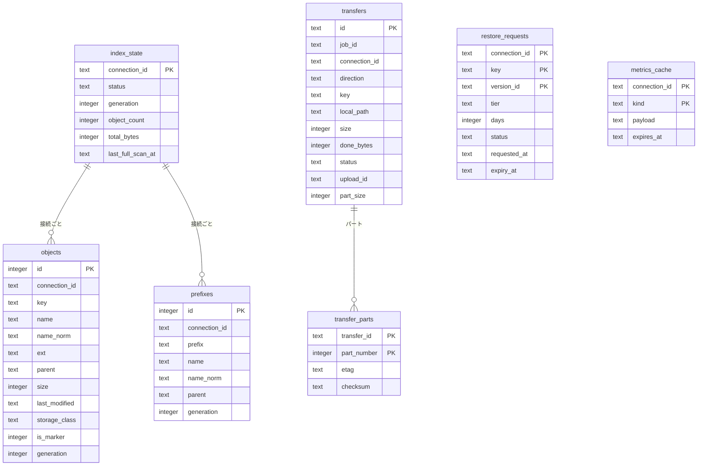

# 06. データ設計

本アプリはサーバーを持たず、データの正本は S3 にある。端末には設定、秘密情報、検索インデックス、キャッシュ、転送の記録だけを保存する。

## 1. 保存先の一覧

| データ | 保存先 | 形式 | 秘密情報 |
|---|---|---|---|
| Google のリフレッシュトークン | macOS キーチェーン | 汎用パスワード項目 | ○ |
| AWS のアクセスキー ID とシークレットアクセスキー | macOS キーチェーン | 汎用パスワード項目（JSON） | ○ |
| 設定、接続、認証情報の表示用情報 | `~/Library/Application Support/io.github.sh1gekicks.s3drive/settings.json` | JSON（`s3drive-core` の `SettingsStore`） | × |
| 検索インデックス、転送の記録、取り出し要求、メトリクス・コストのキャッシュ | 同じフォルダの `s3drive.db` | SQLite | ×（オブジェクトのキー＝ファイル名を含む） |
| ウィンドウの位置・サイズ | 同じフォルダ（tauri-plugin-window-state） | JSON | × |
| ログ | `~/Library/Logs/io.github.sh1gekicks.s3drive/` | テキスト | ×（[01 §7.3](01-architecture.md#73-ログ) のマスキングを適用） |
| ダウンロード中の一時ファイル | 保存先フォルダの `*.s3drive-download` | — | × |

- 検索インデックスにはファイル名（キー）が含まれるため、端末のディスク暗号化（FileVault）を前提とする。`Application Support` は iCloud と同期されない。
- 開発ビルドはバンドル ID に `.dev` を付け、保存先とキーチェーンのサービス名を本番と分ける。

## 2. 設定ファイル

Tauri に依存しないよう `s3drive-core` の `SettingsStore` で読み書きし（D1）、変更は即時に保存する（一時ファイルに書いてから置き換える）。接続と認証情報は Google アカウント（`sub`）ごとに分けて保持する。

```json
{
  "version": 1,
  "general": {
    "appearance": "auto",
    "downloadDir": null,
    "showHidden": false,
    "showMenuBarIcon": true
  },
  "view": {
    "mode": "list",
    "sort": { "key": "name", "dir": 1 },
    "inspector": true,
    "sidebarWidth": 220
  },
  "transfer": {
    "maxFiles": 3,
    "maxPartsPerFile": 4,
    "multipartThresholdMb": 16,
    "defaultStorageClass": "STANDARD",
    "normalizeNfc": true,
    "ignore": [".DS_Store"],
    "notifyOnComplete": true
  },
  "cost": { "useCostExplorer": true },
  "search": { "autoRefreshMinutes": 60 },
  "advanced": { "logLevel": "info", "autoCheckUpdate": true },
  "accounts": {
    "<Google の sub>": {
      "profile": { "email": "yuki.tanaka@gmail.com", "name": "田中 優希" },
      "credentials": [
        { "id": "7f0c…", "accessKeyIdMasked": "AKIA************7Q2LM", "createdAt": "2026-09-27T05:30:00Z" }
      ],
      "connections": [
        {
          "id": "c2a1…",
          "bucket": "acme-media-tokyo",
          "region": "ap-northeast-1",
          "credentialId": "7f0c…",
          "roleArn": "arn:aws:iam::123456789012:role/S3DriveAccess",
          "externalId": null,
          "useSourceIdentity": false,
          "costTag": null,
          "defaultStorageClass": null,
          "endpointUrl": null
        }
      ],
      "lastLocation": { "connectionId": "c2a1…", "prefix": "projects/2026/" }
    }
  }
}
```

| キー | 内容 | 既定値 |
|---|---|---|
| `general.appearance` | 外観（`auto`／`light`／`dark`） | `auto` |
| `general.downloadDir` | ダウンロード先（`null` は `~/Downloads`）。フロントエンドからパスを受け取らないため、`settings_update` では変更できず、`app_choose_download_dir`（Rust 側のフォルダ選択）でだけ変更する（[05 §3.9](05-backend-ipc.md#39-ローカルパスの受け渡し)） | `null` |
| `general.showHidden` | 隠しファイルを表示 | `false` |
| `general.showMenuBarIcon` | メニューバーに表示 | `true` |
| `view.*` | 表示モード・並べ替え・インスペクタの表示 | リスト・名前昇順・表示 |
| `view.sidebarWidth` | サイドバーの幅（px）。180〜360 に収める | `220` |
| `transfer.maxFiles` / `maxPartsPerFile` | 並列数 | 3 / 4 |
| `transfer.multipartThresholdMb` | マルチパートにする最小サイズ | 16 |
| `transfer.defaultStorageClass` | アップロード時のストレージクラス（接続の `defaultStorageClass` が優先） | `STANDARD` |
| `transfer.normalizeNfc` | キーの NFC 正規化 | `true` |
| `transfer.ignore` | 除外するファイル名 | `[".DS_Store"]` |
| `cost.useCostExplorer` | Cost Explorer の利用（取得は手動の「更新」のみ） | `true` |
| `search.autoRefreshMinutes` | インデックスを自動更新するまでの時間（0 は手動のみ） | 60 |
| `accounts.*.connections[].endpointUrl` | エンドポイントの上書き。テスト用で、開発ビルドでのみ有効 | `null` |

- 読み込み時に `version` を確認し、古い形式なら `settings.json.bak` に退避してから変換する。
- アクセスキー ID はシークレットとあわせてキーチェーンに保存し、設定ファイルには伏せ字の表示用文字列だけを置く。

## 3. キーチェーン

| サービス | アカウント | 値 |
|---|---|---|
| `io.github.sh1gekicks.s3drive` | `google:{sub}` | Google のリフレッシュトークン |
| `io.github.sh1gekicks.s3drive` | `aws:{認証情報 ID}` | `{"accessKeyId": "…", "secretAccessKey": "…"}` |

- keyring-core と apple-native-keyring-store の `keychain` モジュール（keyring 4 系の構成）で、ログインキーチェーンに汎用パスワード項目として保存する。
- 項目のアクセス権は、作成したアプリのコード署名に結び付く。リリースはアドホック署名（[08 §4](08-cicd.md#4-releaseyml)）で、署名がビルドごとに変わるため、更新後の初回アクセス時に項目ごとに確認ダイアログが出る（「常に許可」を選べば、次の更新まで出ない）。開発ビルドも同様。Developer ID で署名すれば、署名者が同じ間は確認なしで読める。
- 値はメモリ上でのみ扱い、設定ファイル・ログ・IPC の応答には含めない。

## 4. SQLite

### 4.1 共通設定

- ファイルは `s3drive.db`。WAL モード、`foreign_keys=ON`、`busy_timeout=5000`。
- rusqlite の `bundled` 機能で SQLite を同梱する（FTS5 を使うため）。
- コネクションプール（r2d2）から取得し、`spawn_blocking` 上で実行する。

### 4.2 テーブル構成



| テーブル | 用途 |
|---|---|
| `index_state` | 接続ごとの検索インデックスの状態（作成中・完了、世代番号、件数、最終走査日時） |
| `objects` | 検索インデックス本体（1 オブジェクト 1 行） |
| `objects_fts` | `objects.name_norm` の全文検索インデックス（FTS5、trigram） |
| `prefixes` | フォルダ名の検索用（親プレフィックスの一覧） |
| `transfers` / `transfer_parts` | 転送の記録。未完了のマルチパートアップロードの後始末（[04 §14.5](04-features.md#145-アプリが中断した転送の後始末)）と、将来の再開に使う |
| `restore_requests` | アーカイブの取り出し要求と状態（`inProgress`／`restored`／`abandoned`。[04 §8.4](04-features.md#84-アーカイブの取り出し)） |
| `metrics_cache` | CloudWatch・Cost Explorer・Price List の結果（JSON） |

### 4.3 主な DDL

```sql
CREATE TABLE index_state (
  connection_id     TEXT PRIMARY KEY,
  status            TEXT NOT NULL,              -- building / ready
  generation        INTEGER NOT NULL,
  object_count      INTEGER NOT NULL DEFAULT 0,
  total_bytes       INTEGER NOT NULL DEFAULT 0,
  last_full_scan_at TEXT                        -- RFC 3339
);

CREATE TABLE objects (
  id            INTEGER PRIMARY KEY,            -- FTS5 の content_rowid に使う
  connection_id TEXT NOT NULL,
  key           TEXT NOT NULL,
  name          TEXT NOT NULL,                  -- 表示名（最後の階層、NFC）
  name_norm     TEXT NOT NULL,                  -- 検索用（NFKC + 小文字）
  ext           TEXT,                           -- 小文字の拡張子
  parent        TEXT NOT NULL,                  -- 親プレフィックス
  size          INTEGER NOT NULL,
  last_modified TEXT NOT NULL,
  etag          TEXT,
  storage_class TEXT NOT NULL,
  is_marker     INTEGER NOT NULL DEFAULT 0,     -- フォルダマーカー
  generation    INTEGER NOT NULL,
  UNIQUE (connection_id, key)
);
CREATE INDEX objects_parent   ON objects (connection_id, parent);
CREATE INDEX objects_ext      ON objects (connection_id, ext);
CREATE INDEX objects_modified ON objects (connection_id, last_modified);
CREATE INDEX objects_size     ON objects (connection_id, size);
CREATE INDEX objects_class    ON objects (connection_id, storage_class);

CREATE VIRTUAL TABLE objects_fts USING fts5(
  name_norm,
  content = 'objects',
  content_rowid = 'id',
  tokenize = 'trigram'
);
-- objects の INSERT / UPDATE / DELETE に合わせて objects_fts を更新するトリガーを作成する

CREATE TABLE metrics_cache (
  connection_id TEXT NOT NULL,                  -- 単価など接続に依存しないものは ''
  kind          TEXT NOT NULL,                  -- storage / cost / pricing:ap-northeast-1
  payload       TEXT NOT NULL,                  -- JSON（コストは対象月を含む）
  fetched_at    TEXT NOT NULL,
  expires_at    TEXT,                           -- NULL は期限なし（コスト。04 §13.4）
  PRIMARY KEY (connection_id, kind)
);
```

- 検索結果を一覧と同じ自然順で並べるため、接続を開くたびに照合順序 `NATURAL_ORDER`（数字の並びを数値として比べる）を登録する（[04 §10.2](04-features.md#102-検索条件)）。

### 4.4 検索クエリの例

```sql
SELECT o.key, o.name, o.parent, o.size, o.last_modified, o.storage_class
FROM objects AS o
WHERE o.connection_id = :connection_id
  AND o.id IN (SELECT rowid FROM objects_fts WHERE objects_fts MATCH :phrase)  -- 3 文字以上。例: '"report"'
  AND (:ext IS NULL OR o.ext = :ext)
  AND (:min_size IS NULL OR o.size >= :min_size)
  AND (:max_size IS NULL OR o.size < :max_size)
  AND (:since IS NULL OR o.last_modified >= :since)
  AND (:storage_class IS NULL OR o.storage_class = :storage_class)
  AND o.is_marker = 0
ORDER BY o.name_norm COLLATE NATURAL_ORDER
LIMIT :limit OFFSET :offset;
```

2 文字以下の検索語は `objects_fts` を使わず、`instr(o.name_norm, :q) > 0` で絞る（`LIKE` の特殊文字を検索語として扱うため）。

## 5. キャッシュ方針

| データ | 保存先 | 有効期限 | 無効化・更新 |
|---|---|---|---|
| フォルダの一覧 | メモリ（TanStack Query） | 30 秒 | 変更操作、⌘R |
| メタデータ | メモリ | 60 秒 | 対象への変更操作 |
| バージョン一覧 | メモリ | 30 秒 | アップロード・復元・削除 |
| フォルダの情報 | メモリ | 5 分 | 配下への変更操作 |
| バケットの情報 | メモリ | 10 分 | 手動更新 |
| 検索インデックス | SQLite | 60 分（検索開始時に背景で更新） | アプリ自身の変更は即時反映 |
| 利用容量（CloudWatch） | SQLite | 1 時間 | ダッシュボードの「更新」 |
| コスト（Cost Explorer） | SQLite | なし（次の手動更新まで保持） | ダッシュボードの「更新」のみ |
| 単価（Price List） | SQLite | 7 日 | — |

## 6. マイグレーション

- SQLite は rusqlite_migration で `user_version` を管理し、起動時に適用する。
- SQLite のファイルが壊れていて開けない場合は、ファイルを退避して作り直す（データはキャッシュと記録なので、S3 から再構築できる）。作り直したことはトーストで知らせる。
- 設定ファイルは §2 のとおり `version` で変換する。

## 7. データの削除

| 契機 | 削除するもの |
|---|---|
| 接続の削除 | 接続の設定、どの接続にも使われなくなった AWS の認証情報（キーチェーン）、その接続の `objects`・`prefixes`・`index_state`・`metrics_cache`・`restore_requests`・`transfers` |
| サインアウト | Google のリフレッシュトークン（キーチェーン）とメモリ上のセッション。接続とキャッシュは残す |
| 設定「キャッシュを削除」 | `metrics_cache` |
| 設定「インデックスを削除」 | その接続の `objects`・`prefixes`・`index_state` |
| アプリの削除 | macOS の慣例どおり、アプリを削除してもデータは残る。ヘルプに削除手順（Application Support、Logs、キーチェーンの項目）を記載する |
