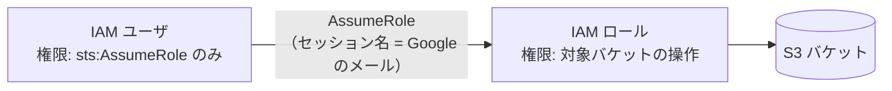

# 07. セキュリティ設計

## 1. 保護対象と対策の概要

| 保護対象 | 想定する脅威 | 主な対策 |
|---|---|---|
| AWS のアクセスキー | 端末からの窃取、ログへの混入、フロントエンド経由の漏えい | キーチェーンにのみ保存、IPC で返さない、ログのマスキング、AssumeRole による最小権限と短期の認証情報 |
| Google のトークン | 認可コードの横取り、端末からの窃取 | PKCE、state、127.0.0.1 のみで待ち受け、キーチェーンに保存 |
| S3 上のデータ | 誤操作による削除、過剰な権限 | 確認ダイアログ、バージョニングの推奨、最小権限ポリシー、ルートユーザーのキーの拒否 |
| ローカルファイル | 不正なスクリプトによる任意ファイルの読み取り・書き込み | 選択 ID 方式（[05 §3.9](05-backend-ipc.md#39-ローカルパスの受け渡し)）、CSP、リモートコンテンツを読み込まない、ウィンドウごとの権限 |
| 配布物 | 改ざん、なりすまし | コード署名（アドホック）、構成証明、アップデートの署名検証 |

## 2. Google 認証（OAuth 2.0 + PKCE）

### 2.1 クライアントの登録

| 項目 | 設定 |
|---|---|
| OAuth クライアントの種類 | デスクトップ アプリ |
| 同意画面 | 外部（Google Workspace で組織内に限る場合は内部）。スコープは `openid`、`email`、`profile`（機密性の低いスコープのため審査は不要） |
| 公開ステータス | 本番環境。「テスト」のままだとリフレッシュトークンが 7 日で失効する |
| クライアント ID とシークレット | ビルド時の環境変数（`S3DRIVE_GOOGLE_CLIENT_ID`、`S3DRIVE_GOOGLE_CLIENT_SECRET`）から埋め込み、リポジトリには含めない。デスクトップアプリのクライアントシークレットは配布物から取り出せるため秘密とはみなさず、安全性は PKCE・state・ループバックで確保する |

### 2.2 認可リクエスト

| パラメータ | 値 |
|---|---|
| `response_type` | `code` |
| `redirect_uri` | `http://127.0.0.1:{空きポート}`（Google がデスクトップアプリに推奨するループバック IP。`localhost` はファイアウォールの影響を受けることがあるため使わない） |
| `scope` | `openid email profile` |
| `code_challenge` / `code_challenge_method` | `BASE64URL(SHA256(code_verifier))` / `S256`（`code_verifier` は 64 文字の乱数） |
| `state` | 32 バイトの乱数（CSRF 対策） |
| `nonce` | 32 バイトの乱数（ID トークンの再送対策） |
| `prompt` | `select_account consent`（毎回。サインアウトでリフレッシュトークンを取り消すため、次のサインインでもリフレッシュトークンを発行させる。[04 §1.2](04-features.md#12-サインイン)） |
| `access_type` | `offline`（リフレッシュトークンを得る） |

ループバックの待ち受け:

- `127.0.0.1` のみにバインドし、`0.0.0.0` にはバインドしない。
- 1 回の要求だけを受け付けて終了する。5 分でタイムアウトする。
- `state` が一致しない要求は破棄する。
- 応答ページは外部リソースを読み込まない最小の HTML とし、`Cache-Control: no-store` を付ける。

### 2.3 トークン交換と ID トークンの検証

- トークンエンドポイント（`https://oauth2.googleapis.com/token`）に `code`、`code_verifier`、`client_id`、`client_secret`、`redirect_uri` を送る。通信は TLS（rustls、証明書検証あり）。
- ID トークンは openidconnect クレートで次を検証する。
  - 署名（Google の JWKS。ディスカバリ文書から取得し、キャッシュする）
  - `iss` がディスカバリ文書の issuer（`https://accounts.google.com`）と一致する
  - `aud` がクライアント ID
  - `exp`（時刻のずれに備えて 60 秒の猶予を設ける）
  - `nonce`（リフレッシュで得た ID トークンでは省略）
  - `email_verified` が `true`
- 許可リスト（ビルド時設定 `S3DRIVE_ALLOWED_EMAILS`、`S3DRIVE_ALLOWED_DOMAINS`）が設定されていれば照合する。ドメインの制限は `hd` クレームで確認する。
- アクセストークンは使わない（Google の API を呼ばない）ため保存しない。リフレッシュトークンだけをキーチェーンに保存する。

### 2.4 更新と失効

| 契機 | 処理 |
|---|---|
| 起動時 | リフレッシュトークンで ID トークンを取り直して検証する（[04 §1.3](04-features.md#13-起動時のセッション復元)） |
| サインアウト | `https://oauth2.googleapis.com/revoke` でトークンを取り消し、キーチェーンから削除する |
| 失効（`invalid_grant`） | キーチェーンから削除し、サインインを求める |

## 3. AWS 認証情報の管理

### 3.1 保存と扱い

- アクセスキー ID とシークレットアクセスキーはキーチェーンにのみ保存する（[06 §3](06-data.md#3-キーチェーン)）。
- 入力欄は password 型とし、保存後はシークレットを画面に再表示しない。アクセスキー ID も伏せ字で表示する。
- IPC の応答、ログ、エラーの `detail` にシークレット・セッショントークンを含めない。
- `GetCallerIdentity` の ARN が `:root` で終わる場合（ルートユーザーのキー）は、「ルートユーザーのアクセスキーは使用できません。IAM ユーザーを作成してください」として保存しない。

### 3.2 推奨する構成（AssumeRole）



- IAM ユーザには対象ロールの `sts:AssumeRole` だけを許可し、S3 の権限はロールに付ける。アクセスキーが漏れても、ロールの信頼ポリシーと権限の範囲に被害を限定できる。
- 一時認証情報の有効期間は 1 時間。セッション名に Google のメールアドレスを入れ、CloudTrail で操作者を追跡できるようにする（[04 §2.3](04-features.md#23-セッション名と監査)）。
- 別アカウントのロールを使う場合は外部 ID（ExternalId）を設定できる。
- AssumeRole 時の MFA は将来拡張とする。

### 3.3 アクセスキーの運用

- 90 日ごとのローテーションを推奨し、DLG-06 で更新できるようにする。
- アクセスキーを無効化・削除した場合、次の API 呼び出しで `CREDENTIALS_INVALID` となり、DLG-06 に誘導する。

## 4. IAM ポリシー

### 4.1 アプリが使う権限

AssumeRole を使う場合はロールに、使わない場合は IAM ユーザに付与する。`BUCKET_NAME` は対象のバケット名に置き換える。

```json
{
  "Version": "2012-10-17",
  "Statement": [
    {
      "Sid": "BucketLevel",
      "Effect": "Allow",
      "Action": [
        "s3:ListBucket",
        "s3:ListBucketVersions",
        "s3:ListBucketMultipartUploads",
        "s3:GetBucketVersioning",
        "s3:GetEncryptionConfiguration"
      ],
      "Resource": "arn:aws:s3:::BUCKET_NAME"
    },
    {
      "Sid": "ObjectLevel",
      "Effect": "Allow",
      "Action": [
        "s3:GetObject",
        "s3:GetObjectVersion",
        "s3:PutObject",
        "s3:DeleteObject",
        "s3:DeleteObjectVersion",
        "s3:RestoreObject",
        "s3:AbortMultipartUpload",
        "s3:ListMultipartUploadParts",
        "s3:GetObjectTagging",
        "s3:GetObjectVersionTagging",
        "s3:PutObjectTagging"
      ],
      "Resource": "arn:aws:s3:::BUCKET_NAME/*"
    },
    {
      "Sid": "StorageMetrics",
      "Effect": "Allow",
      "Action": "cloudwatch:GetMetricData",
      "Resource": "*"
    },
    {
      "Sid": "Cost",
      "Effect": "Allow",
      "Action": ["ce:GetCostAndUsage", "ce:GetCostForecast", "pricing:GetProducts"],
      "Resource": "*"
    }
  ]
}
```

権限が足りない場合の振る舞い:

| 足りない権限 | 影響 |
|---|---|
| `s3:DeleteObjectVersion` | 全バージョンの削除、バージョンの削除ができない（削除マーカーの作成はできる） |
| `s3:ListBucketVersions` | バージョンタブと削除済みの項目を表示できない |
| `s3:RestoreObject` | アーカイブを取り出せない |
| `s3:GetObjectTagging`／`s3:PutObjectTagging` | タグ付きオブジェクトの移動・クラス変更が失敗する |
| `cloudwatch:GetMetricData` | 利用容量を検索インデックスから集計する |
| `ce:*` | コストのカードに権限がない旨を表示する |
| `pricing:GetProducts` | 同梱の単価表を使う |

Cost Explorer の API の利用可否は IAM ポリシーで決まる（請求コンソールの「IAM アクセスの有効化」設定は API には影響しない）。組織のメンバーアカウントでは、管理アカウントの設定で制限されることがある。

### 4.2 IAM ユーザのポリシー（AssumeRole を使う場合）

```json
{
  "Version": "2012-10-17",
  "Statement": [
    {
      "Effect": "Allow",
      "Action": "sts:AssumeRole",
      "Resource": "arn:aws:iam::123456789012:role/S3DriveAccess"
    }
  ]
}
```

`SourceIdentity` を使う場合は、`sts:SetSourceIdentity` も許可する。

### 4.3 ロールの信頼ポリシー

```json
{
  "Version": "2012-10-17",
  "Statement": [
    {
      "Effect": "Allow",
      "Principal": { "AWS": "arn:aws:iam::123456789012:user/s3drive-user" },
      "Action": "sts:AssumeRole",
      "Condition": { "StringEquals": { "sts:ExternalId": "外部 ID を使う場合のみ指定" } }
    }
  ]
}
```

`SourceIdentity` を使う場合は、同じ Principal に `sts:SetSourceIdentity` を許可する文を加える。

### 4.4 SSE-KMS のバケット

カスタマー管理キーで暗号化しているバケットでは、そのキーに対する `kms:Decrypt`（ダウンロード・コピー）と `kms:GenerateDataKey`（アップロード・コピー・マルチパート）が必要。

## 5. Tauri のセキュリティ設定

### 5.1 設定値

```json
{
  "app": {
    "security": {
      "csp": "default-src 'self' ipc: http://ipc.localhost; img-src 'self' data: blob:; style-src 'self' 'unsafe-inline'; script-src 'self'; font-src 'self'; object-src 'none'; base-uri 'none'; form-action 'none'; frame-ancestors 'none'",
      "freezePrototype": true,
      "capabilities": ["main", "settings"]
    }
  }
}
```

| 項目 | 方針 |
|---|---|
| CSP | 自アプリのリソースと IPC のみ。外部の画像・スクリプト・フォントを読み込まない（Google のプロフィール画像も使わない） |
| リモートコンテンツ | WebView には同梱したフロントエンドだけを読み込む。外部 URL への遷移はブロックし、リンクは Rust 側で既定のブラウザに渡す |
| `freezePrototype` | プロトタイプ汚染を防ぐ |
| 開発者ツール | リリースビルドでは無効 |
| 権限（capabilities） | ウィンドウごとに必要なコマンドとプラグインの操作だけを許可する（[05 §8](05-backend-ipc.md#8-tauri-の権限capabilities)）。フロントエンドには fs・dialog・opener・shell の権限を与えない |
| ローカルパス | フロントエンドからパス文字列を受け取らず、Rust が発行した選択 ID だけを受け付ける。既定のダウンロード先も `settings_update` では変更できない。ダウンロードでは、S3 のキーの `.`・`..` の階層で保存先の外に書き込まないよう、該当する項目を保存しない（[05 §3.9](05-backend-ipc.md#39-ローカルパスの受け渡し)） |
| 入力の検証 | 全コマンドで、接続 ID がサインイン中のアカウントのものか、キー・プレフィックス・名前が規則に合うかを検証する |
| 信頼できないデータの表示 | オブジェクトのキー、メタデータ、エラーメッセージは常にテキストとして描画する。`dangerouslySetInnerHTML` は Biome のルールで禁止する |
| Isolation パターン | サードパーティのスクリプトを読み込まないため採用しない |

### 5.2 macOS の実行環境

- Hardened Runtime を有効にしてアドホック署名する。Apple Developer Program に加入していないため公証はしない（[08 §4](08-cicd.md#4-releaseyml)）。
- App Sandbox は使わない（`macOSPrivateApi` を使うことと、任意の保存先へのダウンロードのため）。
- entitlements は必要最小限とする。

## 6. ログとエラー情報

| 情報 | 扱い |
|---|---|
| シークレットアクセスキー、セッショントークン | 出力しない |
| OAuth の認可コード、トークン、ID トークン | 出力しない |
| アクセスキー ID | 先頭 4 文字と末尾 4 文字以外を伏せる |
| オブジェクトのキー | debug レベルでのみ出力する |
| AWS のリクエスト ID・エラーコード | 出力する（問い合わせ・調査用） |

ログは端末内にのみ保存し、外部に送信しない。

## 7. サプライチェーン

| 対策 | 内容 |
|---|---|
| ロックファイル | `Cargo.lock` と `pnpm-lock.yaml` をコミットする。CI では Cargo は `--locked`、pnpm は `pnpm/setup` の `require-lockfile` で、ロックファイルと食い違う場合に失敗させる。Node.js のバージョンは `.node-version` で固定する |
| 公開直後のパッケージ | pnpm の `minimumReleaseAge`（1 日。pnpm 11 以降の既定値）で、公開から 1 日未満のバージョンをインストールしない。乗っ取られたパッケージの悪意あるバージョンが公開直後に取り下げられるまでの間を避ける |
| 依存のビルドスクリプト | pnpm の `allowBuilds` で許可したパッケージだけ postinstall などを実行する（既定は実行しない。[01 §8.2](01-architecture.md#82-pnpm-の設定)） |
| 脆弱性・ライセンスの検査 | `cargo deny check`（advisories、licenses、bans）と `pnpm audit --prod` を CI で実行する。pnpm の監査で例外にする脆弱性は GHSA ID で `auditConfig.ignoreGhsas` に理由とともに記録する |
| 依存の更新 | Renovate（npm、cargo、github-actions、docker）で週 1 回。Renovate の `minimumReleaseAge` も 1 日に揃える（[08 §2.1](08-cicd.md#21-依存の自動更新renovate)） |
| GitHub Actions | サードパーティのアクションはコミット SHA で固定する（SHA の更新は Renovate）。ワークフローごとに `permissions` を最小にする |
| 秘密情報 | OAuth・アップデート署名の鍵は GitHub Environments（`release`）のシークレットに置き、レビュー承認を必須にする |

## 8. 配布物の完全性

| 対策 | 内容 |
|---|---|
| コード署名 | アドホック署名（Hardened Runtime）。改ざんは検出できるが、署名者の身元は示さない |
| 公証 | 行わない（Apple Developer Program に未加入）。初回起動時に Gatekeeper が止めるため、利用者が「プライバシーとセキュリティ」で許可する（[08 §6.1](08-cicd.md#61-利用者のインストール手順リリースノートに記載する)） |
| 構成証明 | DMG と `.app.tar.gz` に GitHub の構成証明（SLSA のビルド来歴、Sigstore で署名）を付ける。`gh attestation verify` で、このリポジトリの `release.yml` がビルドしたものか確認できる |
| 自動更新 | tauri-plugin-updater の署名（公開鍵をリリース時に `tauri.conf.json` へ埋め込み、秘密鍵は GitHub のシークレット）を検証してから適用する。更新情報は HTTPS で取得する。公証がないため、インストール後の配布物の真正性はこの署名が担う |
| チェックサム | リリースノートに配布物の SHA-256 を記載する |

## 9. プライバシー

- 利用状況の収集（テレメトリ）は行わない。
- 外部への通信先は、AWS（利用者のアカウント）、Google（サインイン）、GitHub（アップデートの確認）に限る。
- Google から得る情報は名前とメールアドレスに限り、プロフィール画像は取得しない。
