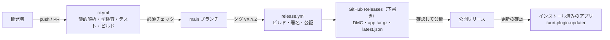

# 08. CI/CD 設計

GitHub Actions で、ビルド・テスト（CI）と、署名・公証済みのアプリの配布（CD）を自動化する（REQ-O01）。

## 1. 全体像



## 2. ワークフロー一覧

| ファイル | トリガー | 内容 | ランナー |
|---|---|---|---|
| `.github/workflows/ci.yml` | pull_request、main への push | 静的解析、型検査、単体テスト、S3 モック（moto）を使う結合テスト、型定義の差分確認、脆弱性検査、macOS でのビルド確認 | ubuntu-latest、macos-latest |
| `.github/workflows/release.yml` | `v*.*.*` タグの push、手動実行 | ユニバーサルバイナリのビルド、署名、公証、GitHub Releases（下書き）の作成、更新情報（latest.json）の生成 | macos-latest |
| `.github/workflows/e2e.yml` | 毎晩、手動実行、`e2e` ラベルの付いた PR | WebdriverIO による E2E テスト（[09 §2.5](09-testing.md#25-e2e-テスト)） | macos-latest |
| `renovate.json`（Renovate） | 毎週 | npm（pnpm）、cargo、github-actions の依存更新（§2.1） | — |

Rust のワークスペースは、Tauri 非依存の `s3drive-core` と、アプリ本体（`src-tauri`、パッケージ名 `s3drive-app`）に分かれている（[01 §4](01-architecture.md#4-リポジトリ構成)）。`s3drive-core` は Linux ランナーで Docker のサービスコンテナ（moto）を使ってテストし、macOS ランナーはアプリのビルド確認とリリースだけに使う。

### 2.1 依存の自動更新（Renovate）

依存の更新には Dependabot ではなく Renovate を使う。pnpm 11 以降の `pnpm-lock.yaml` は、環境の情報（pnpm と Node.js の解決結果）と依存関係を別々のドキュメントに書く形式になっており、Dependabot はこれを正しく解析できない（依存が 0 件と扱われ、脆弱性アラートが更新なしで閉じられる不具合が報告されている）。Renovate は `packageManager` に指定した pnpm 12 を実際に使ってロックファイルを更新する。

```json
{
  "$schema": "https://docs.renovatebot.com/renovate-schema.json",
  "extends": ["config:recommended"],
  "timezone": "Asia/Tokyo",
  "schedule": ["before 9am on monday"],
  "minimumReleaseAge": "1 day",
  "packageRules": [
    { "matchManagers": ["github-actions"], "pinDigests": true }
  ]
}
```

- Renovate の `minimumReleaseAge` を pnpm の設定（1 日。[01 §8.2](01-architecture.md#82-pnpm-の設定)）と揃える。Renovate は pnpm 側の設定を読まないため、揃えないと公開直後のバージョンへの更新 PR がインストールで失敗する。
- GitHub Actions のアクションはコミット SHA で固定し（`pinDigests`）、SHA の更新も Renovate に任せる。
- GitHub の依存関係グラフも同じ理由で pnpm 12 のロックファイルを正しく扱えないことがあるため、脆弱性の検出は CI の `pnpm audit` と `cargo deny` を正とする（§3 の `audit` ジョブ）。

## 3. ci.yml

| ジョブ | ランナー | 内容 |
|---|---|---|
| `frontend` | ubuntu-latest | `pnpm/setup`（pnpm 12・Node.js 26 の導入とロックファイルどおりの `pnpm install`）、Biome、`pnpm typecheck`（TypeScript 7 の `tsc -b`）、Vitest 5（カバレッジ）、`vite build` |
| `core` | ubuntu-latest（サービス: moto） | rustfmt、clippy（警告をエラー扱い）、`cargo test -p s3drive-core`（単体テストと moto を使う結合テスト）、ts-rs で生成した型定義に差分がないことの確認 |
| `app` | macos-latest | clippy、`cargo test -p s3drive-app`、`pnpm tauri build --debug --bundles app`（署名なし）で macOS 向けビルドが通ることを確認 |
| `audit` | ubuntu-latest | `cargo deny check`、`pnpm audit --prod` |

pnpm と Node.js のバージョンはワークフローに書かない。`pnpm/setup` アクション（pnpm 11 以降向けの公式アクション）が `package.json` の `packageManager` と `devEngines.runtime`（[01 §8.1](01-architecture.md#81-バージョンの固定)）を読み取り、pnpm 12 と Node.js 26 を導入してから `pnpm install` まで行う。`actions/setup-node` は使わない。

```yaml
name: CI

on:
  pull_request:
  push:
    branches: [main]

permissions:
  contents: read

concurrency:
  group: ci-${{ github.ref }}
  cancel-in-progress: true

jobs:
  frontend:
    runs-on: ubuntu-latest
    steps:
      - uses: actions/checkout@<SHA>
      - uses: pnpm/setup@<SHA>        # v3。pnpm 12 と Node.js 26 を導入し、pnpm install まで行う
        with:
          cache: true
          require-lockfile: true       # ロックファイルと食い違えば失敗させる
      - run: pnpm biome ci .
      - run: pnpm typecheck            # tsc -b（TypeScript 7）
      - run: pnpm vitest run --coverage
      - run: pnpm vite build

  core:
    runs-on: ubuntu-latest
    services:
      moto:
        image: motoserver/moto:<バージョン>
        ports: ["5000:5000"]
    env:
      S3DRIVE_TEST_ENDPOINT: http://localhost:5000
    steps:
      - uses: actions/checkout@<SHA>
      - uses: dtolnay/rust-toolchain@<SHA>
        with:
          toolchain: stable
          components: rustfmt, clippy
      - uses: Swatinem/rust-cache@<SHA>
      - run: cargo fmt --all --check
      - run: cargo clippy -p s3drive-core --all-targets --locked -- -D warnings
      - run: cargo test -p s3drive-core --locked
      - run: git diff --exit-code -- src/lib/ipc/bindings

  app:
    runs-on: macos-latest
    needs: [frontend, core]
    steps:
      - uses: actions/checkout@<SHA>
      - uses: pnpm/setup@<SHA>
        with:
          cache: true
          require-lockfile: true
      - uses: dtolnay/rust-toolchain@<SHA>
        with:
          toolchain: stable
          components: clippy
      - uses: Swatinem/rust-cache@<SHA>
      - run: cargo clippy -p s3drive-app --all-targets --locked -- -D warnings
      - run: cargo test -p s3drive-app --locked
      - run: pnpm tauri build --debug --bundles app

  audit:
    runs-on: ubuntu-latest
    steps:
      - uses: actions/checkout@<SHA>
      - uses: EmbarkStudios/cargo-deny-action@<SHA>
      - uses: pnpm/setup@<SHA>
        with:
          install: false               # audit はロックファイルだけで実行できる
      - run: pnpm audit --prod --audit-level high
```

- `<SHA>` はアクションのコミット SHA で固定する（[07 §7](07-security.md#7-サプライチェーン)）。moto のイメージもバージョンを固定する。
- `s3drive-core` はキーチェーンを `SecretStore` トレイトで抽象化しており、Linux のテストではメモリ上の実装を使う。

## 4. release.yml

### 4.1 処理の流れ

1. `vX.Y.Z` のタグが push されたら起動する。ジョブは GitHub Environments の `release` で実行し、承認を必須にする。
2. タグと `package.json` のバージョンが一致することを確認する（`tauri.conf.json` の `version` は `../package.json` を参照する）。
3. Rust のターゲット `aarch64-apple-darwin` と `x86_64-apple-darwin` を追加する。
4. App Store Connect API キー（.p8）をシークレットから一時ファイルに書き出す。
5. `tauri-apps/tauri-action` で `--target universal-apple-darwin` をビルドする。署名用の証明書（`APPLE_CERTIFICATE`）はバンドラが一時キーチェーンに取り込み、署名・公証・ステープルまで行う。更新用の成果物（`.app.tar.gz` と署名）と `latest.json` も生成し、下書きのリリースに添付する。
6. 成果物を検証する: `codesign --verify --deep --strict`、`spctl --assess --type execute`、`xcrun stapler validate`。
7. 担当者が下書きのリリースで DMG を取得し、クリーンな Mac で確認してから公開する（§6）。

```yaml
name: Release

on:
  push:
    tags: ['v*.*.*']
  workflow_dispatch:

permissions:
  contents: write

jobs:
  release:
    runs-on: macos-latest
    environment: release
    steps:
      - uses: actions/checkout@<SHA>
      - uses: pnpm/setup@<SHA>
        with:
          cache: true
          require-lockfile: true
      - uses: dtolnay/rust-toolchain@<SHA>
        with:
          toolchain: stable
          targets: aarch64-apple-darwin,x86_64-apple-darwin
      - uses: Swatinem/rust-cache@<SHA>
      - name: バージョンの確認
        run: test "v$(jq -r .version package.json)" = "${GITHUB_REF_NAME}"
      - name: App Store Connect API キーの配置
        run: |
          mkdir -p "$RUNNER_TEMP/keys"
          echo "$APPLE_API_KEY_P8" > "$RUNNER_TEMP/keys/AuthKey.p8"
          echo "APPLE_API_KEY_PATH=$RUNNER_TEMP/keys/AuthKey.p8" >> "$GITHUB_ENV"
        env:
          APPLE_API_KEY_P8: ${{ secrets.APPLE_API_KEY_P8 }}
      - uses: tauri-apps/tauri-action@<SHA>
        env:
          GITHUB_TOKEN: ${{ secrets.GITHUB_TOKEN }}
          APPLE_CERTIFICATE: ${{ secrets.APPLE_CERTIFICATE }}
          APPLE_CERTIFICATE_PASSWORD: ${{ secrets.APPLE_CERTIFICATE_PASSWORD }}
          APPLE_SIGNING_IDENTITY: ${{ secrets.APPLE_SIGNING_IDENTITY }}
          APPLE_API_ISSUER: ${{ secrets.APPLE_API_ISSUER }}
          APPLE_API_KEY: ${{ secrets.APPLE_API_KEY }}
          TAURI_SIGNING_PRIVATE_KEY: ${{ secrets.TAURI_SIGNING_PRIVATE_KEY }}
          TAURI_SIGNING_PRIVATE_KEY_PASSWORD: ${{ secrets.TAURI_SIGNING_PRIVATE_KEY_PASSWORD }}
          S3DRIVE_GOOGLE_CLIENT_ID: ${{ secrets.S3DRIVE_GOOGLE_CLIENT_ID }}
          S3DRIVE_GOOGLE_CLIENT_SECRET: ${{ secrets.S3DRIVE_GOOGLE_CLIENT_SECRET }}
          S3DRIVE_ALLOWED_EMAILS: ${{ vars.S3DRIVE_ALLOWED_EMAILS }}
          S3DRIVE_ALLOWED_DOMAINS: ${{ vars.S3DRIVE_ALLOWED_DOMAINS }}
        with:
          args: --target universal-apple-darwin
          tagName: ${{ github.ref_name }}
          releaseName: S3 Drive ${{ github.ref_name }}
          releaseDraft: true
          includeUpdaterJson: true
      - name: 署名と公証の検証
        run: |
          APP="target/universal-apple-darwin/release/bundle/macos/S3 Drive.app" # Cargo ワークスペース直下の target
          codesign --verify --deep --strict --verbose=2 "$APP"
          spctl --assess --type execute --verbose "$APP"
          xcrun stapler validate "$APP"
```

### 4.2 バンドルの設定（tauri.conf.json）

```json
{
  "productName": "S3 Drive",
  "version": "../package.json",
  "identifier": "io.github.sh1gekicks.s3drive",
  "bundle": {
    "active": true,
    "targets": ["app", "dmg"],
    "createUpdaterArtifacts": true,
    "category": "Productivity",
    "icon": ["icons/32x32.png", "icons/128x128.png", "icons/128x128@2x.png", "icons/icon.icns"],
    "macOS": {
      "minimumSystemVersion": "13.0",
      "hardenedRuntime": true
    }
  },
  "plugins": {
    "updater": {
      "pubkey": "<pnpm tauri signer generate で作成した公開鍵>",
      "endpoints": [
        "https://github.com/Sh1gekicks/s3driveapp/releases/latest/download/latest.json"
      ]
    }
  }
}
```

## 5. シークレットと変数

| 名前 | 種類 | 用途 | 作成方法 |
|---|---|---|---|
| `APPLE_CERTIFICATE` | Secret | Developer ID Application 証明書（.p12 を Base64 化） | キーチェーンアクセスから書き出し |
| `APPLE_CERTIFICATE_PASSWORD` | Secret | .p12 のパスワード | 書き出し時に設定 |
| `APPLE_SIGNING_IDENTITY` | Secret | `Developer ID Application: 名前 (TEAMID)` | `security find-identity -v -p codesigning` |
| `APPLE_API_ISSUER` / `APPLE_API_KEY` / `APPLE_API_KEY_P8` | Secret | 公証用の App Store Connect API キー（発行者 ID、キー ID、.p8 の内容） | App Store Connect で発行 |
| `TAURI_SIGNING_PRIVATE_KEY` / `TAURI_SIGNING_PRIVATE_KEY_PASSWORD` | Secret | 自動更新の署名 | `pnpm tauri signer generate` |
| `S3DRIVE_GOOGLE_CLIENT_ID` / `S3DRIVE_GOOGLE_CLIENT_SECRET` | Secret | Google OAuth クライアント（ビルド時に埋め込み） | GCP で作成（[07 §2.1](07-security.md#21-クライアントの登録)） |
| `S3DRIVE_ALLOWED_EMAILS` / `S3DRIVE_ALLOWED_DOMAINS` | Variable | 利用を許可する Google アカウント（任意） | — |
| `GITHUB_TOKEN` | 自動 | リリースの作成（`contents: write`） | — |

シークレットはすべて Environment `release` に置き、ほかのワークフローからは参照できないようにする。

## 6. バージョン管理とリリース手順

- バージョンは SemVer とし、`package.json` の `version` を唯一の正とする（`tauri.conf.json` はこれを参照する）。Rust クレートのバージョンはアプリのバージョンと連動させない。
- 手順:
  1. `package.json` のバージョンと `CHANGELOG.md` を更新する PR を作り、マージする。
  2. main の該当コミットに `vX.Y.Z` のタグを付けて push する。
  3. `release` Environment の実行を承認する。
  4. 下書きのリリースから DMG を取得し、クリーンな Mac で確認する（Gatekeeper の警告なしで起動できる、サインイン、一覧表示、アップロード、ダウンロード）。
  5. リリースノートに SHA-256 を記載して公開する。公開すると、自動更新が有効なアプリに配信される。

## 7. 自動更新

| 項目 | 方式 |
|---|---|
| 確認のタイミング | 起動時と 24 時間ごと（設定で無効にできる）、およびメニュー「アップデートを確認…」 |
| 取得先 | GitHub Releases の最新リリースに添付した `latest.json`（HTTPS） |
| 通知 | 「新しいバージョン {x.y.z} があります」ダイアログ（後で／アップデート） |
| 適用 | ダウンロード（進捗表示）→ 署名の検証 → インストール → 再起動。転送中は、転送が終わるまで再起動を待つか確認する |
| 前提 | リポジトリの Releases が公開されていること。非公開の場合は配布先を S3 + CloudFront などに変更する（[README §10 Q5](README.md#10-未決事項要確認事項)） |

## 8. ブランチ保護

| 対象 | ルール |
|---|---|
| main | PR 必須、必須チェック（`frontend`、`core`、`app`、`audit`）、squash マージ、force push 禁止 |
| タグ `v*` | 保護されたタグ（作成できるのはメンテナのみ） |

## 9. 実行時間とコスト

- macOS ランナーは Linux より実行コストが高いため、`app` ジョブは Linux のジョブが成功してから実行する。E2E は毎晩と必要時のみにする。
- pnpm のストア（`pnpm/setup` の `cache`）と Cargo のビルド結果（`rust-cache`）をキャッシュする。
- 目安: `frontend` 約 2 分、`core` 約 3〜6 分、`app` 約 10 分、リリース約 20〜30 分（ユニバーサルビルドと公証を含む）。
