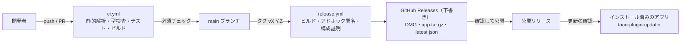

# 08. CI/CD 設計

GitHub Actions で、ビルド・テスト（CI）と、署名済みのアプリの配布（CD）を自動化する（REQ-O01）。

Apple Developer Program（有料）には加入していないため、署名はアドホック署名とし、公証は行わない（[README D11](README.md#7-主要な設計判断)）。

## 1. 全体像



## 2. ワークフロー一覧

| ファイル | トリガー | 内容 | ランナー |
|---|---|---|---|
| `.github/workflows/ci.yml` | pull_request、main への push | 静的解析、型検査、単体テスト（カバレッジの閾値あり）、画面テストとビジュアル回帰テスト（Playwright）、S3 モック（moto）を使う結合テスト、型定義の差分確認、脆弱性検査、macOS でのビルド確認 | ubuntu-latest、macos-latest |
| `.github/workflows/release.yml` | `v*.*.*` タグの push、手動実行 | ユニバーサルバイナリのビルド、アドホック署名、構成証明、GitHub Releases（下書き）の作成、更新情報（latest.json）の生成 | macos-latest |
| `.github/workflows/e2e.yml` | 毎晩、手動実行、`e2e` ラベルの付いた PR | WebdriverIO による E2E テスト（[09 §2.5](09-testing.md#25-e2e-テスト)） | macos-latest |
| `renovate.json`（Renovate） | 毎週 | npm（pnpm）、cargo、github-actions、docker（moto・Playwright のイメージ）の依存更新（§2.1） | — |

Rust のワークスペースは、Tauri 非依存の `s3drive-core` と、アプリ本体（`src-tauri`、パッケージ名 `s3drive-app`）に分かれている（[01 §4](01-architecture.md#4-リポジトリ構成)）。`s3drive-core` は Linux ランナーで Docker のサービスコンテナ（moto）を使ってテストし、macOS ランナーはアプリのビルド確認とリリースだけに使う。

### 2.1 依存の自動更新（Renovate）

依存の更新には Dependabot ではなく Renovate を使う。pnpm 11 以降の `pnpm-lock.yaml` は、環境の情報（pnpm と Node.js の解決結果）と依存関係を別々のドキュメントに書く形式になっており、Dependabot はこれを正しく解析できない（依存が 0 件と扱われ、脆弱性アラートが更新なしで閉じられる不具合が報告されている）。Renovate は `packageManager` に指定した pnpm 12 を実際に使ってロックファイルを更新する。

```json
{
  "$schema": "https://docs.renovatebot.com/renovate-schema.json",
  "extends": ["config:recommended"],
  "timezone": "Asia/Tokyo",
  "schedule": ["before 9am on monday"],
  "minimumReleaseAge": "1 day",
  "packageRules": [
    { "matchManagers": ["github-actions"], "pinDigests": true }
  ]
}
```

- Renovate の `minimumReleaseAge` を pnpm の設定（1 日。[01 §8.2](01-architecture.md#82-pnpm-の設定)）と揃える。Renovate は pnpm 側の設定を読まないため、揃えないと公開直後のバージョンへの更新 PR がインストールで失敗する。
- GitHub Actions のアクションはコミット SHA で固定し（`pinDigests`）、SHA の更新も Renovate に任せる。
- 実際の `renovate.json` には、上に加えて次のルールがある。moto のイメージを 5.1 系に留める（5.2 系は `GetBucketVersioning` の応答が SDK と互換でない）、Tauri の npm パッケージと Rust クレートをまとめて更新する、WebdriverIO をまとめて更新する、`@playwright/test` と CI の Playwright のイメージ（`mcr.microsoft.com/playwright`）をまとめて更新する（更新したら基準画像を作り直す。[09 §2.6](09-testing.md#26-ビジュアル回帰テスト)）。
- GitHub の依存関係グラフも同じ理由で pnpm 12 のロックファイルを正しく扱えないことがあるため、脆弱性の検出は CI の `pnpm audit` と `cargo deny` を正とする（§3 の `audit` ジョブ）。

## 3. ci.yml

| ジョブ | ランナー | 内容 |
|---|---|---|
| `frontend` | ubuntu-latest | `pnpm/setup`（pnpm 12・Node.js 26 の導入とロックファイルどおりの `pnpm install`）、Biome、`pnpm typecheck`（TypeScript 7 の `tsc -b`）、Vitest 5（カバレッジ。`src/lib`・`src/features` の行カバレッジが 70% 未満なら失敗）、`vite build` |
| `ui` | ubuntu-latest（コンテナ: Playwright の公式イメージ） | Playwright（WebKit）でモックバックエンドの画面テストとビジュアル回帰テスト（[09 §2.4](09-testing.md#24-モックバックエンドでの画面テスト)、[§2.6](09-testing.md#26-ビジュアル回帰テスト)）。基準画像と同じ描画にするため、`@playwright/test` と同じ版のイメージで実行する |
| `core` | ubuntu-latest（サービス: moto） | rustfmt、clippy（警告をエラー扱い。ベンチマークの `bench` 機能を含む）、`cargo llvm-cov -p s3drive-core --fail-under-lines 80`（単体テストと moto を使う結合テスト。行カバレッジが 80% 未満なら失敗）、ts-rs で生成した型定義に差分がないことの確認 |
| `app` | macos-latest | clippy（`e2e` 機能の有無の両方）、`cargo test -p s3drive-app`、`pnpm tauri build --debug --bundles app`（アドホック署名）で macOS 向けビルドが通ることを確認 |
| `audit` | ubuntu-latest | アクセスキー ID の形の文字列の検査、`cargo deny check`、`pnpm audit --prod` |

pnpm と Node.js のバージョンはワークフローに書かない。`pnpm/setup` アクション（pnpm 11 以降向けの公式アクション）が `package.json` の `packageManager` と `.node-version`（[01 §8.1](01-architecture.md#81-バージョンの固定)）を読み取り、pnpm 12 と Node.js 26 を導入してから `pnpm install` まで行う。`actions/setup-node` は使わない。

```yaml
name: CI

on:
  pull_request:
  push:
    branches: [main]

permissions:
  contents: read

concurrency:
  group: ci-${{ github.ref }}
  cancel-in-progress: true

env:
  CARGO_PROFILE_DEV_DEBUG: line-tables-only   # デバッグ情報は行番号だけにする（§9）

jobs:
  frontend:
    runs-on: ubuntu-latest
    steps:
      - uses: actions/checkout@<SHA>
      - uses: pnpm/setup@<SHA>        # v3。pnpm 12 と Node.js 26 を導入し、pnpm install まで行う
        with:
          require-lockfile: true       # ロックファイルと食い違えば失敗させる
      - run: pnpm biome ci .
      - run: pnpm typecheck            # tsc -b（TypeScript 7）
      - run: pnpm vitest run --coverage   # 閾値は vite.config.ts の coverage.thresholds
      - run: pnpm vite build

  ui:
    runs-on: ubuntu-latest
    container:
      image: mcr.microsoft.com/playwright:v<@playwright/test と同じ版>-noble
    steps:
      - uses: actions/checkout@<SHA>
      - uses: pnpm/setup@<SHA>
        with:
          require-lockfile: true
      - run: pnpm exec playwright test   # 画面テストとビジュアル回帰テスト

  core:
    runs-on: ubuntu-latest
    services:
      moto:
        image: motoserver/moto:<バージョン>
        ports: ["5000:5000"]
    env:
      S3DRIVE_TEST_ENDPOINT: http://localhost:5000
    steps:
      - uses: actions/checkout@<SHA>
      - uses: dtolnay/rust-toolchain@<SHA>
        with:
          toolchain: stable
          components: rustfmt, clippy, llvm-tools-preview
      - uses: Swatinem/rust-cache@<SHA>
      - uses: taiki-e/install-action@<SHA>
        with:
          tool: cargo-llvm-cov
      - run: cargo fmt --all --check
      - run: cargo clippy -p s3drive-core --all-targets --all-features --locked -- -D warnings
      - run: cargo llvm-cov -p s3drive-core --locked --fail-under-lines 80
      - run: git diff --exit-code -- src/lib/ipc/bindings

  app:
    runs-on: macos-latest               # Linux のジョブを待たずに並行して実行する（§9）
    steps:
      - uses: actions/checkout@<SHA>
      - uses: pnpm/setup@<SHA>
        with:
          require-lockfile: true
      - uses: dtolnay/rust-toolchain@<SHA>
        with:
          toolchain: stable
          components: clippy
      - name: MACOSX_DEPLOYMENT_TARGET の設定   # tauri build と同じ値にそろえる（§9）
        run: |
          target=$(jq -er .bundle.macOS.minimumSystemVersion src-tauri/tauri.conf.json)
          echo "MACOSX_DEPLOYMENT_TARGET=$target" >> "$GITHUB_ENV"
      - uses: Swatinem/rust-cache@<SHA>
        with:
          key: macos-${{ env.MACOSX_DEPLOYMENT_TARGET }}
      - run: cargo clippy -p s3drive-app --all-targets --locked -- -D warnings
      - run: cargo clippy -p s3drive-app --all-targets --locked --features e2e -- -D warnings
      - run: cargo test -p s3drive-app --locked
      - run: pnpm tauri build --debug --bundles app

  audit:
    runs-on: ubuntu-latest
    steps:
      - uses: actions/checkout@<SHA>
      - name: アクセスキー ID の形の文字列がないことの確認
        run: "! git grep -nE '(AKIA|ASIA)[0-9A-Z]{16}' -- . ':!design-system'"
      - uses: EmbarkStudios/cargo-deny-action@<SHA>
      - uses: pnpm/setup@<SHA>
        with:
          install: false               # audit はロックファイルだけで実行できる
      - run: pnpm audit --prod --audit-level high
```

- `<SHA>` はアクションのコミット SHA で固定する（[07 §7](07-security.md#7-サプライチェーン)）。moto のイメージもバージョンを固定する。
- `s3drive-core` はキーチェーンを `SecretStore` トレイトで抽象化しており、Linux のテストではメモリ上の実装を使う。

## 4. release.yml

### 4.1 処理の流れ

1. `vX.Y.Z` のタグが push されたら起動する。ジョブは GitHub Environments の `release` で実行し、承認を必須にする。
2. タグと `package.json` のバージョンが一致することを確認する（`tauri.conf.json` の `version` は `../package.json` を参照する）。
3. Rust のターゲット `aarch64-apple-darwin` と `x86_64-apple-darwin` を追加する。
4. 自動更新の公開鍵（変数 `TAURI_UPDATER_PUBKEY`）と `createUpdaterArtifacts` を、リリース用の設定ファイルとして `tauri.conf.json` に重ねる。
5. `tauri-apps/tauri-action` で `--target universal-apple-darwin` をビルドする。`tauri.conf.json` の `signingIdentity: "-"` により、バンドラが Hardened Runtime 付きのアドホック署名を行う。更新用の成果物（`.app.tar.gz` と署名）と `latest.json` も生成し、下書きのリリースに添付する。
6. 署名を検証する: `codesign --verify --deep --strict` に加え、アドホック署名（`Signature=adhoc`）と Hardened Runtime（`flags` の `runtime`）であることを確認する。公証していないため `spctl --assess` と `xcrun stapler validate` は行わない。
7. DMG と `.app.tar.gz` の構成証明（`actions/attest`。SLSA のビルド来歴）を作成する。公開リポジトリのため無料で利用でき、利用者は `gh attestation verify` で、配布物がこのワークフローでビルドされたことを確認できる。
8. 配布物の SHA-256 をジョブのサマリーに出力する（リリースノートに記載する）。
9. 担当者が下書きのリリースで DMG を取得し、クリーンな Mac で確認してから公開する（§6）。

アドホック署名とは、証明書を使わずにコードのハッシュだけで行う署名で、Apple Silicon で動かすために必要な最低限の署名である。改ざんの検出はできるが、署名者の身元は示さない。このため、ダウンロードした DMG から初めて起動するときは Gatekeeper に止められ、利用者が「プライバシーとセキュリティ」で許可する必要がある（§6.1）。

```yaml
name: Release

on:
  push:
    tags: ['v*.*.*']
  workflow_dispatch:

permissions:
  contents: write
  id-token: write
  attestations: write

jobs:
  release:
    runs-on: macos-latest
    environment: release
    steps:
      - uses: actions/checkout@<SHA>
      - uses: pnpm/setup@<SHA>
        with:
          require-lockfile: true
      - uses: dtolnay/rust-toolchain@<SHA>
        with:
          toolchain: stable
          targets: aarch64-apple-darwin,x86_64-apple-darwin
      - uses: Swatinem/rust-cache@<SHA>
      - name: バージョンの確認
        if: github.event_name == 'push'
        run: test "v$(jq -r .version package.json)" = "${GITHUB_REF_NAME}"
      - name: 自動更新の設定
        env:
          TAURI_UPDATER_PUBKEY: ${{ vars.TAURI_UPDATER_PUBKEY }}
        run: |
          test -n "$TAURI_UPDATER_PUBKEY" || exit 1
          jq -n --arg pubkey "$TAURI_UPDATER_PUBKEY" \
            '{bundle: {createUpdaterArtifacts: true}, plugins: {updater: {pubkey: $pubkey}}}' \
            > "$RUNNER_TEMP/tauri.release.conf.json"
          echo "RELEASE_CONFIG=$RUNNER_TEMP/tauri.release.conf.json" >> "$GITHUB_ENV"
      - uses: tauri-apps/tauri-action@<SHA>
        env:
          GITHUB_TOKEN: ${{ secrets.GITHUB_TOKEN }}
          TAURI_SIGNING_PRIVATE_KEY: ${{ secrets.TAURI_SIGNING_PRIVATE_KEY }}
          TAURI_SIGNING_PRIVATE_KEY_PASSWORD: ${{ secrets.TAURI_SIGNING_PRIVATE_KEY_PASSWORD }}
          S3DRIVE_GOOGLE_CLIENT_ID: ${{ secrets.S3DRIVE_GOOGLE_CLIENT_ID }}
          S3DRIVE_GOOGLE_CLIENT_SECRET: ${{ secrets.S3DRIVE_GOOGLE_CLIENT_SECRET }}
          S3DRIVE_ALLOWED_EMAILS: ${{ vars.S3DRIVE_ALLOWED_EMAILS }}
          S3DRIVE_ALLOWED_DOMAINS: ${{ vars.S3DRIVE_ALLOWED_DOMAINS }}
        with:
          args: --target universal-apple-darwin --config ${{ env.RELEASE_CONFIG }}
          tagName: ${{ github.ref_name }}
          releaseName: S3 Drive ${{ github.ref_name }}
          releaseDraft: true
          uploadUpdaterJson: true
      - name: 署名の検証
        run: |
          APP="target/universal-apple-darwin/release/bundle/macos/S3 Drive.app" # Cargo ワークスペース直下の target
          codesign --verify --deep --strict --verbose=2 "$APP"
          codesign --display --verbose=2 "$APP" 2>&1 | tee "$RUNNER_TEMP/codesign.txt"
          grep -q 'Signature=adhoc' "$RUNNER_TEMP/codesign.txt"
          grep -q 'flags=.*runtime' "$RUNNER_TEMP/codesign.txt"
      - uses: actions/attest@<SHA>
        with:
          subject-path: |
            target/universal-apple-darwin/release/bundle/dmg/*.dmg
            target/universal-apple-darwin/release/bundle/macos/*.app.tar.gz
      - name: チェックサムの出力
        run: |
          cd target/universal-apple-darwin/release/bundle
          shasum -a 256 dmg/*.dmg macos/*.app.tar.gz >> "$GITHUB_STEP_SUMMARY"
```

### 4.2 バンドルの設定（tauri.conf.json）

```json
{
  "productName": "S3 Drive",
  "version": "../package.json",
  "identifier": "io.github.sh1gekicks.s3drive",
  "bundle": {
    "active": true,
    "targets": ["app", "dmg"],
    "createUpdaterArtifacts": false,
    "category": "Productivity",
    "copyright": "Copyright © 2026 Sh1gekicks",
    "icon": [
      "icons/32x32.png",
      "icons/128x128.png",
      "icons/128x128@2x.png",
      "icons/icon.icns",
      "icons/icon.png"
    ],
    "macOS": {
      "minimumSystemVersion": "13.0",
      "signingIdentity": "-",
      "hardenedRuntime": true
    }
  },
  "plugins": {
    "updater": {
      "pubkey": "",
      "requireSignedVersion": true,
      "endpoints": [
        "https://github.com/Sh1gekicks/s3driveapp/releases/latest/download/latest.json"
      ]
    }
  }
}
```

- `signingIdentity: "-"` はアドホック署名の指定。環境変数 `APPLE_SIGNING_IDENTITY` を設定するとそちらが優先されるため、リリースのワークフローでは設定しない。
- `createUpdaterArtifacts` と `pubkey` はリリース時に §4.1 の手順 4 で重ねる。

### 4.3 Developer ID 署名と公証に切り替える場合

Apple Developer Program に加入したら、次の手順で Developer ID 署名と公証に切り替える。

1. Developer ID Application 証明書と、公証用の App Store Connect API キーを作成し、§5 の加入後に追加するシークレットを登録する。
2. `tauri.conf.json` から `signingIdentity` を削除する（`APPLE_SIGNING_IDENTITY` を使う）。
3. `release.yml` で API キー（.p8）を一時ファイルに書き出し（`APPLE_API_KEY_PATH`）、`tauri-action` に `APPLE_CERTIFICATE`・`APPLE_CERTIFICATE_PASSWORD`・`APPLE_SIGNING_IDENTITY`・`APPLE_API_ISSUER`・`APPLE_API_KEY` を渡す。バンドラが署名・公証・ステープルまで行う。
4. 検証を `codesign --verify --deep --strict`、`spctl --assess --type execute`、`xcrun stapler validate` に戻し、最後に鍵の一時ファイルを削除する。
5. 切り替え後の最初の更新では、署名者が変わるためキーチェーンの確認ダイアログが一度だけ表示される（[06 §3](06-data.md#3-キーチェーン)）。

## 5. シークレットと変数

| 名前 | 種類 | 用途 | 作成方法 |
|---|---|---|---|
| `TAURI_SIGNING_PRIVATE_KEY` / `TAURI_SIGNING_PRIVATE_KEY_PASSWORD` | Secret | 自動更新の署名 | `pnpm tauri signer generate` |
| `TAURI_UPDATER_PUBKEY` | Variable | 自動更新の公開鍵（リリース時に `tauri.conf.json` へ重ねる） | `pnpm tauri signer generate` |
| `S3DRIVE_GOOGLE_CLIENT_ID` / `S3DRIVE_GOOGLE_CLIENT_SECRET` | Secret | Google OAuth クライアント（ビルド時に埋め込み） | GCP で作成（[07 §2.1](07-security.md#21-クライアントの登録)） |
| `S3DRIVE_ALLOWED_EMAILS` / `S3DRIVE_ALLOWED_DOMAINS` | Variable | 利用を許可する Google アカウント（任意） | — |
| `GITHUB_TOKEN` | 自動 | リリースの作成（`contents: write`） | — |
| （OIDC トークン） | 自動 | 構成証明の作成（`id-token: write`、`attestations: write`） | — |

Apple Developer Program に加入した場合は、次を追加する（§4.3）。

| 名前 | 種類 | 用途 | 作成方法 |
|---|---|---|---|
| `APPLE_CERTIFICATE` | Secret | Developer ID Application 証明書（.p12 を Base64 化） | キーチェーンアクセスから書き出し |
| `APPLE_CERTIFICATE_PASSWORD` | Secret | .p12 のパスワード | 書き出し時に設定 |
| `APPLE_SIGNING_IDENTITY` | Secret | `Developer ID Application: 名前 (TEAMID)` | `security find-identity -v -p codesigning` |
| `APPLE_API_ISSUER` / `APPLE_API_KEY` / `APPLE_API_KEY_P8` | Secret | 公証用の App Store Connect API キー（発行者 ID、キー ID、.p8 の内容） | App Store Connect で発行 |

シークレットはすべて Environment `release` に置き、ほかのワークフローからは参照できないようにする。

## 6. バージョン管理とリリース手順

- バージョンは SemVer とし、`package.json` の `version` を唯一の正とする（`tauri.conf.json` はこれを参照する）。Rust クレートのバージョンはアプリのバージョンと連動させない。
- 手順:
  1. `package.json` のバージョンと `CHANGELOG.md` を更新する PR を作り、マージする。
  2. main の該当コミットに `vX.Y.Z` のタグを付けて push する。
  3. `release` Environment の実行を承認する。
  4. 下書きのリリースから DMG を取得し、`gh attestation verify <DMG> -R Sh1gekicks/s3driveapp` で構成証明を確認する。
  5. クリーンな Mac で確認する（§6.1 の手順で初回起動できる、サインイン、一覧表示、アップロード、ダウンロード）。
  6. ジョブのサマリーに出力した SHA-256 と、§6.1 のインストール手順をリリースノートに記載して公開する。公開すると、自動更新が有効なアプリに配信される。

### 6.1 利用者のインストール手順（リリースノートに記載する）

公証していないため、初回起動時に「Apple は、“S3 Drive”にマルウェアが含まれていないことを検証できませんでした」などと表示されて起動できない。次の手順で許可する。

1. DMG を開き、「S3 Drive」を「アプリケーション」フォルダにドラッグする。
2. 「S3 Drive」を開く。警告が表示されたら「完了」を押して閉じる。
3. 「システム設定」→「プライバシーとセキュリティ」を開き、「セキュリティ」の項目にある「“S3 Drive”は Mac を保護するためにブロックされました」の「このまま開く」を押す。管理者のパスワードで認証し、表示されたダイアログで「開く」を押す。
4. 以降は通常どおり起動できる。

- macOS 14 以前では、Finder で Control キーを押しながらアプリをクリックし、「開く」を選んでも許可できる。macOS 15 以降はこの方法が使えないため、手順 3 による。
- 配布物の確認: `shasum -a 256` の結果がリリースノートの SHA-256 と一致すること、または `gh attestation verify <DMG> -R Sh1gekicks/s3driveapp` が成功することを確認できる。
- 自動更新で入れ替えたアプリには quarantine 属性が付かないため、更新のたびに許可する必要はない。ただし、アドホック署名は更新ごとに変わるため、更新後の初回起動でキーチェーンへのアクセスの確認が表示される（「常に許可」を選ぶ。[06 §3](06-data.md#3-キーチェーン)）。

## 7. 自動更新

| 項目 | 方式 |
|---|---|
| 確認のタイミング | 起動時（起動の 10 秒後）と 24 時間ごと（設定で無効にできる）、およびメニュー「アップデートを確認…」。自動の確認は Rust の背景処理で行い、新しいバージョンがあれば `update://available` で知らせる（フロントエンドは起動時に確認しない）。開発ビルドでは自動で確認しない |
| 取得先 | GitHub Releases の最新リリースに添付した `latest.json`（HTTPS） |
| 通知 | 「新しいバージョン {x.y.z} があります」ダイアログ（後で／アップデート） |
| 適用 | ダウンロード（進捗表示）→ 署名の検証 → インストール → 再起動。転送中（待機中を含む）は「転送の完了後に再起動」と「転送を中止して再起動」のどちらにするかを確認する。前者はインストールしてからダイアログを閉じて知らせ、転送がなくなったら再起動する（待つ間は自動の確認をしない）。後者と転送がない場合は、終了と同じく 3 秒を上限に転送の中止処理を行ってから再起動する（[04 §14.4](04-features.md#144-キャンセルと終了)） |
| 前提 | リポジトリの Releases が公開されていること。非公開の場合は配布先を S3 + CloudFront などに変更する（[README §10 Q5](README.md#10-未決事項要確認事項)） |

## 8. ブランチ保護

| 対象 | ルール |
|---|---|
| main | PR 必須、必須チェック（`frontend`、`ui`、`core`、`app`、`audit`）、squash マージ、force push 禁止 |
| タグ `v*` | 保護されたタグ（作成できるのはメンテナのみ） |

## 9. 実行時間とコスト

- `app` ジョブは Linux のジョブを待たずに並行して実行する。公開リポジトリでは標準の macOS ランナーも無料のため、待っても費用は変わらず、全体の所要時間が延びるだけである（Linux のジョブが失敗しても `app` は最後まで実行される）。E2E は毎晩と必要時のみにする。
- CI の Rust のビルドは、デバッグ情報を行番号だけにする（ワークフローの `env` の `CARGO_PROFILE_DEV_DEBUG: line-tables-only`。`test` プロファイルと `tauri build --debug` にも効く）。パニックのバックトレースの行番号は残したまま、コンパイルとリンクを速くし、キャッシュを小さくする。
- Cargo のビルド結果は `rust-cache` でキャッシュする。`rust-cache` は `CARGO_` で始まる環境変数をキーに含めるため、`CARGO_PROFILE_DEV_DEBUG` を変えるとキャッシュも作り直される。
  - `app` ジョブでは、clippy と `cargo test` にも `tauri build` と同じ `MACOSX_DEPLOYMENT_TARGET`（`tauri.conf.json` の `minimumSystemVersion`）を渡す。`tauri build` はこの変数を設定して cargo を実行し、cc を使うクレート（`ring`、`aws-lc-sys` など）はこの変数が変わるとビルドスクリプトから作り直しになるため、そろえないと `cargo test` と `tauri build` が互いの依存のビルド結果を無効にし、キャッシュがあっても依存を毎回ビルドし直す。
  - `rust-cache` はキーが一致すると保存し直さない。キャッシュの中身を作り直したいときは `key` を変える（`app` ジョブのキーには `MACOSX_DEPLOYMENT_TARGET` を含める）。
- pnpm のストアはキャッシュしない（`pnpm/setup` の `cache` を使わない）。`cache: true` は実行ごとに別のキーで保存するため、リポジトリのキャッシュの上限（10 GB）を圧迫して Cargo のキャッシュが追い出されやすくなる。また macOS では保存前の `pnpm store prune` でパッケージがすべて消え、復元しても再利用されない。レジストリからの取得は数秒で済む。
- 目安: `frontend` 約 2 分、`ui` 約 3 分、`core` 約 4〜8 分（カバレッジの計測を含む）、`app` 約 10 分、リリース約 15〜25 分（ユニバーサルビルドを含む）。
