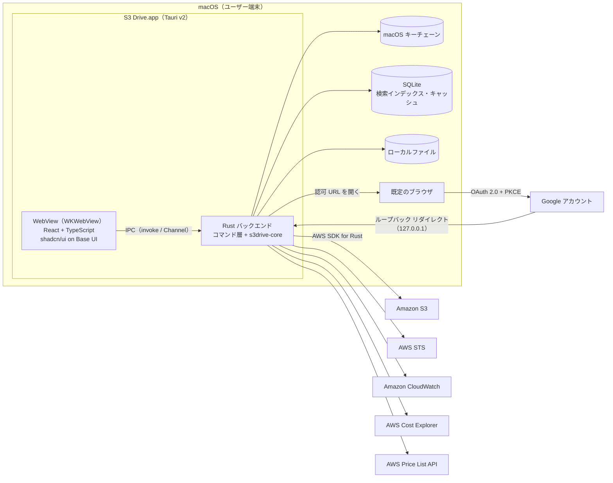

# S3 Drive App 設計書

| 項目 | 内容 |
|---|---|
| 版 | 0.7（ドラフト） |
| 作成日 | 2026-09-27 |
| 対象 | S3 Drive App（macOS ネイティブアプリ） |
| 入力資料 | 要求事項（当初の requirements.txt。内容は [§4.1](#41-対象) に転記し、ファイルは削除済み）／デザインシステム「S3 Drive デザインシステム」（[Claude Design](https://claude.ai/design/p/2d5c9b6d-736c-4a1d-8ca7-8d2787602a5e)） |

---

## 1. 本書の目的

要求事項（[§4.1](#41-対象)）と、Claude Design 上のデザインシステム（トークン・コンポーネント・UI キット）を基に、実装に着手できる粒度で次を定義する。

- アーキテクチャと技術スタック
- UI 基盤（デザインシステムの実装方法）と画面仕様
- 機能ごとの処理方式（AWS API との対応を含む）
- Rust バックエンドと IPC（フロントエンドとの境界）の仕様
- ローカルデータ、セキュリティ、CI/CD、テスト

## 2. 設計書の構成

| ファイル | 内容 |
|---|---|
| [README.md](README.md)（本書） | 概要・スコープ・前提・要件トレーサビリティ・主要な設計判断・非機能要件・実装フェーズ・未決事項 |
| [01-architecture.md](01-architecture.md) | システム構成、技術スタック、ディレクトリ構成、状態管理、横断的方針（エラー・ログ・性能） |
| [02-ui-foundation.md](02-ui-foundation.md) | デザインシステムの実装方法（トークン、Tailwind v4、shadcn/ui on Base UI）、macOS ネイティブ化 |
| [03-screens.md](03-screens.md) | 画面一覧・画面遷移・各画面／ダイアログ／メニューの仕様、ショートカット |
| [04-features.md](04-features.md) | 機能ごとの処理設計（シーケンス）、AWS API の使い方 |
| [05-backend-ipc.md](05-backend-ipc.md) | Rust モジュール設計、IPC コマンド／チャネル仕様、エラーコード |
| [06-data.md](06-data.md) | ローカルデータ設計（設定、キーチェーン、SQLite）、キャッシュ方針 |
| [07-security.md](07-security.md) | Google 認証、AWS 認証情報の管理、IAM ポリシー、Tauri のセキュリティ設定 |
| [08-cicd.md](08-cicd.md) | GitHub Actions（ビルド・テスト・署名・リリース・自動更新） |
| [09-testing.md](09-testing.md) | テスト戦略、テスト環境、テスト観点 |

デザインシステムは Claude Design のプロジェクトが正本である。本書では同プロジェクト内のファイルを `DS:` を付けて参照する（例: `DS: ui_kits/s3-drive/Dashboard.jsx`）。リポジトリの [`design-system/`](../../design-system/SNAPSHOT.md) に 2026-09-27 時点の写しを置いており、`DS:` のパスはこのフォルダからの相対パスと同じである。

## 3. システム概要

S3 Drive App（以下、本アプリ）は、事前に用意した Amazon S3 バケットを Google ドライブや Finder と同じ感覚で操作できる macOS ネイティブアプリである。デスクトップシェルは Tauri v2、バックエンドは Rust（AWS SDK for Rust）、フロントエンドは Vite + React + TypeScript で構築し、UI は shadcn/ui（Base UI 版）とデザインシステムで macOS 標準アプリと違和感のない見た目にする。

## 4. スコープ

### 4.1 対象

要求事項の機能をすべて対象とする。本書では以下の要件 ID で参照する。

| 要件 ID | 要件（要求事項より） |
|---|---|
| REQ-F01 | ユーザ認証（Google 認証） |
| REQ-F02 | 利用容量、リージョン、ストレージクラスの表示 |
| REQ-F03 | ストレージクラスの変更 |
| REQ-F04 | ファイル一覧表示 |
| REQ-F05 | アップロード |
| REQ-F06 | ダウンロード |
| REQ-F07 | ファイル削除 |
| REQ-F08 | S3 に関わるコスト表示 |
| REQ-F09 | ファイルのメタデータ表示（作成日、更新日、サイズなど） |
| REQ-F10 | ファイルの検索（名前、拡張子、サイズなどでフィルタリング） |
| REQ-F11 | フォルダ構造の表示と管理（フォルダ作成、削除、移動） |
| REQ-F12 | ファイルのバージョン管理（バージョンの表示、復元、削除） |
| REQ-P01 | アプリから S3 バケットの指定と IAM ユーザ（ロール含む）の入力を行う |
| REQ-T01 | Tauri + Rust バックエンド、AWS SDK for Rust で S3 と通信する |
| REQ-T02 | フロントエンドは Vite + React + TypeScript |
| REQ-D01 | デスクトップシェルは Tauri v2 |
| REQ-D02 | shadcn/ui（TypeScript + Tailwind）、土台の部品ライブラリは Base UI |
| REQ-D03 | フォントは -apple-system 系のシステムフォント |
| REQ-D04 | prefers-color-scheme でダーク／ライトモードに追従する |
| REQ-D05 | ボタン等の上ではカーソルを矢印（cursor: default）にし、テキスト選択を必要な箇所に限る |
| REQ-D06 | タイトルバーを透過させる |
| REQ-O01 | GitHub Actions でビルド・テスト・デプロイを自動化する（Tauri のビルドを含む） |

### 4.2 対象外

| 項目 | 理由・扱い |
|---|---|
| S3 バケット、IAM ユーザ／ロールの作成と設定変更（バージョニングの有効化、ライフサイクルルール、バケットポリシーなど） | 前提として AWS 側で設定済みとする。アプリは状態の表示のみ行う |
| 他者とのファイル共有（署名付き URL など） | 将来拡張 |
| Finder との自動同期（File Provider 拡張） | 対象外 |
| Windows / Linux 版 | 対象外（Tauri のため移植の余地は残す） |
| Mac App Store での配布 | 対象外（透過ウィンドウのために `macOSPrivateApi` を使うため） |
| S3 互換ストレージ（MinIO など） | 正式対象外。テスト用にエンドポイントの上書きだけ用意する |

## 5. 前提条件・制約

| 区分 | 内容 |
|---|---|
| AWS | バケット、IAM ユーザ（アクセスキー発行済み）、任意で AssumeRole 先のロールが作成済みであること。必要な権限は [07-security.md §4](07-security.md#4-iam-ポリシー) を参照 |
| AWS（推奨設定） | バージョニング有効化（削除からの復元に必要）／ライフサイクルルール `AbortIncompleteMultipartUpload`（7 日）／非現行バージョンの有効期限（コスト抑制）／バケットへのコスト配分タグ（バケット単位のコスト表示に必要。キーは共通、値はバケットごとに変える）／Cost Explorer の有効化 |
| Google | GCP プロジェクトに OAuth クライアント（種類: デスクトップ アプリ）を作成済みであること。同意画面の公開ステータスが「テスト」の間はリフレッシュトークンが 7 日で失効する |
| Apple | Apple Developer Program（有料）には加入しない。署名はアドホック署名とし、公証は行わない（D11）。加入した場合の切り替え手順は [08 §4.3](08-cicd.md#43-developer-id-署名と公証に切り替える場合) |
| 対応 OS | macOS 13 Ventura 以降、Apple Silicon と Intel（ユニバーサルバイナリ）※要確認（[§10](#10-未決事項要確認事項)） |
| 言語 | 日本語 UI のみ。文言は辞書ファイルに集約し、将来の多言語化に備える |
| 開発環境 | Node.js 26、pnpm 12、TypeScript 7、Rust stable。pnpm は `package.json` の `packageManager`、Node.js は `.node-version` で固定する（[01 §8](01-architecture.md#8-開発環境とツールチェーン)） |

## 6. 要件トレーサビリティ

| 要件 ID | 主な設計箇所 |
|---|---|
| REQ-F01 | [04 §1 ユーザ認証](04-features.md#1-ユーザ認証google)／[07 §2 Google OAuth](07-security.md#2-google-認証oauth-20--pkce)／[03 SCR-01](03-screens.md#4-scr-01-サインイン) |
| REQ-F02 | [04 §12 利用容量・リージョン](04-features.md#12-利用容量リージョンストレージクラスの表示)／[03 SCR-02 サイドバー](03-screens.md#51-サイドバー)・[SCR-03](03-screens.md#6-scr-03-ストレージとコスト) |
| REQ-F03 | [04 §8 ストレージクラスの変更](04-features.md#8-ストレージクラスの変更とアーカイブの取り出し)／[03 DLG-04](03-screens.md#dlg-04-ストレージクラスを変更) |
| REQ-F04 | [04 §3 一覧表示](04-features.md#3-ファイル一覧フォルダ表示)／[03 §5.4](03-screens.md#54-ファイル一覧リストアイコン) |
| REQ-F05 | [04 §4 アップロード](04-features.md#4-アップロード)／[04 §14 転送管理](04-features.md#14-転送管理) |
| REQ-F06 | [04 §5 ダウンロード](04-features.md#5-ダウンロード) |
| REQ-F07 | [04 §6 削除](04-features.md#6-削除)／[03 DLG-02](03-screens.md#dlg-02-削除の確認) |
| REQ-F08 | [04 §13 コスト表示](04-features.md#13-コスト表示)／[03 SCR-03](03-screens.md#6-scr-03-ストレージとコスト) |
| REQ-F09 | [04 §9 メタデータ](04-features.md#9-メタデータ表示)／[03 §5.6 インスペクタ](03-screens.md#56-インスペクタ) |
| REQ-F10 | [04 §10 検索](04-features.md#10-検索フィルタ)／[06 §4 検索インデックス](06-data.md#4-sqlite) |
| REQ-F11 | [04 §7 フォルダ管理](04-features.md#7-フォルダ管理作成削除移動) |
| REQ-F12 | [04 §11 バージョン管理](04-features.md#11-バージョン管理) |
| REQ-P01 | [04 §2 バケット接続](04-features.md#2-バケット接続と認証情報の管理)／[07 §3](07-security.md#3-aws-認証情報の管理) |
| REQ-T01, REQ-T02, REQ-D01 | [01-architecture.md](01-architecture.md) |
| REQ-D02 | [02 §5〜§6](02-ui-foundation.md#5-shadcnui-on-base-ui-のセットアップ) |
| REQ-D03〜REQ-D06 | [02 §7 macOS ネイティブ化](02-ui-foundation.md#7-macos-ネイティブ化の実装) |
| REQ-O01 | [08-cicd.md](08-cicd.md)／[09-testing.md](09-testing.md) |

## 7. 主要な設計判断

| # | 判断 | 理由 | 検討した代替案 |
|---|---|---|---|
| D1 | Rust を Tauri 非依存の `s3drive-core` と、コマンド層の `src-tauri` に分割する | AWS 処理・DB・検索を Linux ランナーと S3 モック（moto）で結合テストでき、CI コストも下がる | 単一クレート |
| D2 | Google 認証は「アプリ利用者の認証」、S3 へのアクセスは「IAM ユーザのアクセスキー（任意で AssumeRole）」とする | 要求事項の前提（IAM ユーザを入力）に合わせる。Google の本人情報は認証情報の名前空間と、AssumeRole のセッション名（CloudTrail での追跡）に使う | Google の ID トークンで `AssumeRoleWithWebIdentity`（長期キー不要。将来拡張） |
| D3 | OAuth はシステムブラウザ + ループバック（127.0.0.1）+ PKCE | Google がデスクトップアプリに推奨する方式。埋め込み WebView での Google ログインは拒否される | カスタム URL スキーム |
| D4 | 秘密情報（シークレットアクセスキー、Google のリフレッシュトークン）は macOS キーチェーンにのみ保存する | OS の保護機構を使い、平文ファイルに残さない | 暗号化ファイル（Stronghold） |
| D5 | 検索は SQLite（FTS5 の trigram トークナイザ）によるローカルインデックスで行う | S3 にはサーバー側の検索機能がない。部分一致・日本語名・複合フィルタを高速に処理できる | 検索のたびに全件 LIST／S3 Inventory／S3 Metadata テーブル |
| D6 | ストレージクラスの変更、移動、バージョンの復元は CopyObject（5 GB 超は UploadPartCopy）で行う | S3 で即時に反映できる唯一の方法 | ライフサイクルルール（反映が遅く、個別操作に向かない） |
| D7 | 容量は CloudWatch の日次メトリクス、コストは Cost Explorer と Price List API から取得する。取得できない場合はインデックスから集計する | 全件走査せずにバケット全体（非現行バージョンを含む）の実容量と実コストを得られる | 常に全件 LIST で集計 |
| D8 | 転送は aws-sdk-s3 のマルチパート API を使う自前の転送マネージャで行う | 公式の Rust 版 S3 Transfer Manager はデベロッパープレビューで本番利用が推奨されていない | `aws-sdk-s3-transfer-manager` |
| D9 | Rust と TypeScript の型は ts-rs で生成して共有する | 安定版。tauri-specta v2 はまだ RC | tauri-specta |
| D10 | フロントエンドの状態は、サーバー由来のデータを TanStack Query、UI 状態を Zustand で管理する | キャッシュ・再取得・楽観的更新を標準化し、UI 状態を単純に保つ | Redux Toolkit |
| D11 | 配布はアドホック署名（Hardened Runtime）の DMG を GitHub Releases で行い、tauri-plugin-updater で自動更新する。公証の代わりに、GitHub の構成証明と SHA-256 で配布物の出所を確認できるようにする | Developer ID 署名と公証には Apple Developer Program（有料）への加入が必要で、加入していない。アドホック署名は無料で、Apple Silicon で動かすのに必要な署名を満たす。初回起動時に利用者が「プライバシーとセキュリティ」で許可する必要がある（[08 §6.1](08-cicd.md#61-利用者のインストール手順リリースノートに記載する)） | Developer ID 署名 + 公証（有料）、自己署名証明書（署名者は固定できるが、Gatekeeper の扱いはアドホック署名と同じで、証明書の管理が増える）、署名なし（Apple Silicon で「壊れている」と表示される）、Mac App Store |
| D12 | E2E テストは WebdriverIO + `@wdio/tauri-service`（アプリ内蔵の WebDriver サーバー）で行う | macOS の WKWebView には公式の WebDriver がなく、`tauri-driver` は macOS 非対応 | 手動テストのみ |
| D13 | Lint・フォーマットは Biome、型検査は TypeScript 7 の `tsc` で行う | TypeScript 7.0 には外部ツール向けの API がなく、typescript-eslint など API に依存するツールが使えない。Biome は独自の解析器で動くため影響を受けない | ESLint + typescript-eslint（TypeScript 6 の併用が必要） |
| D14 | 依存の自動更新は Renovate で行い、脆弱性の検出は CI の `pnpm audit` と `cargo deny` を正とする | pnpm 11 以降のロックファイルを Dependabot と GitHub の依存関係グラフが正しく解析できない | Dependabot |

## 8. 非機能要件

| 区分 | 要件 | 目標値 |
|---|---|---|
| 性能 | 起動から初回描画まで | 2 秒以内（サインイン済み・キャッシュあり） |
| 性能 | フォルダ一覧の表示 | 1,000 件の初回描画 1 秒以内（通信時間を除く）。10 万件でもスクロールが滑らか（仮想リスト） |
| 性能 | 検索 | 100 万件のインデックスに対し 300 ms 以内 |
| 転送 | 大容量ファイル | マルチパート並列転送。最大 50 TB（S3 の上限）まで対応する |
| 信頼性 | 転送の失敗 | 指数バックオフで自動リトライ。キャンセル・失敗時は未完了のマルチパートアップロードを中止する。中断からの再開は Phase 4 |
| セキュリティ | 認証情報 | [07-security.md](07-security.md) の方針に従う |
| 互換性 | OS・CPU | macOS 13 以降、Apple Silicon / Intel |
| 保守性 | 静的解析・テスト | Rust: clippy（警告をエラー扱い）と rustfmt。TS: strict、Biome。カバレッジ目標は [09-testing.md](09-testing.md) |
| アクセシビリティ | 操作性 | VoiceOver で全操作が可能。キーボードだけで主要操作が可能。デザインシステムのコントラスト基準を守る |
| リソース | メモリ・サイズ | 通常時のメモリ 300 MB 以下、DMG 30 MB 以下 |

## 9. 実装フェーズ

| フェーズ | 内容 | 完了条件 |
|---|---|---|
| Phase 0: 基盤 | リポジトリ構成、Tauri v2 + Vite + React の雛形、デザインシステムのトークン取り込み、shadcn/ui（Base UI）導入、ウィンドウ設定（透過タイトルバー・vibrancy）、CI（lint / 型検査 / テスト / ビルド） | 空のメインウィンドウがデザインシステムどおりに表示され、CI が通る |
| Phase 1: MVP | Google サインイン、バケット接続、一覧・フォルダ移動、アップロード／ダウンロード（マルチパート）、削除、フォルダ作成、メタデータ表示、署名付きリリース | REQ-F01, F04〜F07, F09, P01 と、F11 のフォルダ作成・表示を満たす |
| Phase 2: 管理機能 | 移動・名前変更、フォルダ削除、ストレージクラス変更（アーカイブの取り出しを含む）、バージョン管理、削除済み項目の表示、検索インデックスとフィルタ | REQ-F03, F10, F11, F12 を満たす |
| Phase 3: 可視化と仕上げ | ストレージとコスト（CloudWatch / Cost Explorer / Price List）、設定ウィンドウ、メニューバー常駐、自動更新 | REQ-F02, F08 を満たし、全要件のテスト観点を消化する |
| Phase 4: 将来拡張 | 転送の再開、Google ID トークンによる AssumeRoleWithWebIdentity、S3 Inventory 連携、プレビュー（Quick Look）、Finder へのドラッグアウト、署名付き URL での共有 | 個別に判断 |

## 10. 未決事項・要確認事項

| ID | 内容 | 暫定方針 |
|---|---|---|
| Q1 | バンドル ID | `io.github.sh1gekicks.s3drive`（GitHub のオーナー名から作成）。独自ドメインがあれば変更する |
| Q2 | Google 認証の位置付け（アプリの利用者認証のみか、AWS 認証にも使うか） | 利用者認証のみ（D2）。AssumeRoleWithWebIdentity は Phase 4 |
| Q3 | 利用を許可する Google アカウントの制限 | ビルド時設定で許可するメールアドレス／ドメインを指定できるようにする。既定は制限なし |
| Q4 | コスト表示の範囲 | コスト配分タグが設定されていればそのタグが付いた S3（値をバケットごとに変えればバケット単位）、なければ「アカウント全体の S3（該当リージョン）」と明示して表示する |
| Q5 | 配布先リポジトリの公開範囲 | 自動更新は GitHub Releases の公開アセットを前提とする。非公開リポジトリの場合は配布先を S3 + CloudFront に変更する |
| Q6 | 対応 OS の下限と Intel Mac 対応の要否 | macOS 13 以降、ユニバーサルバイナリ |
| Q7 | 想定するバケットの規模（オブジェクト数） | 100 万件までをローカルインデックスで扱う。超える場合は S3 Inventory 連携（Phase 4） |
| Q8 | 「最近の項目」ビュー | デザインシステムの最新版でサイドバーの入口が削除されているため対象外。UI キットの実装は残す |
| Q9 | 名前の変更機能 | 要件・デザインシステムにはないが、移動と同じ処理で実現できるため Phase 2 で追加する（[03 DLG-10](03-screens.md#dlg-10-名前を変更)） |
| Q10 | アプリの表示名 | 要求事項は「S3 Drive App」、デザインシステムは「S3 Drive」。画面・メニュー・バンドル名（`productName`）は DS に合わせて「S3 Drive」とし、リポジトリ名と本書では「S3 Drive App」を使う |

## 11. 用語集

| 用語 | 説明 |
|---|---|
| 接続（Connection） | 本アプリに登録した 1 つのバケットへの接続設定。バケット名、リージョン、認証情報、任意のロール ARN からなる |
| 認証情報（Credential） | IAM ユーザのアクセスキー ID とシークレットアクセスキーの組。複数の接続で共有できる |
| プレフィックス | S3 のキーの先頭部分。本アプリでは `/` 区切りのプレフィックスをフォルダとして表示する |
| フォルダマーカー | 空フォルダを表すための、キー末尾が `/` の 0 バイトのオブジェクト |
| 削除マーカー | バージョニング有効時に、バージョン指定なしで削除したときに作られるマーカー。最新が削除マーカーのキーは一覧に表示されない |
| アーカイブ | 即時に取得できないストレージクラス（Glacier Flexible Retrieval、Glacier Deep Archive、Intelligent-Tiering のアーカイブ階層）。取得前に取り出し（RestoreObject）が必要 |
| インデックス | 検索用にバケット内の全キーを保存したローカルの SQLite テーブル |
| DS | デザインシステム（Claude Design の「S3 Drive デザインシステム」） |

## 12. 改訂履歴

| 版 | 日付 | 内容 |
|---|---|---|
| 0.1 | 2026-09-27 | 初版ドラフト |
| 0.2 | 2026-09-27 | 開発ツールを最新版に更新（pnpm 12、Node.js 26、TypeScript 7、Vitest 5、keyring 4 系の構成）。バージョンの固定方法（[01 §8](01-architecture.md#8-開発環境とツールチェーン)）を追加。CI を `pnpm/setup` に、依存の自動更新を Renovate に変更。デザインシステムの写しを `design-system/` に追加 |
| 0.3 | 2026-09-27 | Cost Explorer の取得を手動の「更新」のみに変更（自動更新と更新間隔の設定を廃止）（[04 §13.4](04-features.md#134-取得のタイミングと料金)） |
| 0.4 | 2026-09-27 | Apple Developer Program に加入しないため、リリースを Developer ID 署名 + 公証からアドホック署名 + GitHub の構成証明に変更（D11、[08 §4](08-cicd.md#4-releaseyml)、[07 §8](07-security.md#8-配布物の完全性)） |
| 0.5 | 2026-09-28 | 設計・実装・テストの突き合わせを反映。ダウンロード先のパスの扱い（[05 §3.9](05-backend-ipc.md#39-ローカルパスの受け渡し)）、`ExpiredToken` の再取得（[01 §7.1](01-architecture.md#71-エラーハンドリング)）、実行時のリージョン補正（[01 §6.1](01-architecture.md#61-aws-クライアントの管理)）、検索結果のページングと並び順（[04 §10.2](04-features.md#102-検索条件)）などを実装どおりに記述。Node.js の固定方法、コマンド・イベント・型の一覧、リポジトリ構成を実装に合わせて更新。画面テスト（Playwright）・カバレッジの強制・ベンチマークを CI とテスト設計に追加（[08 §3](08-cicd.md#3-ciyml)、[09](09-testing.md)） |
| 0.6 | 2026-09-29 | 設計・実装・テスト・運用ドキュメントの 2 回目の突き合わせを反映。転送中のサインアウトとアップデートの適用の確認（[04 §1.4](04-features.md#14-サインアウト)、[08 §7](08-cicd.md#7-自動更新)）、コストの「更新」の失敗の表示（[03 §6](03-screens.md#6-scr-03-ストレージとコスト)）、接続ごとのストレージクラスと SourceIdentity の設定（[03 §7](03-screens.md#7-scr-04-設定)）、マルチパートの境界の単位（[04 §4.2](04-features.md#42-転送の方式)）を実装に合わせて追記。AssumeRole の取り直し（[04 §2.3](04-features.md#23-セッション名と監査)）、ファイル一覧のアクセシビリティ（[02 §10](02-ui-foundation.md#10-アクセシビリティ)）、開発ビルドの保存先（[06 §1](06-data.md#1-保存先の一覧)）、モジュール・ストア・関数の名前、テスト観点などの古い記述を修正 |
| 0.7 | 2026-10-07 | 設計・実装・テスト・運用ドキュメントの 3 回目の突き合わせを反映。アーカイブの取り出し完了の通知はフロントエンドだけが出す（[05 §4.2](05-backend-ipc.md#42-グローバルイベントrust--全ウィンドウ)）。ジョブにする処理と種類（[01 §3](01-architecture.md#3-実行時の構成)・[§6.2](01-architecture.md#62-ジョブモデル)）、アップロードと移動のシーケンス（[04 §4.1](04-features.md#41-処理の流れ)・[§7.3](04-features.md#73-移動名前の変更を含む)）、削除済みの項目の取得の上限（[04 §3.3](04-features.md#33-削除済みの項目の表示)）、「認証情報を更新」の入力項目（[03 DLG-06](03-screens.md#dlg-06-認証情報を更新)）を実装に合わせて記述。使わない API の権限を IAM ポリシーの例から削除（[04 §15](04-features.md#15-aws-api-対応表)、[07 §4.1](07-security.md#41-アプリが使う権限)）。コンポーネントのファイル名と globals.css の例（[02 §4〜§6](02-ui-foundation.md#4-tailwind-css-v4-への割り当て)）、手動テストの配布の確認項目（[09 §2.7](09-testing.md#27-手動テスト)）などの古い記述を修正 |
