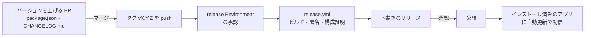

# 04. リリースの方法

リリースは GitHub Actions（`.github/workflows/release.yml`）で行う。タグ `vX.Y.Z` を push すると、ユニバーサルバイナリ（Apple Silicon と Intel）をビルドしてアドホック署名し、下書きのリリースを作る。担当者が確認してから公開する。

Apple Developer Program（有料）に加入していないため、Developer ID 署名と公証は行わない。代わりに GitHub の構成証明と SHA-256 で配布物の出所を確認できるようにしている（[README D11](../design/README.md#7-主要な設計判断)、[08 §4](../design/08-cicd.md#4-releaseyml)）。



## 1. 事前の準備（初回のみ）

### 1.1 自動更新の署名鍵

自動更新（tauri-plugin-updater）の配布物に署名する鍵を作る。

```bash
pnpm tauri signer generate -w ~/.tauri/s3drive.key
```

- 秘密鍵（`~/.tauri/s3drive.key`）とパスワードは、パスワードマネージャーなどに必ずバックアップする。**秘密鍵をなくすと、インストール済みのアプリに更新を配信できなくなる**（アプリに埋め込んだ公開鍵で検証できる更新を作れないため、利用者に手動で再インストールしてもらう必要がある）。
- 公開鍵（`~/.tauri/s3drive.key.pub` の内容）は秘密ではない。リポジトリの変数に設定する（§1.3）。

### 1.2 Google の OAuth クライアント

本番用の OAuth クライアント（種類: デスクトップ アプリ）を GCP で作成する（[07 §2.1](../design/07-security.md#21-クライアントの登録)）。同意画面の公開ステータスは「本番環境」にする（「テスト」のままだとリフレッシュトークンが 7 日で失効する）。

### 1.3 Environment・シークレット・変数

リポジトリの「Settings」→「Environments」で `release` を作り、「Required reviewers」に承認者を設定する。「Deployment branches and tags」は「Selected branches and tags」にして、タグ `v*` だけを許可する。シークレットと変数はすべて `release` Environment に登録し、ほかのワークフローから参照できないようにする。

| 名前 | 種類 | 必須 | 内容 |
|---|---|---|---|
| `TAURI_SIGNING_PRIVATE_KEY` | Secret | ○ | 自動更新の署名の秘密鍵（`~/.tauri/s3drive.key` の内容） |
| `TAURI_SIGNING_PRIVATE_KEY_PASSWORD` | Secret | ○ | 秘密鍵のパスワード |
| `TAURI_UPDATER_PUBKEY` | Variable | ○ | 自動更新の公開鍵（`~/.tauri/s3drive.key.pub` の内容）。未設定の場合、ワークフローはエラーで止まる |
| `S3DRIVE_GOOGLE_CLIENT_ID` | Secret | ○ | Google の OAuth クライアント ID。未設定だとサインインできないアプリができる |
| `S3DRIVE_GOOGLE_CLIENT_SECRET` | Secret | ○ | Google の OAuth クライアントシークレット |
| `S3DRIVE_ALLOWED_EMAILS` | Variable | — | 利用を許可するメールアドレス（カンマ区切り）。未設定なら制限しない |
| `S3DRIVE_ALLOWED_DOMAINS` | Variable | — | 利用を許可するドメイン（カンマ区切り）。未設定なら制限しない |

GitHub CLI で登録する場合:

```bash
gh secret set TAURI_SIGNING_PRIVATE_KEY --env release < ~/.tauri/s3drive.key
```

```bash
gh secret set TAURI_SIGNING_PRIVATE_KEY_PASSWORD --env release
```

```bash
gh variable set TAURI_UPDATER_PUBKEY --env release < ~/.tauri/s3drive.key.pub
```

```bash
gh secret set S3DRIVE_GOOGLE_CLIENT_ID --env release
```

```bash
gh secret set S3DRIVE_GOOGLE_CLIENT_SECRET --env release
```

`GITHUB_TOKEN`（リリースの作成）と OIDC トークン（構成証明）は自動で発行されるため、登録は不要。

### 1.4 リポジトリの設定

| 設定 | 内容 |
|---|---|
| リポジトリの公開範囲 | 公開（Public）。自動更新は公開リリースの `latest.json` を取得する前提。非公開にする場合は配布先の変更が必要（[08 §7](../design/08-cicd.md#7-自動更新)） |
| ルールセット `main`（既定のブランチ） | PR 必須、squash マージのみ、直線的な履歴、force push と削除の禁止 |
| ルールセット `release-tags`（`refs/tags/v*`） | タグの作成・更新・削除を制限する。タグを push・削除できるのは、ルールセットのバイパスを許可した人（メンテナ）だけ |
| Environment `release` | 承認者（Required reviewers）の設定と、§1.3 のシークレット・変数 |

ルールセットは「Settings」→「Rules」→「Rulesets」で設定する。設計（[08 §8](../design/08-cicd.md#8-ブランチ保護)）では、main に必須チェック（`frontend`、`ui`、`core`、`app`、`audit`）を設けることにしているが、2026-09 時点のルールセット `main` には設定していない。有効にする場合は、ルールセット `main` に「Require status checks to pass」を追加し、5 つのジョブを指定する。

## 2. バージョンの決め方

- バージョンは [セマンティック バージョニング](https://semver.org/lang/ja/) に従う。

  | 変更 | 上げる桁 | 例 |
  |---|---|---|
  | 互換性のない変更（設定やデータの移行が必要など） | メジャー | 1.4.2 → 2.0.0 |
  | 機能の追加 | マイナー | 1.4.2 → 1.5.0 |
  | 不具合の修正のみ | パッチ | 1.4.2 → 1.4.3 |

- `package.json` の `version` を唯一の正とする。`tauri.conf.json` の `version` は `../package.json` を参照するため変更しない。Rust クレート（`Cargo.toml`）のバージョンはアプリのバージョンと連動させない。
- 変更履歴は `CHANGELOG.md` に [Keep a Changelog](https://keepachangelog.com/ja/1.1.0/) の形式で書く。

## 3. release.yml の処理

| 順 | ステップ | 内容 |
|---|---|---|
| 1 | 起動 | `v*.*.*` のタグの push（または手動実行）。`release` Environment の承認を待つ |
| 2 | バージョンの確認 | タグと `package.json` の `version` が一致しなければ失敗する（タグの push のときのみ） |
| 3 | 自動更新の設定 | 変数 `TAURI_UPDATER_PUBKEY` と `createUpdaterArtifacts: true` を、リリース用の設定として `tauri.conf.json` に重ねる |
| 4 | ビルド | `tauri-apps/tauri-action` で `--target universal-apple-darwin` をビルドし、アドホック署名する。DMG、`.app.tar.gz`（自動更新用）とその署名、`latest.json` を下書きのリリース「S3 Drive vX.Y.Z」に添付する |
| 5 | 署名の検証 | `codesign --verify --deep --strict` に加え、アドホック署名（`Signature=adhoc`）と Hardened Runtime（`runtime`）であることを確認する |
| 6 | 構成証明 | DMG と `.app.tar.gz` の構成証明（SLSA のビルド来歴）を作る |
| 7 | チェックサム | DMG と `.app.tar.gz` の SHA-256 をジョブのサマリーに出力する |

目安の実行時間は 15〜25 分。

## 4. リリースの手順

### 4.1 バージョンを上げる PR を作る

main から作業ブランチを作り、`package.json` の `version` と `CHANGELOG.md` を更新する。

```bash
git switch main && git pull
```

```bash
git switch -c release/vX.Y.Z
```

`package.json` の `"version"` を `X.Y.Z` に書き換え、`CHANGELOG.md` に `## [X.Y.Z] - YYYY-MM-DD` の節と、末尾のリンク（`[X.Y.Z]: https://github.com/Sh1gekicks/s3driveapp/releases/tag/vX.Y.Z`）を追加する。コミットして PR を作り、CI が通ったらマージする。

### 4.2 タグを push する

マージしたコミットを取り込み、タグを付けて push する。

```bash
git switch main && git pull
```

```bash
git tag -a vX.Y.Z -m "S3 Drive vX.Y.Z"
```

```bash
git push origin vX.Y.Z
```

タグの push はルールセット `release-tags` で制限しているため、バイパスを許可された人（メンテナ）が行う。タグは、`package.json` のバージョンを上げたコミット以降の main に付ける。バージョンが一致しないと、ワークフローの「バージョンの確認」で失敗する。

### 4.3 実行を承認する

「Actions」→「Release」の実行が承認待ちになる。承認者が「Review deployments」から `release` を承認すると、ビルドが始まる。

```bash
gh run list --workflow release.yml
```

```bash
gh run watch <実行 ID>
```

### 4.4 下書きのリリースを確認する

1. 「Releases」に下書きのリリース「S3 Drive vX.Y.Z」ができ、次のファイルが添付されていることを確認する（GitHub はファイル名の空白を `.` に置き換える）。

   | ファイル | 用途 |
   |---|---|
   | `S3.Drive_X.Y.Z_universal.dmg` | 配布用のインストーラ |
   | `S3.Drive_X.Y.Z_universal.app.tar.gz` | 自動更新用のアプリ |
   | `S3.Drive_X.Y.Z_universal.app.tar.gz.sig` | 自動更新用の署名 |
   | `latest.json` | 自動更新の情報（バージョン、URL、署名） |

2. DMG をダウンロードし、構成証明を確認する。

   ```bash
   gh release download vX.Y.Z -p '*.dmg'
   ```

   ```bash
   gh attestation verify S3.Drive_X.Y.Z_universal.dmg -R Sh1gekicks/s3driveapp
   ```

3. クリーンな Mac（S3 Drive を入れたことのない環境。可能なら Apple Silicon と Intel の両方）で次を確認する。
   - 利用者のインストール手順（§4.5 の「インストール」）で初回起動できる
   - Google でサインインできる
   - バケットに接続し、一覧を表示できる
   - アップロードとダウンロードができる
4. 前のバージョンをインストールした Mac で、自動更新を確認する（公開後に行う。§4.6）。

### 4.5 リリースノートを書いて公開する

下書きのリリースを編集し、リリースノートを書いて「Publish release」を押す。「Set as the latest release」を有効にする（自動更新は最新のリリースの `latest.json` を取得する）。

リリースノートには、`CHANGELOG.md` の該当の節、ジョブのサマリーに出力された SHA-256、インストール手順を記載する。

````markdown
## 変更点

（CHANGELOG.md の該当の節）

## インストール

1. `S3.Drive_X.Y.Z_universal.dmg` を開き、「S3 Drive」を「アプリケーション」フォルダにドラッグします。
2. 「S3 Drive」を開きます。警告が表示されたら「完了」を押して閉じます。
3. 「システム設定」→「プライバシーとセキュリティ」を開き、「“S3 Drive”は Mac を保護するためにブロックされました」の「このまま開く」を押します。管理者のパスワードで認証し、表示されたダイアログで「開く」を押します。
4. 以降は通常どおり起動できます。

このアプリは Apple の公証を受けていないため、初回起動時に上記の操作が必要です。自動更新した場合は不要ですが、更新後の初回起動でキーチェーンへのアクセスの確認が表示されるため「常に許可」を選んでください。

## 配布物の確認

```
（ジョブのサマリーの SHA-256）
```

`gh attestation verify S3.Drive_X.Y.Z_universal.dmg -R Sh1gekicks/s3driveapp` でも確認できます。
````

### 4.6 公開後の確認

- 前のバージョンのアプリで「アップデートを確認…」を実行し、新しいバージョンが通知され、更新・再起動できることを確認する。
- 次のコマンドで、公開された `latest.json` が新しいバージョンになっていることを確認できる。

  ```bash
  curl -sL https://github.com/Sh1gekicks/s3driveapp/releases/latest/download/latest.json
  ```

## 5. 失敗したとき・やり直すとき

| 状況 | 対処 |
|---|---|
| 「バージョンの確認」で失敗 | タグと `package.json` のバージョンが一致していない。タグを削除し（§5.1）、正しいコミットに付け直す |
| 「自動更新の設定」で失敗 | 変数 `TAURI_UPDATER_PUBKEY` が `release` Environment にない。登録してから「Re-run jobs」で再実行する |
| ビルドの途中で失敗（一時的なエラー） | 下書きのリリースが途中までできていれば削除してから、「Re-run jobs」で再実行する |
| ビルドの失敗（コードの問題） | タグと下書きのリリースを削除し（§5.1）、修正を main にマージしてからタグを付け直す |
| 下書きの確認で不具合が見つかった | 同上。公開前なので同じバージョン番号を使ってよい |

### 5.1 タグと下書きのリリースの削除

タグの削除はルールセット `release-tags` で制限しているため、バイパスを許可された人が行う。

```bash
gh release delete vX.Y.Z --yes
```

```bash
git push origin :refs/tags/vX.Y.Z && git tag -d vX.Y.Z
```

### 5.2 手動実行

「Actions」→「Release」→「Run workflow」で手動実行できる。「Use workflow from」では必ずタグ（`vX.Y.Z`）を選ぶ（`release` Environment は `v*` のタグからの実行だけを許可しているため、ブランチを選ぶとジョブが開始されずに失敗する）。手動実行ではバージョンの確認を行わないため、タグと `package.json` のバージョンが一致していることを自分で確認する。通常は、タグの push による実行の「Re-run jobs」を使う。

### 5.3 公開後に不具合が見つかった場合

- 自動更新は新しいバージョンにしか更新しないため、前のバージョンに戻す配信はできない。修正したパッチバージョン（例: vX.Y.Z+1）をリリースする。
- 修正版を用意するまで配信を止める場合は、問題のリリースを下書きに戻す（または削除する）。`latest/download/latest.json` がひとつ前の公開リリースを指すようになり、まだ更新していないアプリには配信されなくなる。すでに更新したアプリはそのままになる。

## 6. 定期的な作業

| 作業 | 頻度 | 内容 |
|---|---|---|
| 依存の更新 | 毎週 | Renovate が月曜の朝に PR を作る。CI が通ることを確認してマージする（[08 §2.1](../design/08-cicd.md#21-依存の自動更新renovate)） |
| E2E の結果の確認 | 毎日 | 毎晩の E2E（`e2e.yml`）が失敗していないか確認する |
| Google の OAuth クライアント | 必要時 | クライアントシークレットを更新したら、`release` Environment のシークレットを更新する（次のリリースから反映される） |
| 署名鍵のバックアップの確認 | 年 1 回 | 自動更新の秘密鍵とパスワードのバックアップが取り出せることを確認する |

## 7. Developer ID 署名と公証に切り替える場合

Apple Developer Program に加入した場合は、[08 §4.3](../design/08-cicd.md#43-developer-id-署名と公証に切り替える場合) の手順で Developer ID 署名と公証に切り替える。必要なシークレットは [08 §5](../design/08-cicd.md#5-シークレットと変数) を参照。切り替えると、初回起動時の「このまま開く」の操作は不要になるため、README とリリースノートのインストール手順も更新する。
