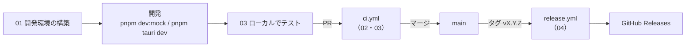

# S3 Drive 運用ドキュメント

S3 Drive の開発・ビルド・テスト・リリースの手順をまとめる。設計の背景（なぜそうしているか）は [設計書](../design/README.md) を、利用者向けの説明はリポジトリの [README](../../README.md) を参照する。

| ドキュメント | 内容 |
|---|---|
| [01-local-setup.md](01-local-setup.md) | ローカル開発環境の構築（必要なツール、依存の導入、アプリの起動方法） |
| [02-build.md](02-build.md) | ビルドの方法（ローカル、GitHub Actions） |
| [03-test.md](03-test.md) | テストの方法（ローカル、GitHub Actions） |
| [04-release.md](04-release.md) | リリースの方法（GitHub Actions） |

## 全体の流れ

## 関連するファイル

| ファイル | 役割 |
|---|---|
| `package.json` | pnpm のバージョン（`packageManager`）、アプリのバージョン（`version`）、スクリプト |
| `.node-version` | Node.js のバージョン |
| `rust-toolchain.toml` | Rust のチャンネルとターゲット |
| `pnpm-workspace.yaml` | pnpm の設定（ビルドスクリプトの許可、公開直後のバージョンの除外） |
| `src-tauri/tauri.conf.json` | アプリの設定（バンドル、署名、自動更新） |
| `docker-compose.test.yml` | 結合テスト用の S3 モック（moto） |
| `.github/workflows/ci.yml` | CI（静的解析・型検査・テスト・ビルド・脆弱性検査） |
| `.github/workflows/e2e.yml` | E2E テスト |
| `.github/workflows/release.yml` | リリース |
| `renovate.json` | 依存の自動更新（Renovate） |
| `deny.toml` | Rust の依存の検査（cargo deny） |
